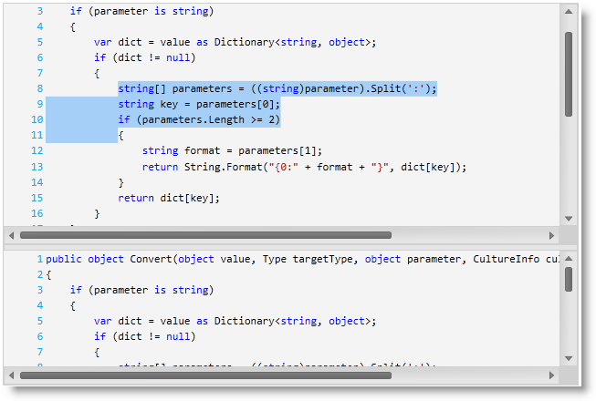

////

|metadata|
{
    "name": "xamsyntaxeditor-overview",
    "controlName": ["xamSyntaxEditor"],
    "tags": ["Getting Started"],
    "guid": "b7042f4b-b074-4f5a-8c89-9a19d64b3088",  
    "buildFlags": [],
    "createdOn": "2016-05-25T18:21:59.3153607Z"
}
|metadata|
////

= xamSyntaxEditor Overview

== Topic Overview

=== Purpose

In this topic, you will find information to help you better understand the  _xamSyntaxEditor’s_™ functions.

=== In this topic

This topic contains the following sections:

* <<_Ref329268346,Introduction>>
* <<_Ref329268647,Features Summary>>
* <<_Ref329268653,Related Content>>

[[_Ref329268346]]
== Introduction

=== Introduction to the xamSyntaxEditor

The  _xamSyntaxEditor_   is a cross platform control providing a link:xamsyntaxeditor-editing-support-overview.html[code editing] experience similar to Microsoft’s Visual Studio Integrated Development Environment (IDE) code window.

The  _xamSyntaxEditor_   provides you with the ability to display and edit the text contained in a link:{ApiPlatform}documents.textdocument{ApiVersion}~infragistics.documents.textdocument.html[TextDocument] class. The `TextDocument` class exposes properties, methods and events for loading, saving and manipulating the contained text. There are no limitations on the size of the text contained in the `TextDocument`.

The `TextDocument` class uses highly optimized lexing and parsing algorithms that allow the  _xamSyntaxEditor_   control to provide link:xamsyntaxeditor-syntax-highlighting.html[syntax highlighting], (using text colorization) and link:xamsyntaxeditor-error-reporting.html[error highlighting] (using squiggly underlines as in Visual Studio) based on link:xamsyntaxeditor-supported-languages.html[predefined language definitions]. Where possible, perform time-consuming operations, such as lexing and parsing on-demand and in background threads, which allows you to display very large documents very quickly.

The following screen shot shows the  _xamSyntaxEditor,_   in split mode, editing some C# code:

[[_Ref329268647]]
== Features Summary

=== Features of the xamSyntaxEditor control

_XamSyntaxEditor_   main features:

[options="header", cols="a,a,a"]
|====
|Feature|Description|Available by default

| link:xamsyntaxeditor-changing-font-and-styles.html[Changing Font And Styles]
|Provides the Syntax Editor support for all of the fonts and styles available to all OS’s .
|image::images/Yes.png[]

| link:xamsyntaxeditor-clipboard-support.html[Clipboard Support]
|Provides the Syntax Editor support for cutting, coping and pasting textual information within a document or between several documents.
|image::images/Yes.png[]

| link:xamsyntaxeditor-find-replace.html[Find / Replace]
|Provides the `TextDocument` with powerful Find and Replace methods.
|image::images/Yes.png[]

| link:xamsyntaxeditor-configuring-initial-content.html[Loading and Saving]
|These methods support both loading and saving to and from a file or stream.
|image::images/Yes.png[]

| link:xamsyntaxeditor-margins.html[Margins (Built-in)]
|Enables the _xamSyntaxEditor’s_ build-in margins.
|image::images/Yes.png[]

| link:xamsyntaxeditor-custom-margins.html[Margins (Custom)]
|Enables the _xamSyntaxEditor’s_ custom margins.
|image::images/No.png[]

| link:xamsyntaxeditor-editing-support-overview.html[Programmatically Append/Insert/Delete]
|Provides the `TextDocument’s` methods for programmatically changing text content.
|image::images/Yes.png[]

| link:xamsyntaxeditor-undo-redo.html[Undo / Redo]
|The link:undo-redo-framework.html[Infragistics Undo/Redo framework] is used to support unlimited undo/redo changes.
|image::images/Yes.png[]

| link:xamsyntaxeditor-editing-support-overview.html[User Editing]
|Provides the _xamSyntaxEditor_ support for user input using multiple keyboard and mouse interactions.
|image::images/Yes.png[]

| link:xamsyntaxeditor-working-with-snapshots.html[Snapshots]
|The `TextDocument` snapshots represent the state of the document at a specific point in time and expose methods for obtaining, traversing and searching through its content.
|image::images/Yes.png[]

| link:xamsyntaxeditor-splitting.html[Splitting]
|Navigational aide, which supports splitting the editing area into two separate regions, either horizontal or vertical, to simultaneously observe different parts of the file being edited.
|image::images/Yes.png[]

| link:xamsyntaxeditor-syntax-highlighting.html[Syntax Highlight]
|Syntax highlighting gives visual cues on how the editor interprets the text (for example, keywords, comments, etc…)
|image::images/Yes.png[]

|====

[[_Ref329268653]]
== Related Content

=== Topics

The following topics provide additional information related to this topic.

[options="header", cols="a,a"]
|====
|Topic|Purpose

| link:xamsyntaxeditor-adding-to-your-page.html[Adding _xamSyntaxEditor_ to Your Page]
|This topic provides you with systematic instructions designed to help you get the _xamSyntaxEditor_ up and running as quickly as possible.

| link:xamsyntaxeditor-configuring.html[Configuring _xamSyntaxEditor_ ]
|This section is a gateway to important conceptual and task-based information that will help you use various functions and features provided by the _xamSyntaxEditor_ cross platform control.

ifdef::wpf[]
| link:xamsyntaxeditor-ime-support.html[IME Support]
|This topic explains the input method support of the control.
endif::wpf[]

|====