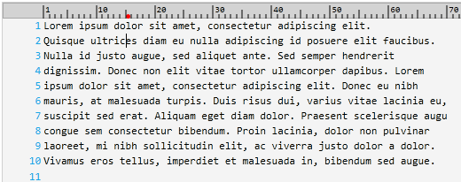

////

|metadata|
{
    "name": "xamsyntaxeditor-ruler-margin",
    "controlName": ["xamSyntaxEditor"],
    "tags": ["Data Presentation","Editing","Navigation"],
    "guid": "3033168b-ca7b-4ef0-9d3c-6d703360b963",  
    "buildFlags": [],
    "createdOn": "2016-05-25T18:21:59.5093619Z"
}
|metadata|
////

= Ruler Margin (xamSyntaxEditor)

== Topic Overview

=== Purpose

This topic explains how to configure the ruler margin feature.

=== Required background

The following topics are prerequisites to understanding this topic:

[options="header", cols="a,a"]
|====
|Topic|Purpose

| link:xamsyntaxeditor-overview.html[ _xamSyntaxEditor_ Overview]
|In this topic, you will find information to help you better understand the _xamSyntaxEditor’s_ functions.

| link:xamsyntaxeditor-adding-to-your-page.html[Adding _xamSyntaxEditor_ to Your Page]
|This topic provides you with systematic instructions designed to help you get the _xamSyntaxEditor_ up and running as quickly as possible.

| link:xamsyntaxeditor-editing-support-overview.html[Editing Support Overview]
|This topic covers the text editing capabilities of the _xamSyntaxEditor_ control from both the developer and user’s perspective.

|====

=== In this topic

This topic contains the following sections:

* <<_Ref345423480, Introduction >>
* <<_Ref345423488, Ruler Margin Configuration Summary >>
* <<_Ref345423495, Show/Hide >>
* <<_Ref345423506, Change Background Brush >>
* <<_Ref345423515, Change Border Brush >>
* <<_Ref345423521, Change Tick Mark Brush >>
* <<_Ref345423528, Change Caret Highlight Brush >>
* <<_Ref345423535, Change Numbers Brush >>
* <<_Ref345423540, Related Content >>

[[_Ref345423480]]
== Introduction

=== Ruler margin summary

The  _xamSyntaxEditor™_   control supports a ruler margin feature using a red dot to identify the location of the caret along the width of the editing area. When enabled the ruler displays at the top of the editing area regardless of splitting being enabled; however, if link:xamsyntaxeditor-splitting.html[splitting] is enabled 2 rulers will render, one for each split.

The following screenshot shows the  _xamSyntaxEditor_   with ruler margin enabled, and the caret positioned at column 15 (1-based):

.Note
[NOTE]
====
You can obtain the current 1-based caret column using the caret’s read-only property link:{ApiPlatform}controls.editors.xamsyntaxeditor{ApiVersion}~infragistics.controls.editors.caret~characterdisplaycolumn.html[CharacterDisplayColumn].
====

[[_Ref345423488]]
== Ruler Margin Configuration Summary

=== Ruler margin configuration summary chart

The following table lists the configurable aspects of the  _xamSyntaxEditor’s_   ruler margin.

[options="header", cols="a,a,a"]
|====
|Configurable aspect|Details|Properties

|<<_Ref345423495,Show/Hide>>
|Show or hide the ruler margin
|
* link:{ApiPlatform}controls.editors.xamsyntaxeditor{ApiVersion}~infragistics.controls.editors.xamsyntaxeditor~isrulermarginvisible.html[IsRulerMarginVisible] 

|<<_Ref345423506,Change Background Brush>>
|Change the background of the ruler margin
|
* link:{ApiPlatform}controls.editors.xamsyntaxeditor{ApiVersion}~infragistics.controls.editors.xamsyntaxeditor~rulermarginbackground.html[RulerMarginBackground] 

|<<_Ref345423515,Change Border Brush>>
|Change the border of the ruler margin
|
* link:{ApiPlatform}controls.editors.xamsyntaxeditor{ApiVersion}~infragistics.controls.editors.xamsyntaxeditor~rulermarginborderbrush.html[RulerMarginBorderBrush] 

|<<_Ref345423521,Change Tick Mark Brush>>
|Change the tick marks of the ruler margin
|
* link:{ApiPlatform}controls.editors.xamsyntaxeditor{ApiVersion}~infragistics.controls.editors.xamsyntaxeditor~rulermargintickmarkbrush.html[RulerMarginTickMarksBrush] 

|<<_Ref345423528,Change Caret Highlight Brush>>
|Change the caret position highlight of the ruler margin
|
* link:{ApiPlatform}controls.editors.xamsyntaxeditor{ApiVersion}~infragistics.controls.editors.xamsyntaxeditor~rulermargincaretpositionhighlightbrush.html[RulerMarginCaretPositionHighlightBrush] 

|<<_Ref345423535,Change Numbers Brush>>
|Change the numbers of the ruler margin
|
* link:{ApiPlatform}controls.editors.xamsyntaxeditor{ApiVersion}~infragistics.controls.editors.xamsyntaxeditor~rulermargintextbrush.html[RulerMarginTextBrush] 

|====

[[_Ref345423495]]
== Show/Hide

=== Overview

Show or hide the ruler margin.

=== Property settings

[options="header", cols="a,a,a"]
|====
|In order to:|Use this property:|And set it to:

|Show the ruler margin
|`IsRulerMarginVisible`
|`true`

|Hide the ruler margin
|`IsRulerMarginVisible`
|`false`

|====

.Note
[NOTE]
====
You can also show or hide the ruler margin by invoking the link:{ApiPlatform}controls.editors.xamsyntaxeditor{ApiVersion}~infragistics.controls.editors.syntaxeditorcommandtype.html[ToggleRulerMarginVisibility] command.
====

=== Code

The following code snippet shows how to make the ruler margin visible:

*In C#:*

[source,csharp]
----
this.xamSyntaxEditor1.IsRulerMarginVisible = true;
----

*In Visual Basic:*

[source,vb]
----
Me.xamSyntaxEditor1.IsRulerMarginVisible = True
----

[[_Ref345423506]]
== Change Background Brush

=== Overview

Change the brush used to fill the ruler margin area.

=== Property settings

[options="header", cols="a,a,a"]
|====
|In order to:|Use this property:|And set it to:

|Change the background brush
|`RulerMarginBackground`
|An object of type link:http://msdn.microsoft.com/en-us/library/system.windows.media.brush.aspx[Brush]

|====

=== Code

The following code snippet shows how to set the ruler margin’s background to light gray.

*In C#:*

[source,csharp]
----
this.xamSyntaxEditor1.RulerMarginBackground = new SolidColorBrush(Colors.LightGray);
----

*In Visual Basic:*

[source,vb]
----
Me.xamSyntaxEditor1.RulerMarginBackground = New SolidColorBrush(Colors.LightGray)
----

[[_Ref345423515]]
== Change Border Brush

=== Overview

Change the brush used to draw the rectangle surrounding the ruler margin’s area.

=== Property settings

[options="header", cols="a,a,a"]
|====
|In order to:|Use this property:|And set it to:

|Change the border brush
|`RulerMarginBorderBrush`
|An object of type `Brush`

|====

=== Code

The following code snippet shows how to set the ruler margin’s border to dark gray.

*In C#:*

[source,csharp]
----
this.xamSyntaxEditor1.RulerMarginBorderBrush = new SolidColorBrush(Colors.DarkGray);
----

*In Visual Basic:*

[source,vb]
----
Me.xamSyntaxEditor1.RulerMarginBorderBrush = New SolidColorBrush(Colors.DarkGray)
----

[[_Ref345423521]]
== Change Tick Mark Brush

=== Overview

Change the brush used to draw the ruler margin tick marks.

=== Property settings

[options="header", cols="a,a,a"]
|====
|In order to:|Use this property:|And set it to:

|Change the tick marks brush
|`RulerMarginTickMarkBrush`
|An object of type `Brush`

|====

=== Code

The following code snippet shows how to set the ruler margin’s tick marks to black.

*In C#:*

[source,csharp]
----
this.xamSyntaxEditor1.RulerMarginTickMarkBrush = new SolidColorBrush(Colors.Black);
----

*In Visual Basic:*

[source,vb]
----
Me.xamSyntaxEditor1.RulerMarginTickMarkBrush = New SolidColorBrush(Colors.Black)
----

[[_Ref345423528]]
== Change Caret Highlight Brush

=== Overview

Change the brush used to draw caret position highlight in the ruler margin.

=== Property settings

[options="header", cols="a,a,a"]
|====
|In order to:|Use this property:|And set it to:

|Change the caret highlight brush
|`RulerMarginCaretPositionHighlightBrush`
|An object of type `Brush`

|====

=== Code

The following code snippet shows how to set the ruler margin’s caret highlight to red.

*In C#:*

[source,csharp]
----
this.xamSyntaxEditor1.RulerMarginCaretPositionHighlightBrush =
    new SolidColorBrush(Colors.Red);
----

*In Visual Basic:*

[source,vb]
----
Me.xamSyntaxEditor1. RulerMarginCaretPositionHighlightBrush = _
    New SolidColorBrush(Colors.Black)
----

[[_Ref345423535]]
== Change Numbers Brush

=== Overview

Change the brush used to draw the ruler margin numbers.

=== Property settings

[options="header", cols="a,a,a"]
|====
|In order to:|Use this property:|And set it to:

|Change the numbers brush
|`RulerMarginTextBrush`
|An object of type `Brush`

|====

=== Code

The following code snippet shows how to set the ruler margin’s numbers to black.

*In C#:*

[source,csharp]
----
this.xamSyntaxEditor1.RulerMarginTextBrush = new SolidColorBrush(Colors.Black);
----

*In Visual Basic:*

[source,vb]
----
Me.xamSyntaxEditor1.RulerMarginTextBrush = New SolidColorBrush(Colors.Black)
----

[[_Ref345423540]]
== Related Content

=== Topics

The following topics provide additional information related to this topic.

[options="header", cols="a,a"]
|====
|Topic|Purpose

| link:xamsyntaxeditor-line-number-margin.html[Line Number Margin]
|This topic describes the use and configuration of the _xamSyntaxEditor_ control’s built-in Line Number Margin.

| link:xamsyntaxeditor-custom-margins.html[Custom Margins]
|This topic explains how to create your own margins.

| link:xamsyntaxeditor-splitting.html[Splitting]
|This topic will help you understand the document splitting capability of the _xamSyntaxEditor_ and how to customize it.

|====

=== Samples

The following samples provide additional information related to this topic.

[options="header", cols="a,a"]
|====
|Sample|Purpose

| pick:[sl=" link:{SamplesURL}/syntax-editor/#/ruler-margin[Ruler Margin]"] pick:[wpf=" link:{SamplesURL}/syntax-editor/ruler-margin[Ruler Margin]"] 
|This sample demonstrates different ways for customizing the _xamSyntaxEditor’s_ ruler margin.

|====