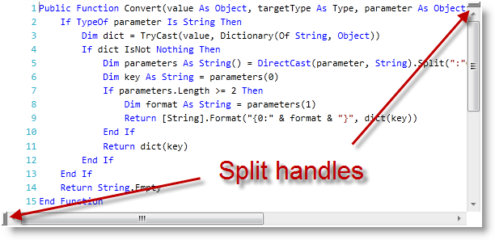
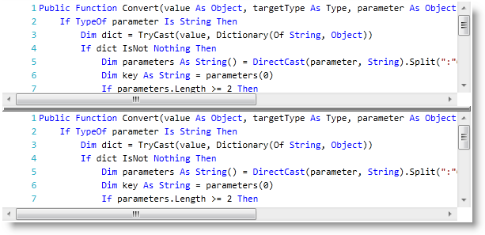
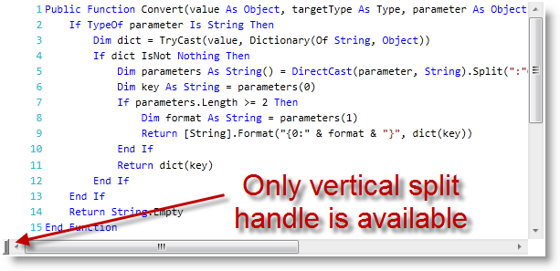

////

|metadata|
{
    "name": "xamsyntaxeditor-splitting",
    "controlName": ["xamSyntaxEditor"],
    "tags": ["Editing","Layouts"],
    "guid": "c74d8e61-3d7c-4cb6-8528-9b761e255568",  
    "buildFlags": [],
    "createdOn": "2016-05-25T18:21:59.4843606Z"
}
|metadata|
////

= Splitting (xamSyntaxEditor)

== Topic Overview

=== Purpose

This topic will help you understand the document splitting capability of the  _xamSyntaxEditor™_   and how to customize it.

=== Required background

The following topics are prerequisites to understanding this topic:

[options="header", cols="a,a"]
|====
|Topic|Purpose

| link:xamsyntaxeditor-overview.html[ _xamSyntaxEditor_ Overview]
|In this topic, you will find information to help you better understand the _xamSyntaxEditor’s_ functions.

| link:xamsyntaxeditor-editing-support-overview.html[Editing Support Overview]
|This topic covers the text editing capabilities of the _xamSyntaxEditor_ control from both the developer and user’s perspective.

|====

=== In this topic

This topic contains the following sections:

* <<_Ref332805583, Introduction >>
* <<_Ref332805592, Control Configuration Summary >>
* <<_Ref332805556, Enable/Disable Different Splitting Types >>
* <<_Ref332805564, Obtain/Set the Current Splitting Status >>
* <<_Ref332805620, Related Content >>

[[_Ref332805583]]
== Introduction

=== Splitting summary

The  _xamSyntaxEditor_   supports splitting of the editing area (either horizontally or vertically). When enabled, the user may use this feature for a visual comparison of two parts of the edited document and make changes to both of them. You can configure which splitting is available to the user (see the table below). In addition, there is a property, which can be used to determine the current splitting status of the  _xamSyntaxEditor’s_   editing area.

The screenshot below shows the  _xamSyntaxEditor’s_   split handles:

The screenshot below shows the  _xamSyntaxEditor_   split horizontally:

[[_Ref332805592]]
== Control Configuration Summary

=== Control configuration summary chart

The following table lists the configurable aspects of the  _xamSyntaxEditor’s_   splitting capabilities.

[options="header", cols="a,a,a"]
|====
|Configurable aspect|Details|Properties

|<<_Ref332805556,Enable/Disable Different Splitting Types>>
|You can enable/disable what splitting is available to the user.
|
* link:{ApiPlatform}controls.editors.xamsyntaxeditor{ApiVersion}~infragistics.controls.editors.xamsyntaxeditor~splitoptions.html[SplitOptions] 

|<<_Ref332805564,Obtain/Set the Current Splitting Status>>
|You can obtain/set the current splitting status and see if and how the user has split the editing area.
|
* link:{ApiPlatform}controls.editors.xamsyntaxeditor{ApiVersion}~infragistics.controls.editors.xamsyntaxeditor~splitstatus.html[SplitStatus] 

|====

.Note
[NOTE]
====
You can also use commands to enable/disable splitting types and to set split. Please refer to the link:xamsyntaxeditor-events-and-commands.html[Events and Commands] topic for more information.
====

[[_Ref332805556]]
== Enable/Disable Different Splitting Types

=== Overview

You can enable/disable what splitting is available to the user.

=== Property settings

The following table maps the desired configuration to property settings.

[options="header", cols="a,a,a"]
|====
|In order to:|Use this property:|And set it to:

|Change which splitting option is available to the user
|`SplitOptions`
|A value of type link:{ApiPlatform}controls.editors.xamsyntaxeditor{ApiVersion}~infragistics.controls.editors.editordocumentviewsplitoptions.html[EditorDocumentViewSplitOptions]

|====

=== Example

The screenshot below demonstrates how the  _xamSyntaxEditor_   looks as a result of implementing the following settings:

[options="header", cols="a,a"]
|====
|Property|Value

|`SplitOptions`
|`EditorDocumentViewSplitOptions.AllowVerticalSplitsOnly`

|====

[[_Ref332805564]]
== Obtain/Set the Current Splitting Status

=== Overview

You can obtain and set the current splitting status and see if and how the user has split the editing area.

=== Property settings

The following table maps the desired configuration to property settings.

[options="header", cols="a,a,a"]
|====
|In order to:|Use this property:|And:

|Obtain the current splitting
|`SplitStatus`
|Read its value

|Set the current splitting
|`SplitStatus`
|Set it to a value of type link:{ApiPlatform}controls.editors.xamsyntaxeditor{ApiVersion}~infragistics.controls.editors.editordocumentviewsplitstatus.html[EditorDocumentViewSplitStatus]

|====

=== Code

The following code example shows how to obtain the current split status:

*In C#:*

[source,csharp]
----
if (this.xamSyntaxEditor1.SplitStatus ==
    EditorDocumentViewSplitStatus.SplitHorizontally)
{
    // do something
}
else if (this.xamSyntaxEditor1.SplitStatus ==
    EditorDocumentViewSplitStatus.SplitVertically)
{
    // do something else
}
----

*In Visual Basic:*

[source,vb]
----
If Me.xamSyntaxEditor1.SplitStatus = _
    EditorDocumentViewSplitStatus.SplitHorizontally Then
        ' do something
ElseIf Me.xamSyntaxEditor1.SplitStatus = _
    EditorDocumentViewSplitStatus.SplitVertically Then
        ' do something else
End If
----

The following code example shows how to set the current split to vertical:

*In C#:*

[source,csharp]
----
this.xamSyntaxEditor1.SplitStatus = EditorDocumentViewSplitStatus.SplitVertically;
----

*In Visual Basic:*

[source,vb]
----
Me.xamSyntaxEditor1.SplitStatus = EditorDocumentViewSplitStatus.SplitVertically
----

[[_Ref332805620]]
== Related Content

=== Topics

The following topics provide additional information related to this topic.

[options="header", cols="a,a"]
|====
|Topic|Purpose

| link:xamsyntaxeditor-changing-font-and-styles.html[Changing Fonts and Styles]
|This topic provides information on how to change the presention of the document’s content inside the _xamSyntaxEditor_ .

| link:xamsyntaxeditor-currentlinehl.html[Current Line Highlighting]
|This topic explains the current line highlighting feature.

|====

=== Samples

The following samples provide additional information related to this topic.

[options="header", cols="a,a"]
|====
|Sample|Purpose

| pick:[sl=" link:{SamplesURL}/syntax-editor/#/splitting-capabilities[Splitting Capabilities]"] pick:[wpf=" link:{SamplesURL}/syntax-editor/splitting-capabilities[Splitting Capabilities]"] 
|This sample demonstrates how to set different splitting options on the editor and how to monitor the current splitting status.

|====