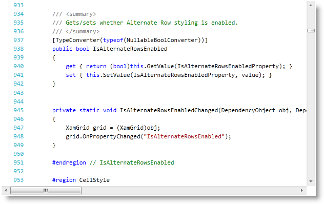

////

|metadata|
{
    "name": "xamsyntaxeditor-syntax-highlighting",
    "controlName": ["xamSyntaxEditor"],
    "tags": [],
    "guid": "6375d86a-372c-4a4b-9071-85ee9bcfb60a",  
    "buildFlags": [],
    "createdOn": "2016-05-25T18:21:59.4073964Z"
}
|metadata|
////

= Syntax Highlighting (xamSyntaxEditor)

== Topic Overview

=== Purpose

This topic provides information about text colorization, based on the link:{ApiPlatform}documents.textdocument{ApiVersion}~infragistics.documents.textdocument_members.html[TextDocument]’s associated language.

=== Required background

The following topics are prerequisites to understanding this topic:

[options="header", cols="a,a"]
|====
|Topic|Purpose

| link:xamsyntaxeditor-overview.html[ _xamSyntaxEditor_ Overview]
|In this topic, you will find information to help you better understand the _xamSyntaxEditor’s_ functions.

| link:xamsyntaxeditor-editing-support-overview.html[Editing Support Overview]
|This topic covers the text editing capabilities of the _xamSyntaxEditor_ control from both the developer and user’s perspective.

|====

== Introduction

=== Introduction to Syntax Highlighting

The  _xamSyntaxEditor™_   supports syntax highlighting, which are visual cues for interpreting the text shown in the editor. Interpreting the manner in which various parts of the text is a function of the language set in the link:{ApiPlatform}documents.textdocument{ApiVersion}~infragistics.documents.textdocument~language.html[Language] property of the `TextDocument`. The syntax-highlighting feature uses text colorization for different text parts (for example. comments, keywords, etc …). Errors are rendered highlighted and with squiggly underlines to help identify text that is not complying within the language syntax rules.

There are several predefined languages supported in the `TextDocument` assembly:

* link:{ApiPlatform}documents.textdocument{ApiVersion}~infragistics.documents.parsing.plaintextlanguage_members.html[PlainTextLanguage]
* link:{ApiPlatform}documents.textdocument.csharp{ApiVersion}~infragistics.documents.parsing.csharplanguage_members.html[CSharpLanguage]
* link:{ApiPlatform}documents.textdocument.visualbasic{ApiVersion}~infragistics.documents.parsing.visualbasiclanguage_members.html[VisualBasicLanguage]
* link:{ApiPlatform}documents.textdocument.tsql{ApiVersion}~infragistics.documents.parsing.tsqllanguage_members.html[TSqlLanguage]

The following screenshot shows the  _xamSyntaxEditor_   control displaying C# code with syntax highlighting applied based on the C# language:

== Related Content

=== Topics

The following topics provide additional information related to this topic.

[options="header", cols="a,a"]
|====
|Topic|Purpose

| link:xamsyntaxeditor-supported-languages.html[Supported Languages]
|This topic lists the languages supported by the _xamSyntaxEditor™_ and shows you how to use each of them.

| link:xamsyntaxeditor-changing-default-classification-types-appearance.html[Changing Default Classification Types Appearance]
|This topic provides information on how to change the colors and other appearance attributes assigned to language elements by the _xamSyntaxEditor_ .

| link:xamsyntaxeditor-error-reporting.html[Error Reporting]
|This topic provides an overview of the _xamSyntaxEditor_ control’s error reporting functionality and shows how to configure and work with the control.

|====

=== Samples

The following samples provide additional information related to this topic.

[options="header", cols="a,a"]
|====
|Sample|Purpose

| pick:[sl=" link:{SamplesURL}/syntax-editor/#/highlighting-customization[Highlighting Customization]"] pick:[wpf=" link:{SamplesURL}/syntax-editor/highlighting-customization[Highlighting Customization]"] 
|This sample demonstrates how to change the style of different classification types of the syntax highlighting.

| pick:[sl=" link:{SamplesURL}/syntax-editor/#/load-external-file[Load External File]"] pick:[wpf=" link:{SamplesURL}/syntax-editor/load-external-file[Load External File]"] 
|This sample demonstrates loading of external files of different types in the _xamSyntaxEditor_ .

|====