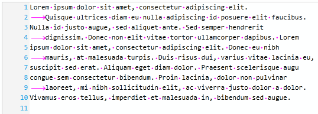

////

|metadata|
{
    "name": "xamsyntaxeditor-whitespacehighlighting",
    "controlName": ["xamSyntaxEditor"],
    "tags": ["Data Presentation","Editing"],
    "guid": "c329eec9-78fa-401d-8218-51d03b10a39b",  
    "buildFlags": [],
    "createdOn": "2016-05-25T18:21:59.5033615Z"
}
|metadata|
////

= Whitespace Highlighting (xamSyntaxEditor)

== Topic Overview

=== Purpose

This topic explains the whitespace highlighting feature.

=== Required background

The following topics are prerequisites to understanding this topic:

[options="header", cols="a,a"]
|====
|Topic|Purpose

| link:xamsyntaxeditor-overview.html[ _xamSyntaxEditor_ Overview]
|In this topic, you will find information to help you better understand the _xamSyntaxEditor’s_ functions.

| link:xamsyntaxeditor-editing-support-overview.html[Editing Support Overview]
|This topic covers the text editing capabilities of the _xamSyntaxEditor_ control from both the developer and user’s perspective.

|====

=== In this topic

This topic contains the following sections:

* <<_Ref343683034, Introduction >>
* <<_Ref343683007, Feature Configuration Summary >>
* <<_Ref343682982, Enable/Disable the Whitespace Highlighting >>
* <<_Ref343682991, Set the Whitespace Highlighting Brush >>
* <<_Ref343683027, Related Content >>

[[_Ref343683034]]
== Introduction

=== Whitespace highlighting summary

The whitespace highlighting feature indicates all of the places within the `TextDocument` occupied by spaces or tabs by displaying them within the editing area using symbols, colored dots and arrows respectively, thus highlighting their locations; these symbols do not replace the spaces or tabs contained within the document.

The following screenshot shows the  _xamSyntaxEditor_   with the whitespace highlighting feature enabled and the drawing brush set as magenta.

[[_Ref343683007]]
== Feature Configuration Summary

=== Feature configuration summary chart

The following table lists the configurable aspects of the whitespace highlighting feature of the  _xamSyntaxEditor_   control. Additional information is available following the table.

[options="header", cols="a,a,a"]
|====
|Configurable aspect|Details|Properties

|<<_Ref343682982,Enable/Disable the Whitespace Highlighting>>
|Show/hide the whitespace highlighting
|
* link:{ApiPlatform}controls.editors.xamsyntaxeditor{ApiVersion}~infragistics.controls.editors.xamsyntaxeditor~whitespaceindicatorvisibility.html[WhitespaceIndicatorVisibility] 

|<<_Ref343682991,Set the Whitespace Highlighting Brush>>
|Sets the brush to use for whitespace highlighting
|
* link:{ApiPlatform}controls.editors.xamsyntaxeditor{ApiVersion}~infragistics.controls.editors.xamsyntaxeditor~whitespaceindicatorbrush.html[WhitespaceIndicatorBrush] 

|====

[[_Ref343682982]]
== Enable/Disable the Whitespace Highlighting

=== Overview

Use the  _xamSyntaxEditor_   control’s `WhitespaceIndicatorVisibility` property to enable/disable whitespace highlighting.

=== Property settings

[options="header", cols="a,a,a"]
|====
|In order to:|Use this property:|And set it to:

|Enable whitespace highlighting feature
|`WhitespaceIndicatorVisibility`
|`Visibility.Visible`

|Disable the whitespace highlighting feature
|`WhitespaceIndicatorVisibility`
|`Visibility.Collapsed`

|====

=== Code

The following code snippet demonstrates how to enable whitespace highlighting:

*In C#:*

[source,csharp]
----
this.xamSyntaxEditor1.WhitespaceIndicatorVisibility = Visibility.Visible;
----

*In Visual Basic:*

[source,csharp]
----
Me.xamSyntaxEditor1.WhitespaceIndicatorVisibility = Visibility.Visible
----

[[_Ref343682991]]
== Set the Whitespace Highlighting Brush

=== Overview

Use the  _xamSyntaxEditor_   control’s `WhitespaceIndicatorBrush` property to set the whitespace highlighting brush.

=== Property settings

[options="header", cols="a,a,a"]
|====
|In order to:|Use this property:|And set it to:

|Set a brush for the whitespace highlighting feature
|`WhitespaceIndicatorBrush`
|An object of type link:http://msdn.microsoft.com/en-us/library/system.windows.media.brush.aspx[Brush]

|====

.Note
[NOTE]
====
The `WhitespaceIndicatorBrush` property has higher priority than the foreground brush set in the  _Whitespace_   link:{ApiPlatform}documents.textdocument{ApiVersion}~infragistics.documents.classificationtype_members.html[Classification Type]. You can also use the link:{ApiPlatform}controls.editors.xamsyntaxeditor{ApiVersion}~infragistics.controls.editors.xamsyntaxeditor~whitespaceindicatorbrushresolved.html[WhiteSpaceIndicatorBrushResolved] property to obtain the brush used to render the whitespace indicators, which value is determined as follows:

* If the `WhitespaceIndicatorBrush` is explicitly set, then its value is returned by the `WhitespaceIndicatorBrushResolved` property
* Otherwise, the value of the foreground brush associated with the `ClassificationType.Whitespace` entry in the link:{ApiPlatform}controls.editors.xamsyntaxeditor{ApiVersion}~infragistics.controls.editors.xamsyntaxeditor~classificationappearancemapresolved.html[XamSyntaxEditor.ClassificationAppearanceMapResolved] map is returned.

====

=== Code

The following code example demonstrates how to set a solid magenta color brush for whitespace highlighting:

*In C#:*

[source,csharp]
----
this.xamSyntaxEditor1.WhitespaceIndicatorBrush = new SolidColorBrush(Colors.Magenta);
----

*In Visual Basic:*

[source,csharp]
----
Me.xamSyntaxEditor1.WhitespaceIndicatorBrush = New SolidColorBrush(Colors.Magenta)
----

[[_Ref343683027]]
== Related Content

=== Topics

The following topics provide additional information related to this topic.

[options="header", cols="a,a"]
|====
|Topic|Purpose

| link:xamsyntaxeditor-changing-font-and-styles.html[Changing Fonts and Styles]
|This topic provides information on how to change the presention of the document’s content inside the _xamSyntaxEditor_ .

| link:xamsyntaxeditor-changing-default-classification-types-appearance.html[Changing Default Classification Types Appearance]
|This topic provides information on how to change the colors and other appearance attributes assigned to language elements by the _xamSyntaxEditor_ .

| link:xamsyntaxeditor-splitting.html[Splitting]
|This topic will help you understand the document splitting capability of the _xamSyntaxEditor_ and how to customize it.

| link:xamsyntaxeditor-syntax-highlighting.html[Syntax Highlighting]
|This topic provides information about text colorization, based on the `TextDocument`’s associated language.

|====

=== Samples

The following sample provides additional information related to this topic.

[options="header", cols="a,a"]
|====
|Sample|Purpose

| pick:[sl=" link:{SamplesURL}/syntax-editor/#/editor-customizations[Editor Customizations]"] pick:[wpf=" link:{SamplesURL}/syntax-editor/editor-customizations[Editor Customizations]"] 
|This sample demonstrates how to customize the _xamSyntaxEditor_ .

|====