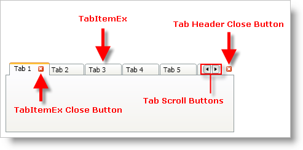
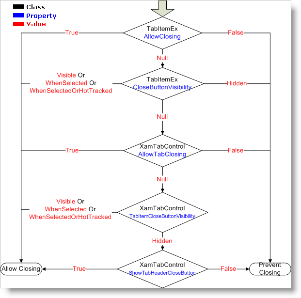

////

|metadata|
{
    "name": "xamtabcontrol-about-xamtabcontrol",
    "controlName": ["xamTabControl"],
    "tags": ["Getting Started"],
    "guid": "{56CF47BB-D45B-4E3F-810E-8968C19FA17F}",  
    "buildFlags": [],
    "createdOn": "2012-01-30T19:39:54.4432417Z"
}
|metadata|
////

= About xamTabControl

The xamTabControl™ derives from the TabControl class found in Microsoft® Windows® Presentation Foundation; therefore, you can start using xamTabControl without having to learn a brand new object model. In addition to the functionality and features of the Windows Presentation Foundation TabControl, xamTabControl exposes these additional features:

* *Tab Closing* - When you enable this feature, your end users can close tabs by middle clicking a tab header or by clicking the tab's close button.
* *Tab Layout* - You can arrange the tab headers in a single row or in multiple rows.
* *Tab Scrolling* - If the tab headers cannot fit into a single row or into multiple rows without going beyond the bounds of your application, xamTabControl displays scroll buttons so your end users will be able to scroll tab headers into view.
* *Tab Content Minimization* - Your end users can double-click a tab header to minimize its content.

== About Closing Tabs

By default, your end users cannot close a link:{RootAssembly}{ApiVersion}~infragistics.windows.controls.tabitemex.html[TabItemEx] object at run time. However, you can enable this functionality by setting properties on each individual TabItemEx object or by setting properties on the xamTabControl™.

.Note
[NOTE]
====
Only the TabItemEx objects in xamTabControl's Items collection will be closable.
====

The xamTabControl determines whether a tab is closable by querying properties starting on the individual TabItemEx object and moving up to the control. The following diagram describes how xamTabControl resolves whether a tab can be closed.

== Related Topics

link:xamtabcontrol-adding-xamtabcontrol-to-your-page-.html[Adding xamTabControl to Your Application]

link:xamtabcontrol-using-xamtabcontrol.html[Using xamTabControl]