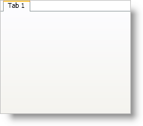

////

|metadata|
{
    "name": "xamtabcontrol-add-a-tab-to-xamtabcontrol",
    "controlName": ["xamTabControl"],
    "tags": ["How Do I"],
    "guid": "{9E9272D2-3559-4C4A-9D85-C9563CF50772}",  
    "buildFlags": [],
    "createdOn": "2012-01-30T19:39:54.4452421Z"
}
|metadata|
////

= Add a Tab to xamTabControl

Just like the tab control found in Microsoft® Windows® Presentation Foundation, you have to add tabs to xamTabControl™ in order to display tabbed content. Unlike the Windows Presentation Foundation TabControl, xamTabControl works with TabItem objects as well as the enhanced link:{RootAssembly}{ApiVersion}~infragistics.windows.controls.tabitemex.html[TabItemEx] objects. If you add TabItemEx objects to xamTabControl's link:{RootAssembly}{ApiVersion}~infragistics.windows.controls.xamtabcontrol.html[Items collection], you can enable tab closing. If you add regular TabItem objects, you will not have this functionality.

The following example code demonstrates how to add a tab to xamTabControl.

*In XAML:*

----
<igWindows:XamTabControl Name="xamTabControl1">
    <igWindows:TabItemEx Header="Tab 1">
        <!--TODO: Add a panel with content here-->
    </igWindows:TabItemEx>
</igWindows:XamTabControl>
----

*In Visual Basic:*

----
Imports Infragistics.Windows.Controls
...
Dim tab1 As New TabItemEx() With {.Header = "Tab 1"}
Me.xamTabControl1.Items.Add(tab1)
----

*In C#:*

----
using Infragistics.Windows.Controls;
...
TabItemEx tab1 = new TabItemEx(){ Header = "Tab 1" };
this.xamTabControl1.Items.Add(tab1);
----

== Related Topics

link:xamtabcontrol-add-content-to-a-tab.html[Add Content to a Tab]

link:xamtabcontrol-close-a-tab.html[Close a Tab]

link:xamtabcontrol-enable-multiple-tab-rows.html[Enable Multiple Tab Rows]

link:xamtabcontrol-removing-a-closed-tab.html[Removing a Closed Tab]

link:xamtabcontrol-select-a-tab.html[Select a Tab]

link:xamtabcontrol-tabs-dragging-and-reordering.html[Tabs Dragging and Reordering (xamTabControl)]