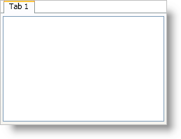

////

|metadata|
{
    "name": "xamtabcontrol-add-content-to-a-tab",
    "controlName": ["xamTabControl"],
    "tags": ["How Do I"],
    "guid": "{7B040F1D-D8E7-4AB5-8085-8F09026F4F48}",  
    "buildFlags": [],
    "createdOn": "2012-01-30T19:39:54.4482427Z"
}
|metadata|
////

= Add Content to a Tab

The link:{ApiPlatform}v{ProductVersion}~infragistics.windows.controls.tabitemex.html[TabItemEx] object derives from TabItem object, which in turn derives from HeaderedContentControl; therefore, using it will be similar to any headered content control found in Microsoft® Windows® Presentation Foundation. Just like any content control in Windows Presentation Foundation, you can set the link:{ApiPlatform}v{ProductVersion}~infragistics.windows.controls.tabitemex.html[Content] property of a tab to an instance of an object. In many cases, you will use a layout container, such as a Grid panel, as the root element -- adding additional elements to the layout container.

The following example code demonstrates how to add content to a tab.

*In XAML:*

----
<igWindows:XamTabControl Name="xamTabControl1">
    <igWindows:TabItemEx Header="Tab 1">
        <Grid>
            <RichTextBox />
        </Grid>
    </igWindows:TabItemEx>
</igWindows:XamTabControl>
----

*In Visual Basic:*

----
Imports Infragistics.Windows.Controls
...
Dim grid1 As New Grid() 
grid1.Children.Add(New RichTextBox()) 
Dim tab1 As New TabItemEx() With {.Header = "Tab 1", .Content = grid1}
Me.xamTabControl1.Items.Add(tab1)
...
----

*In C#:*

----
using Infragistics.Windows.Controls;
...
Grid grid1 = new Grid();
grid1.Children.Add(new RichTextBox());
TabItemEx tab1 = new TabItemEx()
{
    Header = "Tab 1",
    Content = grid1
};
this.xamTabControl1.Items.Add(tab1);
...
----

== Related Topics

link:xamtabcontrol-add-a-tab-to-xamtabcontrol.html[Add a Tab to xamTabControl]

link:xamtabcontrol-close-a-tab.html[Close a Tab]

link:xamtabcontrol-enable-multiple-tab-rows.html[Enable Multiple Tab Rows]

link:xamtabcontrol-removing-a-closed-tab.html[Removing a Closed Tab]

link:xamtabcontrol-select-a-tab.html[Select a Tab]

link:xamtabcontrol-tabs-dragging-and-reordering.html[Tabs Dragging and Reordering (xamTabControl)]