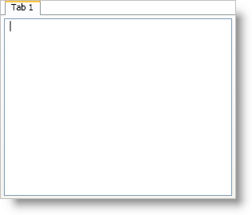

////

|metadata|
{
    "name": "xamtabcontrol-adding-xamtabcontrol-to-your-page ",
    "controlName": ["xamTabControl"],
    "tags": ["Getting Started"],
    "guid": "d92383a4-3a5d-4b92-a1c0-0075e13c2a5e",  
    "buildFlags": [],
    "createdOn": "2012-01-30T19:39:54.4742479Z"
}
|metadata|
////

= Adding xamTabControl to Your Application

== Before You Begin

You can add link:{RootAssembly}{ApiVersion}~infragistics.windows.controls.xamtabcontrol.html[xamTabControl™] to a Window using the same pattern as any control found in Microsoft® Windows® Presentation Foundation. This pattern involves using a layout container as the main content of the Window and then adding a control to the Children collection of the layout container. It is important to name the layout container in XAML so that you can reference it from the code-behind.

== What You Will Accomplish

You will add xamTabControl to a Window using XAML or procedural code. You will then add a tab to xamTabControl, and set the tab's content to a RichTextBox control.

When you run the finished project, you should see a xamTabControl in your Window that is similar to the screen shot below.

== Follow these Steps

[start=1]
. Create a Microsoft® Windows® Presentation Foundation Window project.
[start=2]
. In the Solution Explorer, add the following reference:

** {ApiPlatform}v{ProductVersion}.dll

[start=3]
. Add an XML namespace declaration for xamTabControl inside the opening Window tag in XAML. In code-behind you will need using/Imports directives so you don't have to type out a member's fully qualified name.

*In XAML:*

----
xmlns:igWindows="http://infragistics.com/Windows"
----

*In Visual Basic:*

----
Imports Infragistics.Windows.Controls
----

*In C#:*

----
using Infragistics.Windows.Controls;
----

[start=4]
. Name the default Grid layout panel in the Window so that you can reference it in the code-behind.

*In XAML:*

----
<Grid Name="layoutRoot">
</Grid>
----

[start=5]
. Create an instance of xamTabControl and name it.

*In XAML:*

----
<igWindows:XamTabControl Name="xamTabControl1"> 
    <!-- TODO: Add Tabs here -->
</igWindows:XamTabControl>
----

Create an instance of the xamTabControl control in the Window constructor after the InitializeComponent method and add it to the Grid's Children collection.

*In Visual Basic:*

----
Dim xamTabControl1 As New XamTabControl()
layoutRoot.Children.Add(xamTabControl1)
----

*In C#:*

----
XamTabControl xamTabControl1 = new XamTabControl();
layoutRoot.Children.Add(xamTabControl1);
----

[start=6]
. Add a link:{RootAssembly}{ApiVersion}~infragistics.windows.controls.tabitemex.html[TabItemEx] object to xamTabControl's link:https://msdn.microsoft.com/en-us/library/system.windows.controls.itemscontrol.items(v=vs.100).aspx[Items] collection and set its link:https://msdn.microsoft.com/en-us/library/system.windows.controls.headeredcontentcontrol.header(v=vs.100).aspx[Header] property.

You do not have to explicitly declare tags for xamTabControl's Items collection.

*In XAML:*

----
<igWindows:TabItemEx Header="Tab 1">
    <!--TODO: Add content here--></igWindows:TabItemEx>
----

*In Visual Basic:*

----
Dim tab1 As New TabItemEx()
tab1.Header = "Tab 1"
xamTabControl1.Items.Add(tab1)
----

*In C#:*

----
TabItemEx tab1 = new TabItemEx();
tab1.Header = "Tab 1";
xamTabControl1.Items.Add(tab1);
----

[start=7]
. Add a RichTextBox control to the tab item.

*In XAML:*

----
<RichTextBox />
----

*In Visual Basic:*

----
tab1.Content = New RichTextBox()
----

*In C#:*

----
tab1.Content = new RichTextBox();
----

[start=8]
. Run the project.

== Related Topics

link:xamtabcontrol-about-xamtabcontrol.html[About xamTabControl]

link:xamtabcontrol-using-xamtabcontrol.html[Using xamTabControl]