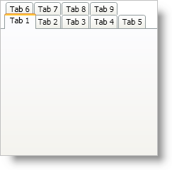

////

|metadata|
{
    "name": "xamtabcontrol-enable-multiple-tab-rows",
    "controlName": ["xamTabControl"],
    "tags": ["Editing"],
    "guid": "{646EB43B-3757-4C55-8431-2425220519DB}",  
    "buildFlags": [],
    "createdOn": "2012-01-30T19:39:54.4592449Z"
}
|metadata|
////

= Enable Multiple Tab Rows

When you add tabs to xamTabControl™, the default layout behavior creates a single row of tabs. In addition, xamTabControl automatically resizes the width of each tab header to fit its content. However, you can modify this behavior by setting xamTabControl's link:{RootAssembly}{ApiVersion}~infragistics.windows.controls.xamtabcontrol~tablayoutstyle.html[TabLayoutStyle] property to a link:{RootAssembly}{ApiVersion}~infragistics.windows.controls.tablayoutstyle.html[TabLayoutStyle enumeration] value.

The following example code demonstrates how to modify tab layouts.

*In XAML:*

----
<igWindows:XamTabControl Name="xamTabControl1" TabLayoutStyle="MultiRowAutoSize">
    <!--TODO: Add tabs here-->
</igWindows:XamTabControl>
----

*In Visual Basic:*

----
Imports Infragistics.Windows.Controls
...
Me.xamTabControl1.TabLayoutStyle = TabLayoutStyle.MultiRowAutoSize
...
----

*In C#:*

----
using Infragistics.Windows.Controls;
...
this.xamTabControl1.TabLayoutStyle = TabLayoutStyle.MultiRowAutoSize;
...
----

== Related Topics

link:xamtabcontrol-add-a-tab-to-xamtabcontrol.html[Add a Tab to xamTabControl]

link:xamtabcontrol-add-content-to-a-tab.html[Add Content to a Tab]

link:xamtabcontrol-close-a-tab.html[Close a Tab]

link:xamtabcontrol-removing-a-closed-tab.html[Removing a Closed Tab]

link:xamtabcontrol-select-a-tab.html[Select a Tab]

link:xamtabcontrol-tabs-dragging-and-reordering.html[Tabs Dragging and Reordering (xamTabControl)]