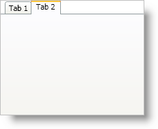

////

|metadata|
{
    "name": "xamtabcontrol-select-a-tab",
    "controlName": ["xamTabControl"],
    "tags": ["Selection"],
    "guid": "{15EEC946-43BA-4912-ABD1-44D7D33F108B}",  
    "buildFlags": [],
    "createdOn": "2012-01-30T19:39:54.4672465Z"
}
|metadata|
////

= Select a Tab

Your end users can click a tab's header at run time to select and view the tab's content. In addition to end user interaction, you can programmatically select a tab to display its content or you can select a tab using XAML to display the contents of a tab when the application starts up.

The following example code demonstrates how to select a tab. The procedural code assumes you have at least two link:{ApiPlatform}v{ProductVersion}~infragistics.windows.controls.tabitemex.html[TabItemEx] objects or TabItem objects in the link:{ApiPlatform}v{ProductVersion}~infragistics.windows.controls.xamtabcontrol.html[Items collection].

*In XAML:*

----
<igWindows:XamTabControl Name="xamTabControl1">
    <igWindows:TabItemEx Header="Tab 1">
         <!-- TODO: Add panel here -->
    </igWindows:TabItemEx>
    <igWindows:TabItemEx Header="Tab 2" IsSelected="True">
        <!-- TODO: Add panel here -->
    </igWindows:TabItemEx>
</igWindows:XamTabControl>
----

*In Visual Basic:*

----
DirectCast(Me.xamTabControl1.Items(1), TabItem).IsSelected = True
----

*In C#:*

----
((TabItem)this.xamTabControl1.Items[1]).IsSelected = true;
----

== Related Topics

link:xamtabcontrol-add-a-tab-to-xamtabcontrol.html[Add a Tab to xamTabControl]

link:xamtabcontrol-add-content-to-a-tab.html[Add Content to a Tab]

link:xamtabcontrol-close-a-tab.html[Close a Tab]

link:xamtabcontrol-enable-multiple-tab-rows.html[Enable Multiple Tab Rows]

link:xamtabcontrol-removing-a-closed-tab.html[Removing a Closed Tab]

link:xamtabcontrol-tabs-dragging-and-reordering.html[Tabs Dragging and Reordering (xamTabControl)]