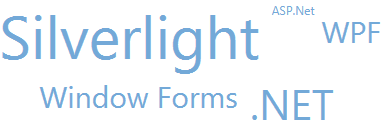

////

|metadata|
{
    "name": "xamtagcloud-about-xamtagcloud",
    "controlName": ["xamTagCloud"],
    "tags": [],
    "guid": "{C97C9536-CEEC-41EA-B5F2-CBD4556F3FC7}",  
    "buildFlags": [],
    "createdOn": "2016-05-25T18:21:59.5413638Z"
}
|metadata|
////

= About xamTagCloud

The xamTagCloud™ control allows you to add a tag-cloud style navigational element to your application. The xamTagCloud control displays a set of related tags with corresponding weights. You can weight each tag based on their frequency of occurrence, importance or any other algorithm you want. The size of the cloud items are scaled by the xamTagCloud control. Your end users can identify the most prevalent tags with just a quick glance at the xamTagCloud control.

The following is a list of the key features of the xamTagCloud control:

* Data Binding – Set the tag cloud’s ItemSource property to any enumerable source of items having Content and Weight properties.
* Linkable Tags – Items appearing in the cloud can be hyperlinked, so that your end users can click on them and go to a URI you define.
* Tags Items – You can also set any control as your tag content and their sizes will be scaled by the xamTagCloud control.
* Weights and Sizes – You can customize a tag cloud’s range of weights, and these will be mapped to a corresponding font size.

== *Related Topics*

link:xamtagcloud-adding-xamtagcloud-to-your-page.html[Adding xamTagCloud To Your Page]

link:xamtagcloud-using-xamtagcloud.html[Using xamTagCloud]