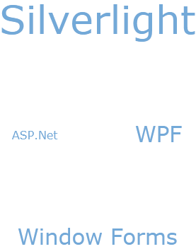

////

|metadata|
{
    "name": "xamtagcloud-add-spaces-between-cloud-items",
    "controlName": ["xamTagCloud"],
    "tags": ["How Do I","Layouts"],
    "guid": "{B537D27B-A814-4FCC-B510-F9784115EAED}",  
    "buildFlags": [],
    "createdOn": "2016-05-25T18:21:59.5794015Z"
}
|metadata|
////

= Add Spaces Between Cloud Items

You can add spaces between the cloud items in the xamTagCloud™ control to allow a greater degree of visual separation. This helps your end user to view the cloud items clearly and precisely.

You can configure the spacing between your cloud items by setting the link:{ApiPlatform}controls.menus.xamtagcloud.v{ProductVersion}~infragistics.controls.menus.xamtagcloud.html[xamTagCloud] control’s link:{ApiPlatform}controls.menus.xamtagcloud.v{ProductVersion}~infragistics.controls.menus.xamtagcloud~itemspacing.html[ItemsSpacing] property. This property accepts a Thickness structure. Setting the Left, Top, Right, and Bottom values of this structure determines the space between each cloud item.

The following code demonstrates how to achieve this.

*In XAML:*

----
<Grid x:Name="LayoutRoot" Background="White">
   <ig:XamTagCloud MaxScale="5" MinScale="1" Name="myTagCloud" 
                              ItemSpacing="50,50,50,50">
   …
   </ig:XamTagCloud>
</Grid>
----

*In Visual Basic:*

----
Dim myThickness As New Thickness()
myThickness.Bottom = 50
myThickness.Left = 50
myThickness.Right = 50
myThickness.Top = 50
tagCloud.ItemSpacing = myThickness
----

*In C#:*

----
Thickness myThickness = new Thickness();
myThickness.Bottom = 50;
myThickness.Left = 50;
myThickness.Right = 50;
myThickness.Top = 50;
tagCloud.ItemSpacing = myThickness;
----

== *Related Topics*

link:xamtagcloud-add-cloud-items-to-xamtagcloud.html[Add Cloud Items to xamTagCloud]

link:xamtagcloud-add-navigation-uris-to-cloud-items2.html[Add Navigation URIs to Cloud Items]

link:xamtagcloud-xamtagcloud-events.html[xamTagCloud Events]

link:xamtagcloud-setting-minimum-and-maximum-scale-values.html[Setting Minimum and Maximum Scale Values]

link:xamtagcloud-smooth-scaling.html[Smooth Scaling]

link:xamtagcloud-working-with-scalebreaks-collection.html[Working with ScaleBreaks Collection]