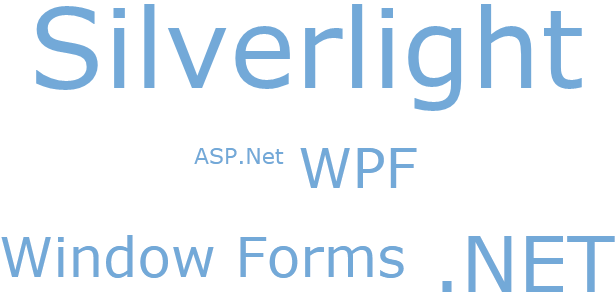

////

|metadata|
{
    "name": "xamtagcloud-setting-minimum-and-maximum-scale-values",
    "controlName": ["xamTagCloud"],
    "tags": ["Getting Started","How Do I","Layouts"],
    "guid": "{6E840221-85B7-4C40-85D2-60A20FD20CEB}",  
    "buildFlags": [],
    "createdOn": "2016-05-25T18:21:59.5864025Z"
}
|metadata|
////

= Setting Minimum and Maximum Scale Values

The xamTagCloud control’s scale is used to determine the size of the tags based on their weight. Setting the link:{ApiPlatform}controls.menus.xamtagcloud{ApiVersion}~infragistics.controls.menus.xamtagcloud~minscale.html[MinScale] and link:{ApiPlatform}controls.menus.xamtagcloud{ApiVersion}~infragistics.controls.menus.xamtagcloud~maxscale.html[MaxScale] properties determines the range of scale values.

For example, if you have a range of items where their weights range from 1-N, the minimum scale value would be applied to the items with weight of 1 and the maximum scale value would be applied to the items with weight of N. All the other items with weight values in between would be scaled relative to the minimum and maximum values.

The following code demonstrates how to set the scale with a minimum value of 1 and a maximum value of 10.

*In XAML:*

----
<Grid x:Name="LayoutRoot" Background="White">
   <ig:XamTagCloud MaxScale="10" MinScale="1" Name="tagCloud">
   …
   </ig:XamTagCloud>
</Grid>
----

*In Visual Basic:*

----
…
tagCloud.MaxScale = 10
tagCloud.MinScale = 1
…
----

*In C#:*

----
…
tagCloud.MaxScale = 10;
tagCloud.MinScale = 1;
…
----

== *Related Topics*

link:xamtagcloud-add-cloud-items-to-xamtagcloud.html[Add Cloud Items to xamTagCloud]

link:xamtagcloud-add-navigation-uris-to-cloud-items2.html[Add Navigation URIs to Cloud Items]

link:xamtagcloud-add-spaces-between-cloud-items.html[Add Spaces Between Cloud Items]

link:xamtagcloud-xamtagcloud-events.html[xamTagCloud Events]

link:xamtagcloud-smooth-scaling.html[Smooth Scaling]

link:xamtagcloud-working-with-scalebreaks-collection.html[Working with ScaleBreaks Collection]