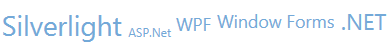

////

|metadata|
{
    "name": "xamtagcloud-smooth-scaling",
    "controlName": ["xamTagCloud"],
    "tags": ["How Do I","Layouts","Performance"],
    "guid": "{6D830353-3E27-4741-9EC2-5D222295FFD8}",  
    "buildFlags": [],
    "createdOn": "2016-05-25T18:21:59.5924066Z"
}
|metadata|
////

= Smooth Scaling

By setting the xamTagCloud™ control’s UseSmoothScaling property, a log scale is applied to the calculated scaled size of the item. This ensures that all of the cloud items are scaled relative to each other. With the link:{ApiPlatform}controls.menus.xamtagcloud.v{ProductVersion}~infragistics.controls.menus.xamtagcloud~usesmoothscaling.html[UseSmoothScaling] property enabled, the MaxScale value will be ignored and the cloud items will never be scaled below the MinScale value. The smooth scaling feature was designed to smooth out the differences between items with large differences in their final scaled sizes.

For example if you have a tag cloud with a MinValue of 1 and a MaxValue of 100, and many cloud items with a vast range of Weight values, you could potentially have a cloud item that is scaled to 100 times its normal size and the rest of the cloud items would appear significantly smaller. Using smooth scaling eliminates this problem and ensures that the cloud item with the heaviest Weight value is always scaled relative to the cloud item with the lightest Weight value.

*In XAML:*

----
<Grid x:Name="LayoutRoot" Background="White">
   <ig:XamTagCloud MaxScale="10" MinScale="1" x:Name="myTagCloud" UseSmoothScaling="True">
   …
   </ig:XamTagCloud>
</Grid>
----

*In Visual Basic:*

----
tagCloud.UseSmoothScaling = True
----

*In C#:*

----
tagCloud.UseSmoothScaling = true;
----

== *Related Topics*

link:xamtagcloud-add-cloud-items-to-xamtagcloud.html[Add Cloud Items to xamTagCloud]

link:xamtagcloud-add-navigation-uris-to-cloud-items2.html[Add Navigation URIs to Cloud Items]

link:xamtagcloud-add-spaces-between-cloud-items.html[Add Spaces Between Cloud Items]

link:xamtagcloud-xamtagcloud-events.html[xamTagCloud Events]

link:xamtagcloud-setting-minimum-and-maximum-scale-values.html[Setting Minimum and Maximum Scale Values]

link:xamtagcloud-working-with-scalebreaks-collection.html[Working with ScaleBreaks Collection]