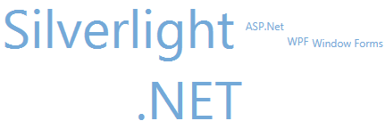

////

|metadata|
{
    "name": "xamtagcloud-working-with-scalebreaks-collection",
    "controlName": ["xamTagCloud"],
    "tags": ["How Do I","Layouts","Performance"],
    "guid": "{477692F9-5C72-4451-9BF8-4113594D3B9F}",  
    "buildFlags": [],
    "createdOn": "2016-05-25T18:21:59.5984066Z"
}
|metadata|
////

= Working with ScaleBreaks Collection

The xamTagCloud™ control contains a link:{ApiPlatform}controls.menus.xamtagcloud{ApiVersion}~infragistics.controls.menus.scalebreak.html[ScaleBreak] collection which allows you to group a range of weight values on the same scale break. For example, if you have a large collection of cloud items with a significant range of weight values, you could create a scale break to apply the same weight to all cloud items with a weight ranging from 1 to 50.

Each ScaleBreak contains the following properties:

* link:{ApiPlatform}controls.menus.xamtagcloud{ApiVersion}~infragistics.controls.menus.scalebreak~startweight.html[StartWeight] – this specifies the start range of weight value you want to apply the scale break to
* link:{ApiPlatform}controls.menus.xamtagcloud{ApiVersion}~infragistics.controls.menus.scalebreak~endweight.html[EndWeight] – this specifies the end range of weight values you want to apply the scale break to
* link:{ApiPlatform}controls.menus.xamtagcloud{ApiVersion}~infragistics.controls.menus.scalebreak~weight.html[Weight] – this specifies the weight you want to apply to the range of weight values specified by the StartWeight and EndWeight properties.

The following code demonstrates how set scale breaks.

*In XAML:*

----
<ig:XamTagCloud MaxScale="5" MinScale="1" x:Name="myTagCloud">
   <ig:XamTagCloud.ScaleBreaks>
      <ig:ScaleBreak StartWeight="1" EndWeight="5" Weight="1"/>
      <ig:ScaleBreak StartWeight="6" EndWeight="10" Weight="2"/>
   </ig:XamTagCloud.ScaleBreaks>
   …
</ig:XamTagCloud>
----

*In Visual Basic:*

----
Dim scaleBreak1 As New ScaleBreak With {.StartWeight = 1, .EndWeight = 5, .Weight = 1}
tagCloud.ScaleBreaks.Add(scaleBreak1)
Dim scaleBreak2 As New ScaleBreak With {.StartWeight = 6, .EndWeight = 10, .Weight = 2}
tagCloud.ScaleBreaks.Add(scaleBreak2)
----

*In C#:*

----
ScaleBreak scaleBreak1 = new ScaleBreak {StartWeight=1, EndWeight=5, Weight=1};
tagCloud.ScaleBreaks.Add(scaleBreak1);
ScaleBreak scaleBreak2 = new ScaleBreak {StartWeight=6, EndWeight=10, Weight=2};
tagCloud.ScaleBreaks.Add(scaleBreak2);
----

== *Related Topics*

link:xamtagcloud-add-cloud-items-to-xamtagcloud.html[Add Cloud Items to xamTagCloud]

link:xamtagcloud-add-navigation-uris-to-cloud-items2.html[Add Navigation URIs to Cloud Items]

link:xamtagcloud-add-spaces-between-cloud-items.html[Add Spaces Between Cloud Items]

link:xamtagcloud-xamtagcloud-events.html[xamTagCloud Events]

link:xamtagcloud-setting-minimum-and-maximum-scale-values.html[Setting Minimum and Maximum Scale Values]

link:xamtagcloud-smooth-scaling.html[Smooth Scaling]