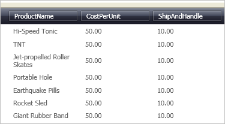

////
|metadata|
{
    "name": "xamtexteditor-using-xamtexteditor-as-a-field-in-xamdatagrid",
    "controlName": ["xamTextEditor"],
    "tags": ["Grids","How Do I"],
    "guid": "{31E5671A-A4E2-4A12-8773-31C480623615}",
    "buildFlags": [],
    "createdOn": "2012-09-05T19:05:30.2559781Z"
}
|metadata|
////

= Using xamTextEditor as a Field in xamDataGrid

An important feature of the xamTextEditor™ control is its ability to be embedded in a xamDataGrid™ link:{ApiPlatform}datapresenter{ApiVersion}~infragistics.windows.datapresenter.field.html[Field]. This feature allows your end user to take advantage of the editor's full potential while modifying a cell's value.

Follow these steps to display xamTextEditor in a Field of xamDataGrid.

[start=1]
. Create a Microsoft® Windows® Presentation Foundation Window or Page project.

[start=2]
. Place the following namespace declarations inside the opening Page or Window tag. These declarations allow you to reference xamDataGrid, xamTextEditor, and to define types (i.e. Int32, Boolean).
+
*In XAML:*
+
[source,xaml]
----
xmlns:igDP="http://infragistics.com/DataPresenter"
xmlns:igEditors="http://infragistics.com/Editors"
xmlns:sys="clr-namespace:System;assembly=mscorlib"
----

[start=3]
. Create a resource section defining an XmlDataProvider. The XmlDataProvider references the link:resources-employees.html[Employees] XML file. Place the following XAML inside the Grid Panel.
+
*In XAML:*
+
[source,xaml]
----
<Grid.Resources>
    <XmlDataProvider Source="../Data/Orders.xml" 
        x:Key="OrderData" XPath="/Orders" />
</Grid.Resources>
----

[start=4]
. Create an instance of XamDataGrid, name it, and set the DataSource property to the XmlDataProvider created in the previous step.
+
*In XAML:*
+
[source,xaml]
----
<igDP:XamDataGrid x:Name="XamDataGrid1" 
    DataSource="{Binding Source={StaticResource OrderData}, XPath=Order}">
    ...
</igDP:XamDataGrid>
----

[start=5]
. Set the link:{ApiPlatform}datapresenter{ApiVersion}~infragistics.windows.datapresenter.fieldlayoutsettings~autogeneratefields.html[AutoGenerateFields] property off the link:{ApiPlatform}datapresenter{ApiVersion}~infragistics.windows.datapresenter.fieldlayoutsettings.html[FieldLayoutSettings] object to False. Place the following XAML between the tags created in the previous step.
+
*In XAML:*
+
[source,xaml]
----
...
<igDP:XamDataGrid.FieldLayoutSettings>
    <igDP:FieldLayoutSettings AutoGenerateFields="False" />
</igDP:XamDataGrid.FieldLayoutSettings>
...
----

[start=6]
. The following XAML creates the Fields and sets the link:{ApiPlatform}datapresenter{ApiVersion}~infragistics.windows.datapresenter.fieldsettings.html[FieldSettings] link:{ApiPlatform}datapresenter{ApiVersion}~infragistics.windows.datapresenter.fieldsettings~editastype.html[EditAsType] and link:{ApiPlatform}datapresenter{ApiVersion}~infragistics.windows.datapresenter.fieldsettings~editortype.html[EditorType] properties for the first Field. Set the EditAsType property to String. The EditorType property defines what Type of link:{ApiPlatform}editors{ApiVersion}~infragistics.windows.editors.valueeditor.html[ValueEditor] to use. In this case, you are using the XamTextEditor. Place this code below the code in the previous step.
+
*In XAML:*
+
[source,xaml]
----
...
<igDP:XamDataGrid.FieldLayouts>
    <igDP:FieldLayout>
        <igDP:FieldLayout.Fields>
            <igDP:Field Name="ProductName" >
                <igDP:Field.Settings>
                    <igDP:FieldSettings 
                        EditAsType="{x:Type sys:String}" 
                        EditorType="{x:Type igEditors:XamTextEditor}" />
                </igDP:Field.Settings>
            </igDP:Field>
            <igDP:Field Name="CostPerUnit" />
            <igDP:Field Name="ShipAndHandle" />
        </igDP:FieldLayout.Fields>
    </igDP:FieldLayout>
</igDP:XamDataGrid.FieldLayouts>
...
----

[start=7]
. Build and run the project. You won't notice a difference when using xamTextEditor in a Field. However, if you retrieve the cell's value, you will notice a difference. If you were to place numeric data in xamTextEditor, the editor would return the number as a string. If you placed numeric data in a numeric editor, the editor would return the value in the type it is set to (i.e., Int32, Double).
+
