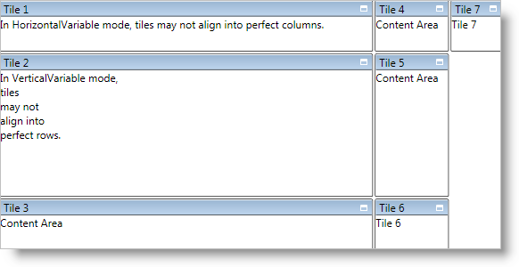

////

|metadata|
{
    "name": "xamtilemanager-about-tile-layout",
    "controlName": ["xamTileManager"],
    "tags": ["How Do I","Layouts"],
    "guid": "8ad6b825-c074-42b0-a710-6e54e71bf6f5",  
    "buildFlags": [],
    "createdOn": "2016-05-25T18:21:59.6623709Z"
}
|metadata|
////

= About Tile Layout

The xamTileManager™ arranges normal tiles like a vertical WrapPanel container. However, you can change this default behavior by setting the link:{ApiPlatform}controls.layouts.xamtilemanager.v{ProductVersion}~infragistics.controls.layouts.normalmodesettings~tilelayoutorder.html[TileLayoutOrder] property exposed by xamTileManager's link:{ApiPlatform}controls.layouts.xamtilemanager.v{ProductVersion}~infragistics.controls.layouts.xamtilemanager~normalmodesettings.html[NormalModeSettings] property to one of the following link:{ApiPlatform}controls.layouts.xamtilemanager.v{ProductVersion}~infragistics.controls.layouts.tilelayoutorder.html[TileLayoutOrder] enum values:

* *Horizontal* - Tiles are arranged left-to-right then top-to-bottom. Tiles will have a uniform height across individual rows and a uniform width down individual columns.

* *HorizontalVariable* - Tiles are arranged just like the Horizontal setting; however, tiles will have a uniform height across individual rows, but their widths can differ based on content.

* *Vertical* - Tiles are arranged top-to-bottom then left-to-right. Tiles will have a uniform height across individual rows and a uniform width down individual columns.

* *VerticalVariable* - Tiles are arranged just like the Vertical setting. However, tiles will have differing heights across individual rows based on content, but their widths will remain uniform down individual columns.

* *UseExplicitRowColumnOnTile* - You have full control over arranging tiles using a concept that is similar to the layout mechanism found in the Grid panel. This also allows you to create tiles of varying sizes.

In addition to the four layout options mentioned above, each link:{ApiPlatform}controls.layouts.xamtilemanager.v{ProductVersion}~infragistics.controls.layouts.xamtile.html[XamTile] object can set the XamTileManager's attached properties - link:{ApiPlatform}controls.layouts.xamtilemanager.v{ProductVersion}~infragistics.controls.layouts.xamtilemanager~columnweightproperty.html[ColumnWeight] and link:{ApiPlatform}controls.layouts.xamtilemanager.v{ProductVersion}~infragistics.controls.layouts.xamtilemanager~rowweightproperty.html[RowWeight] property. These properties determine how extra space or lack thereof is assigned to the tiles. By default, a tile is sized to fit its content. However, if you set the NormalModeSettings object's link:{ApiPlatform}controls.layouts.xamtilemanager.v{ProductVersion}~infragistics.controls.layouts.normalmodesettings~horizontaltileareaalignment.html[HorizontalTileAreaAlignment] or link:{ApiPlatform}controls.layouts.xamtilemanager.v{ProductVersion}~infragistics.controls.layouts.normalmodesettings~verticaltileareaalignment.html[VerticalTileAreaAlignment] properties to Stretch, xamTileManager will automatically resize tiles to fill up all the available space. If you do not set the ColumnWeight and RowWeight properties, xamTileManager distributes the space equally among all tiles. However, if you set the properties, xamTileManager only distributes the extra space to the tiles that specify a weight.

The ColumnWeight property acts as a percentage of the sum of column weights across tiles in a single row. The RowWeight property acts as a percent of the sum of row weights across tiles in a single column. For example, if you have four tiles in a single row and you set the first tile's ColumnWeight property to 1 and the second tile's ColumnWeight property to 2, xamTileManager will assign 1/3 of the extra width to the first tile and 2/3 of the extra width to the second tile. On the other hand, if xamTileManager has to reduce the size of the tiles, it resizes the first and second tile's width while maintaining the proper ratio; but it does not resize the other two tiles.

== Related Topics

link:xamtilemanager-add-tiles-to-xamtilemanager.html[Add Tiles to xamTileManager]

link:xamtilemanager-retrieve-a-reference-to-a-tile.html[Retrieve a Reference to a Tile]

link:xamtilemanager-change-the-state-of-a-tile.html[Change the State of a Tile]

link:xamtilemanager-about-saving-and-loading-layouts.html[About Saving and Loading Layouts]

link:xamtilemanager-about-tile-templates.html[About Tile Templates]

link:xamtilemanager-binding-xamtilemanager-to-data.html[Binding xamTileManager to Data]

link:xamtilemanager-explicitly-arrange-tiles.html[Explicitly Arrange Tiles]

link:xamtilemanager-allow-end-users-to-close-tiles.html[Allow End Users to Close Tiles]

link:xamtilemanager-restrict-a-tiles-size.html[Restrict a XamTile's Size]

link:xamtilemanager-modify-tile-behaviors-in-normal-mode.html[Modify Tile Behaviors in Normal Mode]

link:xamtilemanager-modify-tile-behaviors-in-maximized-mode.html[Modify Tile Behaviors in Maximized Mode]

link:xamtilemanager-about-animations.html[About Animations]