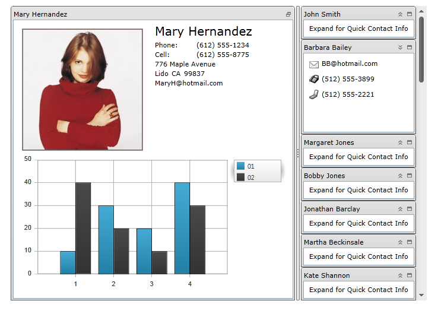

////

|metadata|
{
    "name": "xamtilemanager-about-xamtilemanager",
    "controlName": ["xamTileManager"],
    "tags": ["Data Presentation","Getting Started"],
    "guid": "445b0dff-4b40-4c57-95c2-acb53fc06a00",  
    "buildFlags": [],
    "createdOn": "2016-05-25T18:21:59.6184063Z"
}
|metadata|
////

= About xamTileManager

The xamTileManager™ displays content using rectangular tiles, which are arranged sequentially creating multiple rows of tiles. Your end users can maximize one or more tiles, which automatically minimizes the remaining tiles. However, the minimized tiles will remain in view along an edge of the control, so your end users can quickly maximize and shift their attention to new content.

The xamTileManager includes the following features:

* *Animations* - The xamTileManager has built-in animations that play during state transitions. You can supply your own animations to customize this experience.
* *Data Binding* - Since the xamTileManager is derived from the ItemsControl class, you can set its ItemsSource property to automatically create Tile objects for your data items.
* *Drag-and-Drop* - Your end users can drag tiles and rearrange them at run time.
* *Explicit Tile Layout* - You can arrange tiles into explicit columns and rows using concepts already found in the Grid panel (Column, Row, ColumnSpan and RowSpan).
* *Saving and Loading Layouts* - After your end users modify the layout at run time, you can save the changes and restore them between application sessions.
* *State-Based Item Templates* - You can define item templates based on the state of the tiles. The xamTileManager will automatically apply the proper item template as your end users change the state of a tile.
* *State-Based Size Constraints* - You can restrict the size of tiles based on their state.
* *Tile Resizing* - Your end users can resize tiles using resizing indicators.

== Related Topics

link:xamtilemanager-adding-xamtilemanager-to-your-application.html[Adding xamTileManager to Your Application]

link:xamtilemanager-using-xamtilemanager.html[Using xamTileManager]