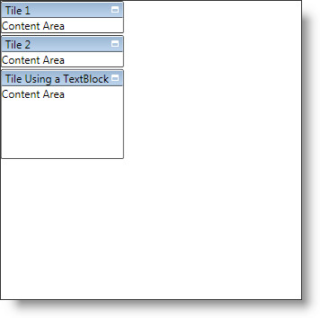

////

|metadata|
{
    "name": "xamtilemanager-add-tiles-to-xamtilemanager",
    "controlName": ["xamTileManager"],
    "tags": ["How Do I"],
    "guid": "3b9cebad-aacf-44d4-99ca-ace7e118df7f",  
    "buildFlags": [],
    "createdOn": "2016-05-25T18:21:59.6753715Z"
}
|metadata|
////

= Add Tiles to xamTileManager

The xamTileManager™ uses link:{ApiPlatform}controls.layouts.xamtilemanager{ApiVersion}~infragistics.controls.layouts.xamtile.html[XamTile] objects to display content. Each XamTile object is a content control that can display a single piece of content. In many cases, you will use a layout container, such as a Grid panel, as the root element -- adding additional elements to the layout container.

Before you can display content, you must add items to xamTileManager's link:{ApiPlatform}controls.layouts.xamtilemanager{ApiVersion}~infragistics.controls.layouts.xamtilemanager~items.html[Items] collection. The xamTileManager does not limit you to only adding XamTile objects. You can also add UIElements, DependencyObjects, and data items directly to the Items collection. If you add UIElements or DependencyObjects directly to the Items collection, you can set the attached properties exposed by xamTileManager to modify the resulting tile's layout.

If you add non-XamTile objects to xamTileManager's Items collection, you will not be able to set the tile's header directly. Instead, you must set xamTileManager's link:{ApiPlatform}controls.layouts.xamtilemanager{ApiVersion}~infragistics.controls.layouts.xamtilemanager~headerpath.html[HeaderPath] property to the name of a property exposed by your items. When the xamTileManager creates tiles for your items, it will use the value of the property specified as the header path.

The following example code demonstrates how to add tiles to xamTileManager. For more information on the constraints used in the example code, see link:xamtilemanager-restrict-a-tiles-size.html[Restrict a XamTile's Size].

*In XAML:*

----
<ig:XamTileManager Name="xamTileManager1" HeaderPath="Tag">    
    <ig:XamTile Header="Tile 1" Content="Content Area" />
    <ig:XamTile Header="Tile 2" Content="Content Area" />
    <!-- Since the HeaderPath is set to "Tag", you can set the Tag property of any UIElements in the collection to display a header in the resulting tile-->
    <TextBlock Text="Content Area" Tag="Tile Using a TextBlock">
        <ig:XamTileManager.Constraints>
            <ig:TileConstraints MinHeight="100" MinWidth="100" />
        </ig:XamTileManager.Constraints>
    </TextBlock>
</ig:XamTileManager>
----

*In Visual Basic:*

----
Imports Infragistics.Controls.Layouts
...
Dim tile1 As New XamTile With _
    {.Header = "Tile 1", .Content = "Content Area"}
Dim tile2 As New XamTile With _
    {.Header = "Tile 2", .Content = "Content Area"}
' Since the HeaderPath is set to "Tag", you can set the Tag
' property of any UIElements in the collection to display a
' header in the resulting tile
Dim textBlock1 As New TextBlock With _
    {.Text = "Content Area", .Tag = "Tile Using a TextBlock"}
Dim constraints1 As New TileConstraints With _
    {.MinHeight = 100, .MinWidth = 100}
XamTileManager.SetConstraints(textBlock1, constraints1)
Me.xamTileManager1.Items.Add(tile1)
Me.xamTileManager1.Items.Add(tile2)
Me.xamTileManager1.Items.Add(textBlock1)
...
----

*In C#:*

----
using Infragistics.Controls.Layouts;
...
XamTile tile1 = new XamTile
{
    Header = "Tile 1",
    Content = "Content Area"
};
XamTile tile2 = new XamTile
{
    Header = "Tile 2",
    Content = "Content Area"
};
// Since the HeaderPath is set to "Tag", you can set the Tag
// property of any UIElements in the collection to display a
// header in the resulting tile
TextBlock textBlock1 = new TextBlock
{
    Text = "Content Area",
    Tag = "Tile Using a TextBlock"
};
TileConstraints constraints1 = new TileConstraints
{
    MinHeight = 100,
    MinWidth = 100
};
XamTileManager.SetConstraints(textBlock1, constraints1);
this.xamTileManager1.Items.Add(tile1);
this.xamTileManager1.Items.Add(tile2);
this.xamTileManager1.Items.Add(textBlock1);
...
----

== Related Topics

link:xamtilemanager-about-tile-layout.html[About Tile Layout]

link:xamtilemanager-retrieve-a-reference-to-a-tile.html[Retrieve a Reference to a Tile]

link:xamtilemanager-change-the-state-of-a-tile.html[Change the State of a Tile]

link:xamtilemanager-about-saving-and-loading-layouts.html[About Saving and Loading Layouts]

link:xamtilemanager-about-tile-templates.html[About Tile Templates]

link:xamtilemanager-binding-xamtilemanager-to-data.html[Binding xamTileManager to Data]

link:xamtilemanager-explicitly-arrange-tiles.html[Explicitly Arrange Tiles]

link:xamtilemanager-allow-end-users-to-close-tiles.html[Allow End Users to Close Tiles]

link:xamtilemanager-restrict-a-tiles-size.html[Restrict a XamTile's Size]

link:xamtilemanager-modify-tile-behaviors-in-normal-mode.html[Modify Tile Behaviors in Normal Mode]

link:xamtilemanager-modify-tile-behaviors-in-maximized-mode.html[Modify Tile Behaviors in Maximized Mode]

link:xamtilemanager-about-animations.html[About Animations]