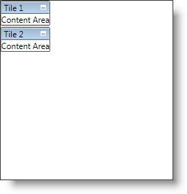

////

|metadata|
{
    "name": "xamtilemanager-adding-xamtilemanager-to-your-application",
    "controlName": ["xamTileManager"],
    "tags": ["Application Scenarios","Getting Started"],
    "guid": "6927aecc-b70a-4f9a-94d8-fd05aa78e555",  
    "buildFlags": [],
    "createdOn": "2016-05-25T18:21:59.6244063Z"
}
|metadata|
////

= Adding xamTileManager to Your Application

== Before You Begin

You can add xamTileManager™ to a page using a layout container and adding the control to the Children collection of the layout container.

== What You Will Accomplish

You will add xamTileManager to your page. When you run the finished project, you should see a xamTileManager in your page that looks similar to the screen shot below.

== Follow these Steps

[start=1]
. Create a {PlatformName} project.
[start=2]
. In the Solution Explorer, add the following references:

** {ApiPlatform}{ApiVersion}dll
** {ApiPlatform}Controls.Layouts.XamTileManager{ApiVersion}.dll

[start=3]
. Place using/Imports directives in your code-behind or add an XML namespace definition for xamTileManager.

*In XAML:*

----
xmlns:ig="http://schemas.infragistics.com/xaml"
----

*In Visual Basic:*

----
Imports Infragistics.Controls.Layouts
----

*In C#:*

----
using Infragistics.Controls.Layouts;
----

[start=4]
. Name the default Grid layout panel in the Page so that you can reference it in the code-behind.

*In XAML:*

----
<Grid Name="LayoutRoot">
</Grid>
----

[start=5]
. Add an instance of the xamTileManager to the default Grid layout panel. If you are doing this in procedural code, you can handle the Page Loaded event and place the code in the event handler.

*In XAML:*

----
<ig:XamTileManager Name="xamTileManager1">
    <!--TODO: Add XamTile objects here-->
</ig:XamTileManager>
----

*In Visual Basic:*

----
Dim xamTileManager1 As XamTileManager
Private Sub Loaded(ByVal sender As Object, ByVal e As RoutedEventArgs)
    xamTileManager1 = New XamTileManager()
    Me.LayoutRoot.Children.Add(xamTileManager1)
    ' TODO: Add XamTile objects to xamTileManager
End Sub
----

*In C#:*

----
private XamTileManager xamTileManager1;
private void Loaded(object sender, RoutedEventArgs e)
{
    xamTileManager1 = new XamTileManager();
    this.LayoutRoot.Children.Add(xamTileManager1);
    // TODO: Add XamTile objects to xamTileManager
}
----

[start=6]
. Add a link:{ApiPlatform}controls.layouts.xamtilemanager{ApiVersion}~infragistics.controls.layouts.xamtile.html[XamTile] object to xamTileManager's Items collection.

.. Set its link:{ApiPlatform}controls.layouts.xamtilemanager{ApiVersion}~infragistics.controls.layouts.xamtile~header.html[Header] property to "Tile 1".
.. Set its Content property "Content Area".

*In XAML:*

----
<ig:XamTile Header="Tile 1" Content="Content Area" />
----

*In Visual Basic:*

----
Dim tile1 As New XamTile With _
    {.Header = "Tile 1", .Content = "Content Area"}
Me.xamTileManager1.Items.Add(tile1)
----

*In C#:*

----
XamTile tile1 = new XamTile
{
    Header = "Tile 1",
    Content = "Content Area"
};
this.xamTileManager1.Items.Add(tile1);
----

[start=7]
. Add a second XamTile object to xamTileManager's Items collection.

.. Set its Header property to "Tile 2".
.. Set its Content property to "Content Area".

*In XAML:*

----
<ig:XamTile Header="Tile 2" Content="Content Area" />
----

*In Visual Basic:*

----
Dim tile2 As New XamTile With _
    {.Header = "Tile 2", .Content = "Content Area"}
Me.xamTileManager1.Items.Add(tile2)
----

*In C#:*

----
XamTile tile2 = new XamTile
{
    Header = "Tile 2",
    Content = "Content Area"
};
this.xamTileManager1.Items.Add(tile2);
----

[start=8]
. Run the project.

== Related Topics

link:xamtilemanager-about-xamtilemanager.html[About xamTileManager]

link:xamtilemanager-using-xamtilemanager.html[Using xamTileManager]