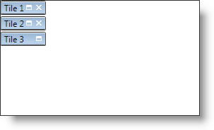

////

|metadata|
{
    "name": "xamtilemanager-allow-end-users-to-close-tiles",
    "controlName": ["xamTileManager"],
    "tags": ["Editing"],
    "guid": "ea0b537e-1f73-4bb7-b0b5-83df49137bd5",  
    "buildFlags": [],
    "createdOn": "2016-05-25T18:21:59.6813714Z"
}
|metadata|
////

= Allow End Users to Close Tiles

You can allow your end users to close tiles by setting the link:{ApiPlatform}controls.layouts.xamtilemanager.v{ProductVersion}~infragistics.controls.layouts.xamtilemanager~tilecloseaction.html[TileCloseAction] property exposed by link:{ApiPlatform}controls.layouts.xamtilemanager.v{ProductVersion}~infragistics.controls.layouts.xamtilemanager.html[xamTileManager] or the link:{ApiPlatform}controls.layouts.xamtilemanager.v{ProductVersion}~infragistics.controls.layouts.xamtile~closeaction.html[CloseAction] property exposed by a link:{ApiPlatform}controls.layouts.xamtilemanager.v{ProductVersion}~infragistics.controls.layouts.xamtile.html[XamTile] object. The CloseAction property of a XamTile object will override the TileCloseAction property of the xamTileManager. If you set the TileCloseAction property or CloseAction property to RemoveItem, xamTileManager will attempt to remove the item from its Items collection (unbound scenario) or the underlying data source (data-bound scenario). If the collection does not support removal, xamTileManager will hide the tile instead.

If you want to allow your end users to re-open closed tiles, you must provide a way to do it. For example code on re-opening closed tiles look at the "Tile Closing Actions" sample in the xamTileManager samples.

Finally, each XamTile object also exposes a link:{ApiPlatform}controls.layouts.xamtilemanager.v{ProductVersion}~infragistics.controls.layouts.xamtile~closebuttonvisibility.html[CloseButtonVisibility] property that you can set to hide the close button. However, setting the CloseAction property will automatically toggle the close button's visibility.

The following example code demonstrates how to allow end users to close tiles.

*In XAML:*

----
<ig:XamTileManager Name="xamTileManager1" TileCloseAction="CollapseTile">
    <ig:XamTile Header="Tile 1" />
    <ig:XamTile Header="Tile 2" />
    <ig:XamTile Header="Tile 3" CloseAction="DoNothing" />
</ig:XamTileManager>
----

*In Visual Basic:*

----
Imports Infragistics.Controls.Layouts
...
Me.xamTileManager1.TileCloseAction = TileCloseAction.CollapseTile
Dim nonClosableTile As Tile = _
    xamTilesControl1.TileFromItem(xamTilesControl1.Items(2))
If nonClosableTile IsNot Nothing Then
    nonClosableTile.CloseAction = TileCloseAction.DoNothing
End If
...
----

*In C#:*

----
using Infragistics.Controls.Layouts;
...
this.xamTileManager1.TileCloseAction = TileCloseAction.CollapseTile;
XamTile nonClosableTile =
    this.xamTilesControl1.TileFromItem(xamTilesControl1.Items[2]);
if (nonClosableTile != null)
{ 
    nonClosableTile.CloseAction = TileCloseAction.DoNothing;
}
...
----

== Related Topics

link:xamtilemanager-about-tile-layout.html[About Tile Layout]

link:xamtilemanager-add-tiles-to-xamtilemanager.html[Add Tiles to xamTileManager]

link:xamtilemanager-retrieve-a-reference-to-a-tile.html[Retrieve a Reference to a Tile]

link:xamtilemanager-change-the-state-of-a-tile.html[Change the State of a Tile]

link:xamtilemanager-about-saving-and-loading-layouts.html[About Saving and Loading Layouts]

link:xamtilemanager-about-tile-templates.html[About Tile Templates]

link:xamtilemanager-binding-xamtilemanager-to-data.html[Binding xamTileManager to Data]

link:xamtilemanager-explicitly-arrange-tiles.html[Explicitly Arrange Tiles]

link:xamtilemanager-restrict-a-tiles-size.html[Restrict a XamTile's Size]

link:xamtilemanager-modify-tile-behaviors-in-normal-mode.html[Modify Tile Behaviors in Normal Mode]

link:xamtilemanager-modify-tile-behaviors-in-maximized-mode.html[Modify Tile Behaviors in Maximized Mode]

link:xamtilemanager-about-animations.html[About Animations]