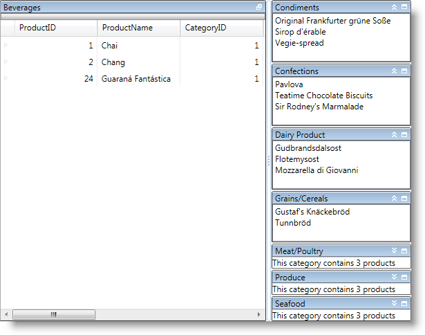

////

|metadata|
{
    "name": "xamtilemanager-binding-xamtilemanager-to-data",
    "controlName": ["xamTileManager"],
    "tags": ["Data Binding"],
    "guid": "4cc111d0-16b6-488c-9807-7d487632f71d",  
    "buildFlags": [],
    "createdOn": "2016-05-25T18:21:59.7253744Z"
}
|metadata|
////

= Binding xamTileManager to Data

== Before You Begin

You can add tiles to xamTileManager™ by binding to a data source or by adding objects directly to the Items collection. However, just like any XAML data-bound control, you must choose between binding xamTileManager to a data source and adding items directly to the Items collection; *you cannot do both* .

When you bind xamTileManager to data, it will create a link:{ApiPlatform}controls.layouts.xamtilemanager.v{ProductVersion}~infragistics.controls.layouts.xamtile.html[XamTile] object for each root-level data item in your data source. However, you must create data templates that define the visual tree of the XamTile object.

== What You Will Accomplish

You will bind xamTileManager to a collection of category data items to create a tile for each category. Each tile will display a category's name in its header. The content in each tile will be different based on the tile's state. In normal mode, a tile will display the category's description. In maximized mode, a tile will display a list of products using the xamGrid™ control. In minimized mode, a tile will display the number of products contained in a category. Finally, in minimized-expanded mode, a tile will display a list of product names that belong to the category.

The link:resources-datautil.html[DataUtil] class is provided for you in C# and VB.NET for you to copy and use in your project while working through this topic.

When you run the project, you should see a xamTileManager that looks similar to the screen shot below.

== Follow these Steps

[start=1]
. Add a copy of the link:resources-datautil.html[DataUtil] class to your project.
[start=2]
. Add tags for the page's resource dictionary.

*In XAML:*

----
<Page.Resources>
    <!-- TODO: Add data templates here-->
</Page.Resources>
----

[start=3]
. Add a DataTemplate object to the resource dictionary. You will use this template for tiles that are in the normal state.

** Set its Key property to normalTemplate.
** Add a TextBlock control to the data template and bind its Text property to the Category object's Description property.

*In XAML:*

----
<DataTemplate x:Key="normalTemplate"> 
    <TextBlock Text="{Binding Description}" />
</DataTemplate>
----

[start=4]
. Add a second DataTemplate object to the resource dictionary. You will use this template for tiles that are in the maximized state.

** Set its Key property to maximizedTemplate.
** Add a xamGrid control to the data template and bind its ItemsSource property to the Category object's Products collection. If you information on the assemblies and namespaces required for using xamGrid, read link:xamgrid-adding-xamgrid-to-your-page.html[Adding xamGrid to Your Page].

*In XAML:*

----
<DataTemplate x:Key="maximizedTemplate"> 
    <ig:XamGrid ItemsSource="{Binding Products}" />
</DataTemplate>
----

[start=5]
. Add a third DataTemplate object to the resource dictionary. You will use this template for tiles that are in the minimized state.

** Set its Key property to minimizedTemplate.
** Add a TextBlock control to the data template and bind its Text property to the Count property of the Products collection.

*In XAML:*

----
<DataTemplate x:Key="minimizedTemplate"> 
    <TextBlock Text="{Binding Products.Count,
            StringFormat=This category contains {0} products}" />
</DataTemplate>
----

[start=6]
. Add a fourth DataTemplate object to the resource dictionary. You will use this template for tiles that are in the minimized-expanded state.

** Set its Key property to minimizedExpandedTemplate.
** Add a ListBox control to the data template.

*** Set its ItemsSource property to the Products collection.
*** Set its DisplayMemberPath property to ProductName.

*In XAML:*

----
<DataTemplate x:Key="minimizedExpandedTemplate">
    <ListBox ItemsSource="{Binding Products}"
        DisplayMemberPath="ProductName" />    
</DataTemplate>
----

[start=7]
. Add a xamTileManager to the default Grid panel.

** Set its ItemsSource property to the CategoriesAndProducts property exposed by the DataUtil class.
** Set its link:{ApiPlatform}controls.layouts.xamtilemanager.v{ProductVersion}~infragistics.controls.layouts.xamtilemanager~headerpath.html[HeaderPath] property to CategoryName.
** Set its ItemTemplate property to the normal template defined in step 3.
** Set its link:{ApiPlatform}controls.layouts.xamtilemanager.v{ProductVersion}~infragistics.controls.layouts.xamtilemanager~itemtemplatemaximized.html[ItemTemplateMaximized] property to the maximized template defined in step 4.
** Set its link:{ApiPlatform}controls.layouts.xamtilemanager.v{ProductVersion}~infragistics.controls.layouts.xamtilemanager~itemtemplateminimized.html[ItemTemplateMinimized] property to the minimized template defined in step 5.
** Set its link:{ApiPlatform}controls.layouts.xamtilemanager.v{ProductVersion}~infragistics.controls.layouts.xamtilemanager~itemtemplateminimizedexpanded.html[ItemTemplateMinimizedExpanded] property to the minimized-expanded template defined in step 6.

*In XAML:*

----
<ig:XamTileManager 
    xmlns:data="clr-namespace:IGDocumentation" 
    Name="xamTileManager1" 
    ItemsSource="{Binding Source={x:Static data:DataUtil.CategoriesAndProducts}}" 
    HeaderPath="CategoryName" 
    ItemTemplate="{StaticResource normalTemplate}" 
    ItemTemplateMaximized="{StaticResource maximizedTemplate}" 
    ItemTemplateMinimized="{StaticResource minimizedTemplate}" 
    ItemTemplateMinimizedExpanded="{StaticResource minimizedExpandedTemplate}">
</ig:XamTileManager>
----

*In Visual Basic:*

----
Me.xamTileManager1.ItemsSource = DataUtil.CategoriesAndProducts;
Me.xamTileManager1.HeaderPath = "CategoryName"
Me.xamTileManager1.ItemTemplate = _
    TryCast(Me.Resources("normalTemplate"), DataTemplate)
Me.xamTileManager1.ItemTemplateMaximized = _
    TryCast(Me.Resources("maximizedTemplate"), DataTemplate)
Me.xamTileManager1.ItemTemplateMinimized = _
    TryCast(Me.Resources("minimizedTemplate"), DataTemplate)
Me.xamTileManager1.ItemTemplateMinimizedExpanded = _
    TryCast(Me.Resources("minimizedExpandedTemplate"), DataTemplate)
----

*In C#:*

----
this.xamTileManager1.ItemsSource = IGDocumentation.DataUtil.CategoriesAndProducts;
this.xamTileManager1.HeaderPath= "CategoryName";
this.xamTileManager1.ItemTemplate =
    this.Resources["normalTemplate"] as DataTemplate;
this.xamTileManager1.ItemTemplateMaximized =
    this.Resources["maximizedTemplate"] as DataTemplate;
this.xamTileManager1.ItemTemplateMinimized =
    this.Resources["minimizedTemplate"] as DataTemplate;
this.xamTileManager1.ItemTemplateMinimizedExpanded =
    this.Resources["minimizedExpandedTemplate"] as DataTemplate;
----

[start=8]
. Run the project.

== Related Topics

link:xamtilemanager-about-tile-layout.html[About Tile Layout]

link:xamtilemanager-add-tiles-to-xamtilemanager.html[Add Tiles to xamTileManager]

link:xamtilemanager-retrieve-a-reference-to-a-tile.html[Retrieve a Reference to a Tile]

link:xamtilemanager-change-the-state-of-a-tile.html[Change the State of a Tile]

link:xamtilemanager-about-saving-and-loading-layouts.html[About Saving and Loading Layouts]

link:xamtilemanager-about-tile-templates.html[About Tile Templates]

link:xamtilemanager-explicitly-arrange-tiles.html[Explicitly Arrange Tiles]

link:xamtilemanager-allow-end-users-to-close-tiles.html[Allow End Users to Close Tiles]

link:xamtilemanager-restrict-a-tiles-size.html[Restrict a XamTile's Size]

link:xamtilemanager-modify-tile-behaviors-in-normal-mode.html[Modify Tile Behaviors in Normal Mode]

link:xamtilemanager-modify-tile-behaviors-in-maximized-mode.html[Modify Tile Behaviors in Maximized Mode]

link:xamtilemanager-about-animations.html[About Animations]