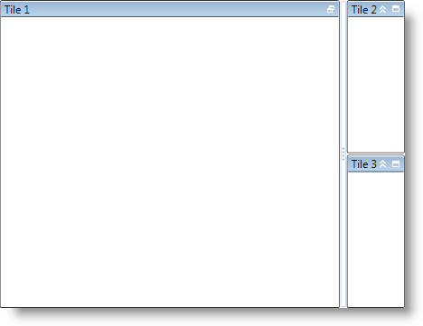

////

|metadata|
{
    "name": "xamtilemanager-change-the-state-of-a-tile",
    "controlName": ["xamTileManager"],
    "tags": ["How Do I"],
    "guid": "d7a975f7-8cf1-4455-b86c-9e6cd47cb715",  
    "buildFlags": [],
    "createdOn": "2016-05-25T18:21:59.6364092Z"
}
|metadata|
////

= Change the State of a Tile

A link:{ApiPlatform}controls.layouts.xamtilemanager{ApiVersion}~infragistics.controls.layouts.xamtile.html[XamTile] object can be in one of four states at any given time -- Normal, Maximized, Minimized, or MinimizedExpanded. Based on the state of its tiles, the xamTileManager™ can be in one of two 'modes'; maximized or normal mode. Normal mode only contains normal tiles; while maximized mode contains one or more maximized tiles with the remaining minimized or minimized-expanded tiles aligned to an edge of the control. Most of the time, your end users will interact with a tile to change its state, which can be obtained from the read-only property link:{ApiPlatform}controls.layouts.xamtilemanager{ApiVersion}~infragistics.controls.layouts.xamtile~state.html[State]; however, you can also change the state of a tile in XAML or in the code-behind by setting several of the XamTile object's properties - link:{ApiPlatform}controls.layouts.xamtilemanager{ApiVersion}~infragistics.controls.layouts.xamtile~isexpandedwhenminimized.html[IsExpandedWhenMinimized], link:{ApiPlatform}controls.layouts.xamtilemanager{ApiVersion}~infragistics.controls.layouts.xamtile~ismaximized.html[IsMaximized]. Please refer to the "Tile State" sample to see how to change a tile state using commands.

When changing a XamTile state, you should be aware of the following behaviors when changing a tile's state:

* You cannot change a normal tile to a minimized or a minimized-expanded state. Instead, you must set the state of a different tile to Maximized, which will minimize the remaining tiles.
* If you limit the number of maximized tiles to one, you cannot change the maximized tile to a minimized or minimized-expanded state. Instead, you must set a minimized or minimized-expanded tile's state to Maximized. However, this does not apply when you have two or more maximized tiles.
* You cannot explicitly change a minimized or minimized-expanded tile to a normal state. Instead, you must set the IsMaximized property of all maximized tiles to *False* or execute the link:{ApiPlatform}controls.layouts.xamtilemanager{ApiVersion}~infragistics.controls.layouts.tilecommandtype.html[ToggleMaximized] command for all maximized tiles.
* You can toggle between the minimized or minimized-expanded state if a tile has been minimized using the IsExpandedWhenMinimized property or by executing the link:{ApiPlatform}controls.layouts.xamtilemanager{ApiVersion}~infragistics.controls.layouts.tilecommandtype.html[ToggleMinimizedExpansion] command.

The following example code demonstrates how to change the state of a tile.

*In XAML:*

----
<ig:XamTileManager Name="xamTileManager1">
    <ig:XamTile Header="Tile 1" IsMaximized="True" />
    <ig:XamTile Header="Tile 2" />
    <ig:XamTile Header="Tile 3" />
</ig:XamTileManager>
----

*In Visual Basic:*

----
Imports Infragistics.Controls.Layouts
...
Dim tileToMaximize = _
    Me.xamTileManager1.TileFromItem(Me.xamTileManager1.Items(0))
If tileToMaximize IsNot Nothing Then
    tileToMaximize.IsMaximized = True
End If
...
----

*In C#:*

----
using Infragistics.Controls.Layouts;
...
XamTile tileToMaximize =
    this.xamTileManager1.TileFromItem(this.xamTileManager1.Items[0]);
if (tileToMaximize != null)
{
    tileToMaximize.IsMaximized = true;
}
...
----

== Related Topics

link:xamtilemanager-about-tile-layout.html[About Tile Layout]

link:xamtilemanager-add-tiles-to-xamtilemanager.html[Add Tiles to xamTileManager]

link:xamtilemanager-retrieve-a-reference-to-a-tile.html[Retrieve a Reference to a Tile]

link:xamtilemanager-about-saving-and-loading-layouts.html[About Saving and Loading Layouts]

link:xamtilemanager-about-tile-templates.html[About Tile Templates]

link:xamtilemanager-binding-xamtilemanager-to-data.html[Binding xamTileManager to Data]

link:xamtilemanager-explicitly-arrange-tiles.html[Explicitly Arrange Tiles]

link:xamtilemanager-allow-end-users-to-close-tiles.html[Allow End Users to Close Tiles]

link:xamtilemanager-restrict-a-tiles-size.html[Restrict a XamTile's Size]

link:xamtilemanager-modify-tile-behaviors-in-normal-mode.html[Modify Tile Behaviors in Normal Mode]

link:xamtilemanager-modify-tile-behaviors-in-maximized-mode.html[Modify Tile Behaviors in Maximized Mode]

link:xamtilemanager-about-animations.html[About Animations]