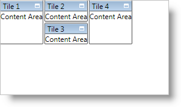

////

|metadata|
{
    "name": "xamtilemanager-explicitly-arrange-tiles",
    "controlName": ["xamTileManager"],
    "tags": ["How Do I"],
    "guid": "a80bfc2c-a244-4027-b64e-bb2c6e390f91",  
    "buildFlags": [],
    "createdOn": "2016-05-25T18:21:59.6423784Z"
}
|metadata|
////

= Explicitly Arrange Tiles

When you set the link:{ApiPlatform}controls.layouts.xamtilemanager{ApiVersion}~infragistics.controls.layouts.normalmodesettings.html[NormalModeSettings] object's link:{ApiPlatform}controls.layouts.xamtilemanager{ApiVersion}~infragistics.controls.layouts.normalmodesettings~tilelayoutorder.html[TileLayoutOrder] property to UseExplicitRowColumnOnTile, you are responsible for arranging link:{ApiPlatform}controls.layouts.xamtilemanager{ApiVersion}~infragistics.controls.layouts.xamtile.html[XamTile] objects into columns and rows by setting the XamTileManager's attached properties - link:{ApiPlatform}controls.layouts.xamtilemanager{ApiVersion}~infragistics.controls.layouts.xamtilemanager~columnproperty.html[Column], link:{ApiPlatform}controls.layouts.xamtilemanager{ApiVersion}~infragistics.controls.layouts.xamtilemanager~columnspanproperty.html[ColumnSpan], link:{ApiPlatform}controls.layouts.xamtilemanager{ApiVersion}~infragistics.controls.layouts.xamtilemanager~rowproperty.html[Row] and link:{ApiPlatform}controls.layouts.xamtilemanager{ApiVersion}~infragistics.controls.layouts.xamtilemanager~rowspanproperty.html[RowSpan]. The Column, ColumnSpan, Row and RowSpan properties work just like their Grid panel counterparts. If you do not set a value for these properties, they will default to 0 just like the Grid panel. This will cause xamTileManager to stack all tiles on top of each other in the upper left-hand corner.

The following example code demonstrates how to explicitly arrange tiles.

*In XAML:*

----
<ig:XamTileManager Name="xamTileManager1">
    <!--Enable explicit layout-->
    <ig:XamTileManager.NormalModeSettings>
        <ig:NormalModeSettings
            TileLayoutOrder="UseExplicitRowColumnOnTile" />
    </ig:XamTileManager.NormalModeSettings>
    <ig:XamTile Header="Tile 1" Content="Content Area"
        ig:XamTileManager.Column="0"
        ig:XamTileManager.Row="0"
        ig:XamTileManager.RowSpan="4"
        ig:XamTileManager.ColumnSpan="1" />
    <ig:XamTile Header="Tile 2" Content="Content Area"
        ig:XamTileManager.Column="1"
        ig:XamTileManager.Row="0"
        ig:XamTileManager.RowSpan="2"
        ig:XamTileManager.ColumnSpan="2" />
    <ig:XamTile Header="Tile 3" Content="Content Area"
        ig:XamTileManager.Column="1"
        ig:XamTileManager.Row="2"
        ig:XamTileManager.RowSpan="2"
        ig:XamTileManager.ColumnSpan="2" />
    <ig:XamTile Header="Tile 4" Content="Content Area"
        ig:XamTileManager.Column="3"
        ig:XamTileManager.Row="0"
        ig:XamTileManager.RowSpan="4"
        ig:XamTileManager.ColumnSpan="1" />
</ig:XamTileManager>
----

*In Visual Basic:*

----
Imports Infragistics.Controls.Layouts
...
Me.xamTileManager1.NormalModeSettings.TileLayoutOrder = _
    TileLayoutOrder.UseExplicitRowColumnOnTile
Dim tile1 As New XamTile With _
    {.Header = "Tile 1", .Content = "Content Area"}
XamTileManager.SetColumn(tile1, 0)
XamTileManager.SetRow(tile1, 0)
XamTileManager.SetRowSpan(tile1, 4)
XamTileManager.SetColumnSpan(tile1, 4)
Dim tile2 As New XamTile With _
    {.Header = "Tile 2", .Content = "Content Area"}
XamTileManager.SetColumn(tile1, 1)
XamTileManager.SetRow(tile1, 0)
XamTileManager.SetRowSpan(tile1, 2)
XamTileManager.SetColumnSpan(tile1, 2)
Dim tile3 As New XamTile With _
    {.Header = "Tile 3", .Content = "Content Area"}
XamTileManager.SetColumn(tile1, 1)
XamTileManager.SetRow(tile1, 2)
XamTileManager.SetRowSpan(tile1, 2)
XamTileManager.SetColumnSpan(tile1, 2)
Dim tile4 As New XamTile With _
    {.Header = "Tile 4", .Content = "Content Area"}
XamTileManager.SetColumn(tile1, 3)
XamTileManager.SetRow(tile1, 0)
XamTileManager.SetRowSpan(tile1, 4)
XamTileManager.SetColumnSpan(tile1, 1)
Me.xamTileManager1.Items.Add(tile1)
Me.xamTileManager1.Items.Add(tile2)
Me.xamTileManager1.Items.Add(tile3)
Me.xamTileManager1.Items.Add(tile4)
...
----

*In C#:*

----
using Infragistics.Controls.Layouts;
...
this.xamTileManager1.NormalModeSettings.TileLayoutOrder =
    TileLayoutOrder.UseExplicitRowColumnOnTile;
XamTile tile1 = new XamTile
{
    Header = "Tile 1",
    Content = "Content Area"
};
XamTileManager.SetColumn(tile1, 0);
XamTileManager.SetRow(tile1, 0);
XamTileManager.SetRowSpan(tile1, 4);
XamTileManager.SetColumnSpan(tile1, 4);
XamTile tile2 = new XamTile
{
    Header = "Tile 2",
    Content = "Content Area"
};
XamTileManager.SetColumn(tile1, 1);
XamTileManager.SetRow(tile1, 0);
XamTileManager.SetRowSpan(tile1, 2);
XamTileManager.SetColumnSpan(tile1, 2);
XamTile tile3 = new XamTile
{
    Header = "Tile 3",
    Content = "Content Area"
};
XamTileManager.SetColumn(tile1, 1);
XamTileManager.SetRow(tile1, 2);
XamTileManager.SetRowSpan(tile1, 2);
XamTileManager.SetColumnSpan(tile1, 2);
XamTile tile4 = new XamTile
{
    Header = "Tile 4",
    Content = "Content Area"
};
XamTileManager.SetColumn(tile1, 3);
XamTileManager.SetRow(tile1, 0);
XamTileManager.SetRowSpan(tile1, 4);
XamTileManager.SetColumnSpan(tile1, 1);
this.xamTileManager1.Items.Add(tile1);
this.xamTileManager1.Items.Add(tile2);
this.xamTileManager1.Items.Add(tile3);
this.xamTileManager1.Items.Add(tile4);
...
----

== Related Topics

link:xamtilemanager-about-tile-layout.html[About Tile Layout]

link:xamtilemanager-add-tiles-to-xamtilemanager.html[Add Tiles to xamTileManager]

link:xamtilemanager-retrieve-a-reference-to-a-tile.html[Retrieve a Reference to a Tile]

link:xamtilemanager-change-the-state-of-a-tile.html[Change the State of a Tile]

link:xamtilemanager-about-saving-and-loading-layouts.html[About Saving and Loading Layouts]

link:xamtilemanager-about-tile-templates.html[About Tile Templates]

link:xamtilemanager-binding-xamtilemanager-to-data.html[Binding xamTileManager to Data]

link:xamtilemanager-allow-end-users-to-close-tiles.html[Allow End Users to Close Tiles]

link:xamtilemanager-restrict-a-tiles-size.html[Restrict a XamTile's Size]

link:xamtilemanager-modify-tile-behaviors-in-normal-mode.html[Modify Tile Behaviors in Normal Mode]

link:xamtilemanager-modify-tile-behaviors-in-maximized-mode.html[Modify Tile Behaviors in Maximized Mode]

link:xamtilemanager-about-animations.html[About Animations]