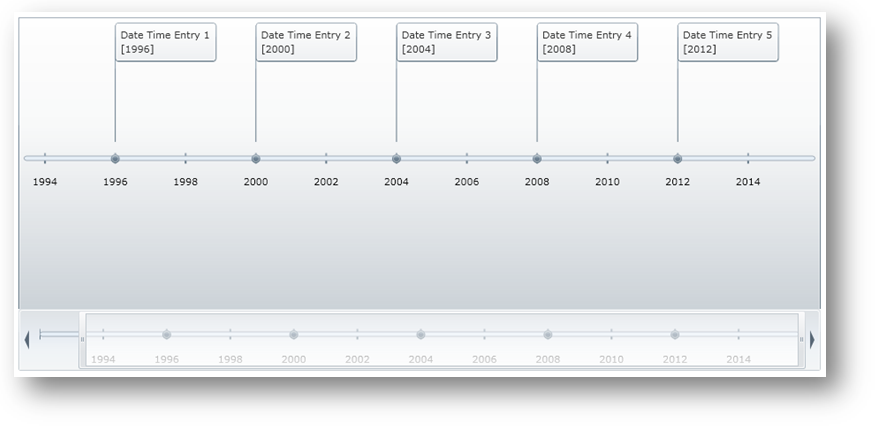

////
|metadata|
{
    "name": "xamtimeline-about-date-time-series",
    "controlName": ["xamTimeline"],
    "tags": ["Data Presentation","How Do I"],
    "guid": "{DF6E7CC5-204A-4C7B-BEB7-23C42CD2474D}",
    "buildFlags": [],
    "createdOn": "2016-05-25T18:22:00.0763946Z"
}
|metadata|
////

= About Date Time Series

*DateTime Values*

The xamTimeline™ control allows you to create a timeline through the link:{ApiPlatform}controls.timelines.xamtimeline.v{ProductVersion}~infragistics.controls.timelines.datetimeseries.html[DateTimeSeries] object using DateTime data. This data may be bound to xamTimeline or entered manually at runtime. The link:{ApiPlatform}controls.timelines.xamtimeline.v{ProductVersion}~infragistics.controls.timelines.datetimeentry.html[DateTimeEntry] object’s link:{ApiPlatform}controls.timelines.xamtimeline.v{ProductVersion}~infragistics.controls.timelines.datetimeentry~time.html[Time] property accepts the DateTime data. When setting this value in XAML, you may supply a space-delimited string of the date followed by the time. The date and time values you enter can be any string in any combination ( date, time, or date and time ) that can be parsed into a DateTime value.

*Displaying Values*

The DateTimeSeries object’s event values may be displayed in any manner that you want using string formatting. You can display any DateTime value parts such as just the day, month, or year. For more information, see link:xamtimeline-format-datetime-values.html[Format Date Time Values].

*Minimum and Maximum Values*

It is important to specify the Minimum and Maximum values when working with DateTime data; most of the time using the default axis values will end up cluttering the display with data points or widely disperse them, making the display undesirable to view. The link:{ApiPlatform}controls.timelines.xamtimeline.v{ProductVersion}~infragistics.controls.timelines.datetimeseries~mintime.html[MinTime] and link:{ApiPlatform}controls.timelines.xamtimeline.v{ProductVersion}~infragistics.controls.timelines.datetimeseries~maxtime.html[MaxTime] properties accept DateTime values and follow the same concept as the Time property when setting them in XAML. For a cleaner display, in addition to setting the Minimum and Maximum values, you can set link:{ApiPlatform}datavisualization.v{ProductVersion}~infragistics.axisbase~autorange.html[AutoRange] to False and the link:{ApiPlatform}controls.timelines.xamtimeline.v{ProductVersion}~infragistics.controls.timelines.timelineaxis~unit.html[Unit] and link:{ApiPlatform}controls.timelines.xamtimeline.v{ProductVersion}~infragistics.controls.timelines.datetimeaxis~unittype.html[UnitType] properties of the link:{ApiPlatform}controls.timelines.xamtimeline.v{ProductVersion}~infragistics.controls.timelines.datetimeaxis.html[DateTimeAxis] object. This allows you to specify your own range of values.

*Unit Types*

Since the DateTime values may be ordered in a matter of ways, it is important that you set the DateTimeAxis object’s Unit and UnitType properties in order to designate the range for the timeline. For example, the data of your timeline could be both dates and time, but it may be more visually appealing to display the values based on 6 month segments. In this case, you would set UnitType to be "Months" and Unit to 6.

*Duration*

Similarly, when setting the link:{ApiPlatform}controls.timelines.xamtimeline.v{ProductVersion}~infragistics.controls.timelines.datetimeentry~duration.html[Duration] for a DateTime entry, it is important that the value makes sense with the UnitType. The Duration is a TimeSpan in which you may set values in terms of days or hours, minutes and seconds; therefore, if you have a really big UnitType such as Year, and the Duration is in hours, you will not be able to see the span. For more information, see link:xamtimeline-set-duration-in-date-time-series.html[Set Duration for Date Time Series].

== Related Topics

link:xamtimeline-display-date-time-series.html[Displaying DateTimeSeries]

link:xamtimeline-set-duration-in-date-time-series.html[Set Duration in DateTimeSeries]