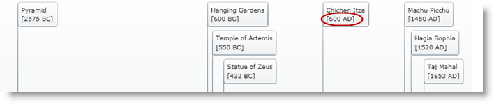
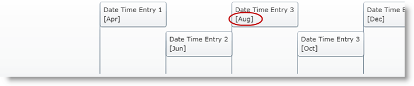
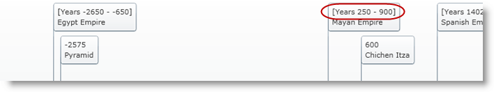

////
|metadata|
{
    "name": "xamtimeline-about-formatting-xamwebtimeline",
    "controlName": ["xamTimeline"],
    "tags": ["Data Presentation"],
    "guid": "{66EB0682-13DB-4769-8B04-95E2BC0844D0}",
    "buildFlags": [],
    "createdOn": "2016-05-25T18:22:00.0364001Z"
}
|metadata|
////

= Formatting Timeline

The xamTimeline™ control accepts the standard .NET format strings to format the dates and numbers that it displays. This allows you to have a custom display that meets your requirements. The link:{ApiPlatform}controls.timelines.xamtimeline{ApiVersion}~infragistics.controls.timelines.numerictimeseries.html[NumericTimeSeries] and link:{ApiPlatform}controls.timelines.xamtimeline{ApiVersion}~infragistics.controls.timelines.datetimeseries.html[DateTimeSeries] objects' EventTitle and the link:{ApiPlatform}controls.timelines.xamtimeline{ApiVersion}~infragistics.controls.timelines.numerictimeaxis.html[NumericTimeAxis] or link:{ApiPlatform}controls.timelines.xamtimeline{ApiVersion}~infragistics.controls.timelines.datetimeaxis.html[DateTimeAxis] objects' link:{ApiPlatform}controls.timelines.xamtimeline{ApiVersion}~infragistics.controls.timelines.axislabel.html[AxisLabel] properties are prime candidates where formatting applies.

Formatting in xamTimeline is done through the use of Styles and is set through the link:{ApiPlatform}controls.timelines.xamtimeline{ApiVersion}~infragistics.controls.timelines.timelineaxis.html[Axis] for both the Axis label and event title. This means that the event title of your time series will take on the format you set for the Axis label.

The following list represents the properties to set in order to format DateTime values for the EventTitle and AxisLabel properties:

* link:{ApiPlatform}controls.timelines.xamtimeline{ApiVersion}~infragistics.controls.timelines.axislabel~yearsunitstringformat.html[YearsUnitStringFormat]
* link:{ApiPlatform}controls.timelines.xamtimeline{ApiVersion}~infragistics.controls.timelines.axislabel~monthsunitstringformat.html[MonthsUnitStringFormat]
* link:{ApiPlatform}controls.timelines.xamtimeline{ApiVersion}~infragistics.controls.timelines.axislabel~weeksunitstringformat.html[WeeksUnitStringFormat]
* link:{ApiPlatform}controls.timelines.xamtimeline{ApiVersion}~infragistics.controls.timelines.axislabel~daysunitstringformat.html[DaysUnitStringFormat]
* link:{ApiPlatform}controls.timelines.xamtimeline{ApiVersion}~infragistics.controls.timelines.axislabel~hoursunitstringformat.html[HoursUnitStringFormat]
* link:{ApiPlatform}controls.timelines.xamtimeline{ApiVersion}~infragistics.controls.timelines.axislabel~minutesunitstringformat.html[MinutesUnitStringFormat]
* link:{ApiPlatform}controls.timelines.xamtimeline{ApiVersion}~infragistics.controls.timelines.axislabel~secondsunitstringformat.html[SecondsUnitStringFormat]
* link:{ApiPlatform}controls.timelines.xamtimeline{ApiVersion}~infragistics.controls.timelines.axislabel~millisecondsunitstringformat.html[MillisecondsUnitStringFormat]

The xamTimeline control uses one of the above formats depending on the link:{ApiPlatform}controls.timelines.xamtimeline{ApiVersion}~infragistics.controls.timelines.datetimeaxis.html[DateTimeAxis] object’s link:{ApiPlatform}controls.timelines.xamtimeline{ApiVersion}~infragistics.controls.timelines.datetimeaxis~unittype.html[UnitType]. For example, if the UnitType is Months, the control uses MonthsUnitStringFormat to format the values. This makes it possible for you to set up multiple format options that can be used depending on the units you wish to display. For more information on formatting DateTime values, see link:xamtimeline-format-datetime-values.html[Format Date Time Values].

The NumericTimeSeries object has one property that handles formatting: link:{ApiPlatform}controls.timelines.xamtimeline{ApiVersion}~infragistics.controls.timelines.axislabel~stringformat.html[StringFormat]. This property takes string formats for Double values. For more information on formatting numeric values, see link:xamtimeline-format-numeric-time-values.html[Format Numeric Time Values].

There are two more properties to target concerning the display of values:

* link:{ApiPlatform}controls.timelines.xamtimeline{ApiVersion}~infragistics.controls.timelines.eventcontrol~pointstringformat.html[PointStringFormat]
* link:{ApiPlatform}controls.timelines.xamtimeline{ApiVersion}~infragistics.controls.timelines.eventcontrol~spanstringformat.html[SpanStringFormat]

The PointStringFormat property allows you to customize the display of each point value, while the SpanStringFormat does the same for span values. For more information on using these properties, see link:xamtimeline-format-point-and-span-values.html[Format Point and Span Values].

== Related Topics

link:xamtimeline-format-datetime-values.html[Format Date Time Values]

link:xamtimeline-format-numeric-time-values.html[Format Numeric Time Values]

link:xamtimeline-format-point-and-span-values.html[Format Point and Span Values]