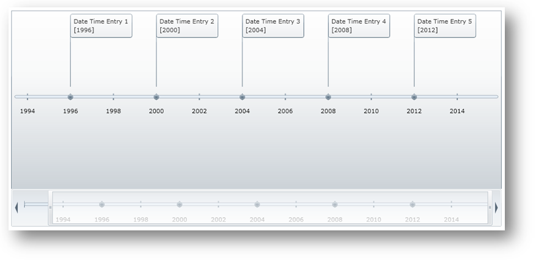

////
|metadata|
{
    "name": "xamtimeline-axis",
    "controlName": ["xamTimeline"],
    "tags": ["API","Data Presentation","How Do I"],
    "guid": "{DCC9B029-EB27-4C99-A71F-FF6C2C08F5DE}",
    "buildFlags": [],
    "createdOn": "2016-05-25T18:21:59.9253965Z"
}
|metadata|
////

= Customizing Axis

This section provides you with useful information about task-based procedures on working with the link:{ApiPlatform}controls.timelines.xamtimeline{ApiVersion}~infragistics.controls.timelines.timelineaxis.html[Axis].

* link:xamtimeline-style-the-axis.html[Styling Axis]

== Axis Elements

The Axis is the main part of xamTimeline™ in which many elements revolve around. It contains the tick marks, labels, gridlines, and thumb, which all play a major part in the functionality of the control. There are two types of Axis: link:{ApiPlatform}controls.timelines.xamtimeline{ApiVersion}~infragistics.controls.timelines.numerictimeaxis.html[NumericTimeAxis] and link:{ApiPlatform}controls.timelines.xamtimeline{ApiVersion}~infragistics.controls.timelines.datetimeaxis.html[DateTimeAxis]. Each one corresponds to their respective series type with attributes unique to that type.

The Axis is responsible for many of the behavior and style settings in xamTimeline control. Objects that you can customize through the Axis include the following:

* Major and minor Tick Marks
* Major and minor Grid Lines
* Axis Thumb
* Minimum and Maximum values for the time series
* Unit of increment for the time values
* Axis Pane
* Axis Label
* Selected time
* Settings for xamZoombar™

The following code shows you how to set the NumericTimeAxis object to define its own range, a unit of increment, and a selected time.

*In XAML:*

----
<ig:XamTimeline x:Name="timeline1">
   <!-- Set up numeric axis -->
   <ig:XamTimeline.Axis>
      <ig:NumericTimeAxis 
         Minimum="1885" 
         Maximum="1900" 
         SelectedTime="1889"
         AutoRange=" 
         Unit="1" />
   </ig:XamTimeline.Axis>
   <ig:XamTimeline.Series>
      <ig:NumericTimeSeries Title="19th Century in Film">
         <!-- TODO: add time entries -->
      </ig:NumericTimeSeries>
   </ig:XamTimeline.Series>
</ig:XamTimeline>
----

*In Visual Basic:*

----
Dim axis = New NumericTimeAxis()
axis.Minimum = 1885
axis.Maximum = 1900
axis.SelectedTime = 1889
axis.AutoRange = False
axis.Unit = 1
timeline1.Axis = axis
----

*In C#:*

----
var axis = new NumericTimeAxis()
{
   Minimum = 1885,
   Maximum = 1900,
   SelectedTime = 1889,
   AutoRange = false,
   Unit = 1
};
timeline1.Axis = axis;
----

image::images/SL_DV_XamTimeline_Customize_Axis_01.png[]

== Related Topic

link:xamtimeline-style-the-axis.html[Axis Style]