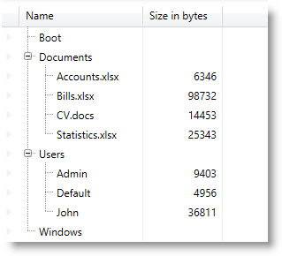

////

|metadata|
{
    "name": "xamtreegrid-adding",
    "tags": ["Data Binding","Getting Started","How Do I"],
    "controlName": ["xamTreeGrid"],
    "guid": "a79d6c49-abd8-4007-b65e-70bd7975f385",  
    "buildFlags": [],
    "createdOn": "2015-02-06T12:21:37.477926Z"
}
|metadata|
////

= Adding xamTreeGrid to Your Page

== Topic Overview

=== Purpose

This topic provides detailed instructions to help you get up and running as soon as possible with the control.

=== Required background

The following topics are prerequisites to understanding this topic:

[options="header", cols="a,a"]
|====
|Topic|Purpose

| link:xamtreegrid-features-overview.html[Features Overview (xamTreeGrid)]
|This topic explains the features supported by the control from developer perspective.

| link:xamtreegrid-visual-elements-overview.html[Visual Elements Overview (xamTreeGrid)]
|This topic provides an overview of the visual elements of the control.

|====

=== In this topic

This topic contains the following sections:

* <<_Ref409710676, Adding xamTreeGrid to Your Page >>
* <<_Ref409710686, Related Content >>

[[_Ref409710676]]
== Adding xamTreeGrid to Your Page

=== Introduction

This procedure will guide you on adding the control to your page and show some hierarchically organized data. You will also learn how to configure some basic features of the control.

=== Preview

The following screenshot is a preview of the result:

=== Prerequisites

To complete the procedure, you need to:

* have a basic understanding of the Data Presenter family controls
* have a basic understanding of how field layout is defined

=== Overview

Following is a conceptual overview of the process:

*1. Define an entity type*

*2. Define a simple data source*

*3. Add the control to your page*

*4. Configure the control and create a field layout*

=== Steps

The following steps demonstrate how to add the link:{ApiPlatform}datapresenter{ApiVersion}~infragistics.windows.datapresenter.xamtreegrid.html[xamTreeGrid] to your page.

=== 1. Define an entity type

Define a simple entity type with a `Name` and `Size` properties and a `SubNodes` list of the same type:

*In C#:*

[source,csharp]
----
public class FileNode
{
    public FileNode()
    {
        this.SubNodes = new List<FileNode>();
    }
    public string Name { get; set; }
    public int? Size { get; set; }
    public List<FileNode> SubNodes { get; set; }
}
----

*In Visual Basic:*

[source,vb]
----
Public Class FileNode
 Public Sub New()
  Me.SubNodes = New List(Of FileNode)()
 End Sub
 Public Property Name() As String
  Get
   Return m_Name
  End Get
  Set
   m_Name = Value
  End Set
 End Property
 Private m_Name As String
 Public Property Size() As System.Nullable(Of Integer)
  Get
   Return m_Size
  End Get
  Set
   m_Size = Value
  End Set
 End Property
 Private m_Size As System.Nullable(Of Integer)
 Public Property SubNodes() As List(Of FileNode)
  Get
   Return m_SubNodes
  End Get
  Set
   m_SubNodes = Value
  End Set
 End Property
 Private m_SubNodes As List(Of FileNode)
End Class
----

=== 2. Define a simple data source

Create a data source class providing a hierarchical structure based on the type defined in the previous step with some data:

*In C#:*

[source,csharp]
----
namespace Sample.DataSource
{
    public class SimpleDataSource
    {
        private List<FileNode> fileNodes;
        public List<FileNode> FileNodes
        {
            get
            {
                if (fileNodes == null) fileNodes = GetDataSource();
                return fileNodes;
            }
        }
        private List<FileNode> GetDataSource()
        {
            List<FileNode> list = new List<FileNode>();
            list.Add(new FileNode() { Name = "Boot", Size = null });
            FileNode docs = new FileNode() { Name = "Documents", Size = null };
            docs.SubNodes.Add(new FileNode() { Name = "Accounts.xlsx", Size = 6346 });
            docs.SubNodes.Add(new FileNode() { Name = "Bills.xlsx", Size = 98732 });
            docs.SubNodes.Add(new FileNode() { Name = "CV.docs", Size = 14453 });
            docs.SubNodes.Add(new FileNode() { Name = "Statistics.xlsx", Size = 25343 });
            list.Add(docs);
            FileNode users = new FileNode() { Name = "Users", Size = null };
            users.SubNodes.Add(new FileNode() { Name = "Admin", Size = 9403 });
            users.SubNodes.Add(new FileNode() { Name = "Default", Size = 4956 });
            users.SubNodes.Add(new FileNode() { Name = "John", Size = 36811 });
            list.Add(users);
            list.Add(new FileNode() { Name = "Windows", Size = null });
            return list;
        }
    }
}
----

*In Visual Basic:*

[source,vb]
----
Namespace Sample.DataSource   
  Public Class SimpleDataSource
    Private m_fileNodes As List(Of FileNode)
    Public ReadOnly Property FileNodes() As List(Of FileNode)
        Get
            If m_fileNodes Is Nothing Then
                m_fileNodes = GetDataSource()
            End If
            Return m_fileNodes
        End Get
    End Property
    Private Function GetDataSource() As List(Of FileNode)
        Dim list As New List(Of FileNode)()
        list.Add(New FileNode() With { _
            .Name = "Boot", _
            .Size = Nothing _
        })
        Dim docs As New FileNode() With { _
            .Name = "Documents", _
            .Size = Nothing _
        }
        docs.SubNodes.Add(New FileNode() With { _
            .Name = "Accounts.xlsx", _
            .Size = 6346 _
        })
        docs.SubNodes.Add(New FileNode() With { _
            .Name = "Bills.xlsx", _
            .Size = 98732 _
        })
        docs.SubNodes.Add(New FileNode() With { _
            .Name = "CV.docs", _
            .Size = 14453 _
        })
        docs.SubNodes.Add(New FileNode() With { _
            .Name = "Statistics.xlsx", _
            .Size = 25343 _
        })
        list.Add(docs)
        Dim users As New FileNode() With { _
            .Name = "Users", _
            .Size = Nothing _
        }
        users.SubNodes.Add(New FileNode() With { _
            .Name = "Admin", _
            .Size = 9403 _
        })
        users.SubNodes.Add(New FileNode() With { _
            .Name = "Default", _
            .Size = 4956 _
        })
        users.SubNodes.Add(New FileNode() With { _
            .Name = "John", _
            .Size = 36811 _
        })
        list.Add(users)
        list.Add(New FileNode() With { _
            .Name = "Windows", _
            .Size = Nothing _
        })
        Return list
    End Function
 End Class
End Namespace
----

=== 3. Add the xamTreeGrid to your page

Add the  _xamTreeGrid_   control to your page. Add an alias to the name space of the data source class and instantiate the data source class as a data context of the  _xamTreeGrid_  . Bind the  _xamTreeGrid's_   link:{ApiPlatform}datapresenter{ApiVersion}~infragistics.windows.datapresenter.datapresenterbase~datasource.html[DataSource] property to the `FileNodes` property of the data context.

*In XAML:*

[source,xaml]
----
<Page 
…
xmlns:igDP="http://infragistics.com/DataPresenter"
xmlns:data="clr-namespace:Sample.DataSource"
…
>
  <Grid x:Name="LayoutRoot">
    <igDP:XamTreeGrid x:Name="xtg" 
      DataSource="{Binding Path=FileNodes}">
      <igDP:XamTreeGrid.DataContext>
        <data:SimpleDataSource />
      </igDP:XamTreeGrid.DataContext>
      <!--
      add field layout definitions here        
      -->
    </igDP:XamTreeGrid>
  </Grid>
</Page>
----

=== 4. Configure the xamTreeGrid and create a field layout

Disable the automatic field layout generation and configure the tree to be located in the  *Name*  field and also set 20 pixels for indenting each nested level. Provide a custom field layout with the following parameters:

*Field 1*  – Bound to the `Name` property of the entity object.

*Field 2*  – Bound to the `Size` property of the entity object.

*Field 3*  – Bound to the `SubNodes` collection of the entity object. Because this is a collection the control will obtain the child records from it.

*In XAML:*

[source,xaml]
----
<igDP:XamTreeGrid.FieldLayoutSettings>
  <igDP:FieldLayoutSettings 
    AutoGenerateFields=" />   
</igDP:XamTreeGrid.FieldLayoutSettings>
<igDP:XamTreeGrid.ViewSettings>
  <igDP:TreeViewSettings
    TreeFieldName="Name"
    IndentPerLevel="20" />
</igDP:XamTreeGrid.ViewSettings>
<igDP:XamTreeGrid.FieldLayouts>
  <igDP:FieldLayout>
    <igDP:TextField Name="Name" Label="Name" Width="150" />
    <igDP:NumericField Name="Size" Label="Size" Width="70" AllowEditing=" />
    <igDP:Field Name="SubNodes" />
  </igDP:FieldLayout>
</igDP:XamTreeGrid.FieldLayouts>
----

[[_Ref409710686]]
== Related Content

=== Topics

The following topics provide additional information related to this topic.

[options="header", cols="a,a"]
|====
|Topic|Purpose

| link:xamtreegrid-binding-to-data.html[Binding xamTreeGrid to Data]
|This topic explains how to bind the control to data and how to define its field layouts.

| link:xamtreegrid-configuring.html[Configuring xamTreeGrid]
|This is a set of topics describing how to configure the control.

| link:xamtreegrid-styling.html[Styling xamTreeGrid]
|This is a set of topics describing how to style some key elements of the control.

|====