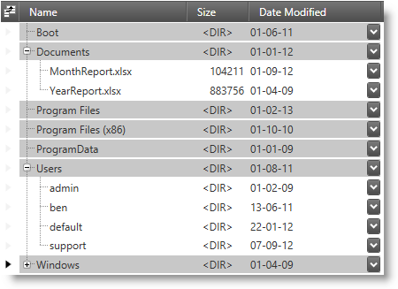
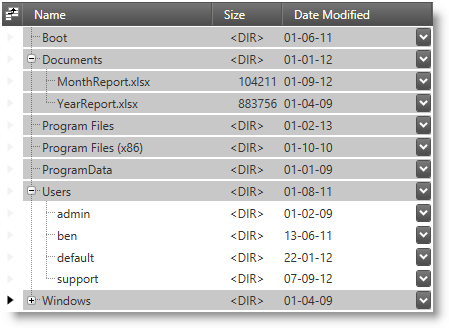
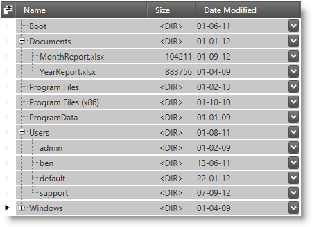

////
|metadata|
{
    "name": "xamtreegrid-conf-selection",
    "tags": ["Selection"],
    "controlName": ["xamTreeGrid"],
    "guid": "2885289b-84f1-45c4-868b-e5abfd7e015c",
    "buildFlags": [],
    "createdOn": "2015-02-06T12:28:08.9955111Z"
}
|metadata|
////

= Configuring Selection (xamTreeGrid)

== Topic Overview

=== Purpose

This topic explains how to configure the selection behavior for child level records.

=== Required background

The following topics are prerequisites to understanding this topic:

[options="header", cols="a,a"]
|====
|Topic|Purpose

| link:xamtreegrid-features-overview.html[Features Overview (xamTreeGrid)]
|This topic explains the features supported by the control from developer perspective.

| link:xamtreegrid-visual-elements-overview.html[Visual Elements Overview (xamTreeGrid)]
|This topic provides an overview of the visual elements of the control.

| link:xamdata-selection-overview.html[Selection Overview (xamDataGrid)]
|This topic provides overview information about the selection of the data presenter’s cells, rows and fields.

|====

== Selection Summary

=== Selection summary

The link:{ApiPlatform}datapresenter.v{ProductVersion}~infragistics.windows.datapresenter.xamtreegrid.html[xamTreeGrid] control allows you to configure (via property) which records are selected in response to a user selecting a range of records or cells. The three cases below have the same initial state:

* No initial selection
* The "Documents" record is expanded
* The "Users" record is collapsed
* The user performs cross-level selection by clicking on the "Boot" record selector and then shift-clicks on the "Windows" record selector
* After the selection is done the user expands the "Users" record

==== "Single" Depth Selection Mode

In this case no nested records are selected regardless of the expanded state of their parent record. Only records on the current selection level are selected. This is the default setting for GridView.

==== "VisibleOnly" Depth Selection Mode

In this case all visible records between the pivot record and the end selection record are selected. The records under the "Users" record were not selected because they became visible after the selection was made. This is the default setting for TreeView.

==== "All" Depth Selection Mode

In this case all records (at the selection level and all nested levels) were selected regardless of the expanded state of their parent.

=== Selection configuration summary

The following table explains briefly the configurable aspect of the  _xamTreeGrid_   control and maps it to the property that configure it.

[options="header", cols="a,a,a"]
|====
|Configurable aspect|Details|Properties

|[[_Hlk356484826]] 

Selection Mode
|Specify the cross-level depth selection mode.
| link:{ApiPlatform}datapresenter.v{ProductVersion}~infragistics.windows.datapresenter.treeviewsettings~selectiondepthmode.html[XamTreeGrid.ViewSettings.SelectionDepthMode]

|====

.Note
[NOTE]
====
To obtain selected item(s) please look at the following data presenter selection - related topics:

* link:xamdatagrid-selected-data-items.html[Working with Selected Data Items (xamDataGrid)]
* link:xamdata-accessing-records-through-the-recordmanager.html[Accessing Records Through the RecordManager]

====

=== Code example

The following code example show how to set the cross-level depth selection mode to "VisibleOnly".

*In XAML:*

[source,xaml]
----
<igDP:XamTreeGrid>
  <igDP:XamTreeGrid.ViewSettings>
    <igDP:TreeViewSettings SelectionDepthMode="VisibleOnly" />
  </igDP:XamTreeGrid.ViewSettings>
</igDP:XamTreeGrid>
----

== Related Content

=== Topics

The following topics provide additional information related to this topic.

[options="header", cols="a,a"]
|====
|Topic|Purpose

| link:xamtreegrid-conf-tree-field.html[Configuring Tree Field (xamTreeGrid)]
|This topic explains how to configure the control's tree field.

| link:xamtreegrid-conf-expansion-indicators.html[Configuring Expansion Indicators (xamTreeGrid)]
|This topic explains how to configure the expansion indicators' behavior.

| link:xamtreegrid-conf-indentation-per-level.html[Configuring Indentation per Level (xamTreeGrid)]
|This topic explains how to set the indentation used to render the child records.

| link:xamtreegrid-conf-filtering.html[Configuring Filtering (xamTreeGrid)]
|This topic explains how to configure the filtering feature of the control.

| link:xamtreegrid-conf-summaries.html[Configuring Summaries (xamTreeGrid)]
|This topic explains the specifics of the summaries support of the control.

|====

=== Sample

The following sample provides additional information related to this topic.

[options="header", cols="a,a"]
|====
|Sample|Purpose

| link:{SamplesURL}/tree-grid/configuring[Configuring]
|This sample demonstrates how to configure the control.

|====