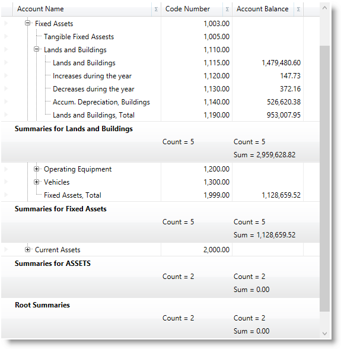

////

|metadata|
{
    "name": "xamtreegrid-conf-summaries",
    "tags": ["Summaries"],
    "controlName": ["xamTreeGrid"],
    "guid": "7904d805-d6c8-4d1d-9589-d3a07345c017",  
    "buildFlags": [],
    "createdOn": "2015-02-06T12:35:40.1618937Z"
}
|metadata|
////

= Configuring Summaries (xamTreeGrid)

== Topic Overview

=== Purpose

This topic explains the specifics of the summaries support of the control.

=== Required background

The following topics are prerequisites to understanding this topic:

[options="header", cols="a,a"]
|====
|Topic|Purpose

| link:xamtreegrid-features-overview.html[Features Overview (xamTreeGrid)]
|This topic explains the features supported by the control from developer perspective.

| link:xamtreegrid-visual-elements-overview.html[Visual Elements Overview (xamTreeGrid)]
|This topic provides an overview of the visual elements of the control.

| link:xamdatapresenter-enable-row-summaries.html[Enable Row Summaries (xamDataPresenter)]
|This topic explains how to enable summaries in a control from the Data Presenter family.

|====

== Summaries Summary

=== Summary

The link:{ApiPlatform}datapresenter{ApiVersion}~infragistics.windows.datapresenter.xamtreegrid.html[xamTreeGrid] control allows you to display summaries under each group of nested records.

The following screenshot shows summaries displayed by the control on three different nested record levels:

=== Code example

Following is the code that implements this example.

*In XAML:*

[source,xaml]
----
<igDP:XamTreeGrid x:Name="xtg" DataSource="{Binding Path=Accounts}">
  <igDP:XamTreeGrid.FieldLayoutSettings>
    <igDP:FieldLayoutSettings AutoGenerateFields=" />
  </igDP:XamTreeGrid.FieldLayoutSettings>
  <igDP:XamTreeGrid.FieldSettings>
    <igDP:FieldSettings
      AllowSummaries="True"
      SummaryUIType="MultiSelect"
      SummaryDisplayArea="Bottom" />
  </igDP:XamTreeGrid.FieldSettings>
  <igDP:XamTreeGrid.FieldLayouts>
    <igDP:FieldLayout>
      <igDP:Field Name="Name" Label="Account Name" Width="250" />
      <igDP:Field Name="Number" Label="Account number" />
      <igDP:Field Name="Balance" Label="Account Balance" />
      <igDP:Field Name="Accounts" />
      <igDP:FieldLayout.SummaryDefinitions>
        <igDP:SummaryDefinition SourceFieldName="Number" Calculator="Count" />
        <igDP:SummaryDefinition SourceFieldName="Balance" Calculator="Count" />
        <igDP:SummaryDefinition SourceFieldName="Balance" Calculator="Sum" />
      </igDP:FieldLayout.SummaryDefinitions>
    </igDP:FieldLayout>
  </igDP:XamTreeGrid.FieldLayouts>
</igDP:XamTreeGrid>
----

== Related Content

=== Topics

The following topics provide additional information related to this topic.

[options="header", cols="a,a"]
|====
|Topic|Purpose

| link:xamtreegrid-conf-tree-field.html[Configuring Tree Field (xamTreeGrid)]
|This topic explains how to configure the control's tree field.

| link:xamtreegrid-conf-expansion-indicators.html[Configuring Expansion Indicators (xamTreeGrid)]
|This topic explains how to configure the expansion indicators' behavior.

| link:xamtreegrid-conf-indentation-per-level.html[Configuring Indentation per Level (xamTreeGrid)]
|This topic explains how to set the indentation used to render the child records.

| link:xamtreegrid-conf-selection.html[Configuring Selection (xamTreeGrid)]
|This topic explains how to configure the selection behavior for child level records.

| link:xamtreegrid-conf-filtering.html[Configuring Filtering (xamTreeGrid)]
|This topic explains how to configure the filtering feature of the control.

| link:xamdatapresenter-enable-row-summaries.html[Enable Row Summaries (xamDataGrid)]
|This is a group of topics explaining how to set and customize summary fields for aggregating results based on fields’ values.

|====

=== Sample

The following sample provides additional information related to this topic.

[options="header", cols="a,a"]
|====
|Sample|Purpose

| link:{SamplesURL}/tree-grid/summaries[Summaries]
|This sample demonstrates summaries supports of the control.

|====