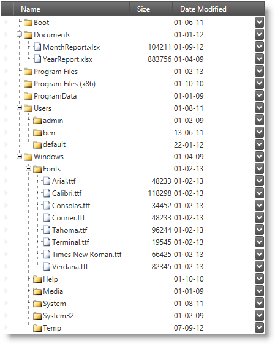

////
|metadata|
{
    "name": "xamtreegrid-features-overview",
    "tags": ["Getting Started"],
    "controlName": ["xamTreeGrid"],
    "guid": "bb71d5ce-a85e-4b64-93a7-fb0c2bfb5fad",
    "buildFlags": [],
    "createdOn": "2015-02-06T12:21:11.3972785Z"
}
|metadata|
////

= Features Overview (xamTreeGrid)

== Topic Overview

=== Purpose

This topic explains the features supported by the control from developer perspective.

=== Required background

The following table lists the concept and topics required as a prerequisite to understanding this topic.

[options="header", cols="a,a"]
|====
|Type|Content

|Concept
|Data Presenter Family
|====

=== Topics
[options="header", cols="a,a"]
|====
|Topic|Purpose

| link:wpf-about-the-data-presenter-family.html[About the Data Presenter Family] 

|This topic explains the concept of the Data Presenter Family of controls. 

| link:xamdata-theoryofoperation.html[Theory of Operation] 

|This is a set of topics explaining flexibility of the Data Presenter architecture and some common tasks (like data binding, assigning field layout and more…) 

| link:wpf-terms-and-concepts.html[Terms and Concepts] 

|This is a set of topics explaining the major elements of the Data Presenter controls. 

| link:xamdatagrid-understanding-xamdatagrid.html[About xamDataGrid] 

|This topic provides an overview of the _xamDataGrid_ control including a conceptual diagram of its comprising elements. 

|====

=== In this topic

This topic contains the following sections:

* <<_Ref410285876, Introduction >>
* <<_Ref410285882, Main Features >>
* <<_Ref410285897, Related Content >>

[[_Ref410285876]]
== Introduction

=== XamTreeGrid summary

The link:{ApiPlatform}datapresenter{ApiVersion}~infragistics.windows.datapresenter.xamtreegrid.html[xamTreeGrid] is a control from the Data Presenter family which arranges data in a tree grid layout. Essentially the control is a link:{ApiPlatform}datapresenter{ApiVersion}~infragistics.windows.datapresenter.xamdatapresenter.html[xamDataPresenter] that implements a single view (a link:{ApiPlatform}datapresenter{ApiVersion}~infragistics.windows.datapresenter.treeview.html[TreeView]) which cannot by dynamically switched.

.Note
[NOTE]
====
If you need dynamically view switching you should use the  _xamDataPresenter_   and attach the required a link:{ApiPlatform}datapresenter{ApiVersion}~infragistics.windows.datapresenter.viewbase.html[ViewBase] derived class to the View property.
====

The  _xamTreeGrid_   control is similar to the  _xamDataGrid_   in many aspects like data binding, field definition, events, commanding etc. This set of topics will describe the differences you need to know comparing to the  _xamDataGrid_  . This said it is a good idea to familiarize yourself with the concept and topics listed in the "Required Background" section.

Like the  _xamDataGrid_  , the  _xamTreeGrid_   has a view extending from the link:{ApiPlatform}datapresenter{ApiVersion}~infragistics.windows.datapresenter.gridviewbase.html[GridViewBase] and because of this it lays out data out in columns and rows. There is an important addition however – one field is designated as the tree field. This is a field which contains a tree representation of the hierarchical data bound to the control. You have the ability to browse thought the nested records' levels by expanding and collapsing them using the designated expansion indicators.

The following screenshot shows the  _xamTreeGrid_   control displaying hierarchical structure of records with the tree positioned in the "Name" field. The "Name" field in this example is using a custom template for the link:{ApiPlatform}datapresenter{ApiVersion}~infragistics.windows.datapresenter.treecellvaluepresenter.html[TreeCellValuePresenter] which displays an image for each record:

[[_Ref410285882]]
== Main Features

=== Main features summary

The following table summarizes the main features of the  _xamTreeGrid_   control in addition to the features supported by the  _xamDataGrid_   control. More details are available after the summary table.

[options="header", cols="a,a"]
|====
|Feature|Description

|<<_Ref410303345,Tree Field>>
|You can specify field in which the tree will be positioned.

|<<_Ref410303357,Expand/Collapse>>
|Expanding and collapsing of nested records.

|<<_Ref410303366,Tree Selection>>
|Selection of cross-level records.

|<<_Ref410303373,Tree Filtering>>
|Filtering of multi-level records.

|<<_Ref410303379,Tree Summaries>>
|Multi-level records' summaries.

|<<_Ref410303380,Exporting Data>>
|Exporting data to Microsoft® Excel® file format and Microsoft® Word® file format.

|====

[[_Ref410303345]]

=== Tree Field

You can specify the field in which the tree will be displayed and also position the tree on the left or on the right side of the field using the  _xamTreeGrid's_   `FlowDirection` property.

*Related Topic:*

link:xamtreegrid-conf-tree-field.html[Configuring Tree Field (xamTreeGrid)]

[[_Ref410303357]]

=== Expand/Collapse

The control supports expanding and collapsing of nested records using expansion indicators. The initial state of the expansion indicators can be configured.

*Related Topic:*

link:xamtreegrid-conf-expansion-indicators.html[Configuring Expansion Indicators (xamTreeGrid)]

[[_Ref410303366]]

=== Tree Selection

The control supports cross-level selection.

*Related Topic:*

link:xamtreegrid-conf-selection.html[Configuring Selection (xamTreeGrid)]

[[_Ref410303373]]

=== Tree Filtering

The control supports multi-level record filtering. You can configure how the control displays records which do not match the filtering criteria.

*Related Topic:*

link:xamtreegrid-conf-filtering.html[Configuring Filtering (xamTreeGrid)]

[[_Ref410303379]]

=== Tree Summaries

The control supports summaries for each nested record level. You can specify the calculators for each field.

*Related Topic:*

link:xamtreegrid-conf-summaries.html[Configuring Summaries (xamTreeGrid)]

[[_Ref410303380]]

=== Exporting Data

As any other Data Presenter control, the  _xamTreeGrid_   support data exporting to popular Microsoft® Excel® file format and Word® file format.

*Related Topics:*

* link:xamdatapresenter-exporting-to-excel.html[Exporting to Excel]
* link:xamdatapresenter-exporting-to-word.html[Exporting to Word]

[[_Ref410285897]]
== Related Content

=== Topics

The following topics provide additional information related to this topic.

[options="header", cols="a,a"]
|====
|Topic|Purpose

| link:xamtreegrid-visual-elements-overview.html[Visual Elements Overview (xamTreeGrid)]
|This topic provides an overview of the visual elements of the control.

| link:xamtreegrid-user-interactions-and-usability.html[User Interactions and Usability (xamTreeGrid)]
|This topic explains what actions can be performed by the user.

| link:xamtreegrid-limitations.html[Limitations (xamTreeGrid)]
|This topic describes which features of the Data Presenter are not supported by this control.

|====