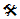

////

|metadata|
{
    "name": "xamtreegrid-limitations",
    "tags": ["Known Issues"],
    "controlName": ["xamTreeGrid"],
    "guid": "bf3eb4f3-7aac-438c-a69b-f2c4a7473670",  
    "buildFlags": [],
    "createdOn": "2015-02-06T12:21:29.8384614Z"
}
|metadata|
////

= Limitations (xamTreeGrid)

== Topic Overview

=== Purpose

This topic describes which features of the Data Presenter are not supported by this control.

=== Required background

The following table lists the concept and topics required as a prerequisite to understanding this topic.

[options="header", cols="a,a"]
|====
|Type|Content

|Concept
|Data Presenter Family
|====

=== Topics
[options="header", cols="a,a"]
|====
|Topic|Purpose 

| link:wpf-about-the-data-presenter-family.html[About the Data Presenter Family] 

|This topic explains the concept of the Data Presenter Family of controls. 

| link:xamdatagrid-understanding-xamdatagrid.html[About xamDataGrid] 

|This topic provides an overview of the _xamDataGrid_ control including a conceptual diagram of its comprising elements. 

| link:xamtreegrid-features-overview.html[Features Overview (xamTreeGrid)] 

|This topic explains the features supported by the control from developer perspective. 

| link:xamtreegrid-visual-elements-overview.html[Visual Elements Overview (xamTreeGrid)] 

|This topic provides an overview of the visual elements of the control. 

| link:xamtreegrid-user-interactions-and-usability.html[User Interactions and Usability (xamTreeGrid)] 

|This topic explains what actions can be performed by the user. 

|====

=== In this topic

This topic contains the following sections:

*  *<<_Ref410378901,Limitations>>*
*  *<<_Ref410378914,Related Content>>* 

[[_Ref410378901]]
== Limitations

=== Limitations summary chart

The following table summarizes the limitations of the  _xamTreeGrid_   control. Detailed explanations of all of the limitations after the summary table.

==== Legend:

image:images/Yes.png[] – Workaround available

image:images/No.png[] – No known workaround

 – Fix planned

[options="header", cols="a,a,a"]
|====
|Limitation|Description|Status

|Adding records not supported
|The _xamTreeGrid_ control does not provide a UI for adding records therefore the link:{ApiPlatform}datapresenter{ApiVersion}~infragistics.windows.datapresenter.fieldlayoutsettings~allowaddnew.html[AllowAddNew] property of link:{ApiPlatform}datapresenter{ApiVersion}~infragistics.windows.datapresenter.fieldlayoutsettings.html[FieldLayoutSettings] is ignored.
|image::images/No.png[]

|Expandable field records not supported
|The _xamTreeGrid_ control does not support expandable field records as the _xamDataGrid_ . Instead it supports expandable records which are rendered using a single field layout. Because of this all properties which begin with "ExpandableFieldRecord…" of the link:{ApiPlatform}datapresenter{ApiVersion}~infragistics.windows.datapresenter.datapresenterbase~fieldsettings.html[FieldSettings] object have no effect on the control.
|image::images/No.png[]

|Grouping not suppotrted
|The _xamTreeGrid_ control does not support grouping records, therefore all of the "GroupBy…" properties are ignored.
|image::images/No.png[]

|Label location in cells not supported
|A setting of link:{ApiPlatform}datapresenter{ApiVersion}~infragistics.windows.datapresenter.labellocation.html[InCells] for the link:{ApiPlatform}datapresenter{ApiVersion}~infragistics.windows.datapresenter.fieldlayoutsettings~labellocation.html[LabelLocation] property of `FieldLayoutSettings` will resolve to `SeperateHeader`.
|image::images/No.png[]

|UseCollectionView filtering not supported
|The _xamTreeGrid_ control does not support the link:{ApiPlatform}datapresenter{ApiVersion}~infragistics.windows.datapresenter.filterevaluationmode.html[UseCollectionView] filtering option for the link:{ApiPlatform}datapresenter{ApiVersion}~infragistics.windows.datapresenter.fieldlayoutsettings~filterevaluationmode.html[FilterEvaluationMode] property. If you set the `UseCollectionView` option this will resolve to `Auto`.
|image::images/No.png[]

|====

[[_Ref410378914]]
== Related Content

=== Topics

The following topics provide additional information related to this topic.

[options="header", cols="a,a"]
|====
|Topic|Purpose

| link:xamtreegrid-adding.html[Adding xamTreeGrid to Your Page]
|This topic provides detailed instructions to help you get up and running as soon as possible with the control.

| link:xamtreegrid-binding-to-data.html[Binding xamTreeGrid to Data]
|This topic explains how to bind the control to data and how to define its field layouts.

| link:xamtreegrid-configuring.html[Configuring xamTreeGrid]
|This is a set of topics describing how to configure the control.

|====