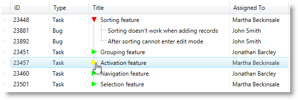

////
|metadata|
{
    "name": "xamtreegrid-styling-expansion-indicators",
    "tags": ["Styling"],
    "controlName": ["xamTreeGrid"],
    "guid": "8c7ef67e-fbe6-4456-842a-95d136246bcf",
    "buildFlags": [],
    "createdOn": "2015-02-06T12:35:56.1048912Z"
}
|metadata|
////

= Styling Expansion Indicators (xamTreeGrid)

== Topic Overview

=== Purpose

This topic explains how to style the control's expansion indicators.

=== Required background

The following topics are prerequisites to understanding this topic:

[options="header", cols="a,a"]
|====
|Topic|Purpose

| link:xamtreegrid-features-overview.html[Features Overview (xamTreeGrid)]
|This topic explains the features supported by the control from developer perspective.

| link:xamtreegrid-visual-elements-overview.html[Visual Elements Overview (xamTreeGrid)]
|This topic provides an overview of the visual elements of the control.

|====

=== In this topic

This topic contains the following sections:

* <<_Ref410649472, Styling Expansion Indicators >>
* <<_Ref410649479, Related Content >>

[[_Ref410649472]]
== Styling Expansion Indicators

=== Styling expansion indicators summary

The  _xamTreeGrid_   control's expansion indicators can be styled by creating a custom style which targets the `ExpansionIndicator` type.

[options="header", cols="a,a,a"]
|====
|Configurable aspect|Details|Target Type

|[[_Hlk356484826]] 

Styling Expansion Indicators
|Set a custom template for changing the expansion indicator.
| link:{ApiPlatform}v{ProductVersion}~infragistics.windows.controls.expansionindicator.html[ExpansionIndicator]

|====

=== Code example

Following is the code that implements this example.

*In XAML:*

[source,xaml]
----
<Page
  …
  xmlns:igWindows="http://infragistics.com/Windows"
  …>
  <Page.Resources>
    <ResourceDictionary>
      
    </ResourceDictionary>
  </Page.Resources>
  …
</Page>
----

The following screenshot depicts the result from the code above:

[[_Ref410649479]]
== Related Content

=== Topic

The following topic provides additional information related to this topic.

[options="header", cols="a,a"]
|====
|Topic|Purpose

| link:xamtreegrid-styling-tree-connector-lines.html[Styling Tree Connector Lines (xamTreeGrid)]
|This topic explains how to style the control's tree connector lines.

|====

=== Samples

The following samples provide additional information related to this topic.

[options="header", cols="a,a"]
|====
|Sample|Purpose

| link:{SamplesURL}/tree-grid/styling-expansion-indicators[Styling Expansion Indicators]
|This sample demonstrates how to style the expansion indicators.

| link:{SamplesURL}/tree-grid/adding-icons[Adding Icons]
|This sample demonstrates how to add an icon in a field which also changes depending on an entity object's property value.

|====