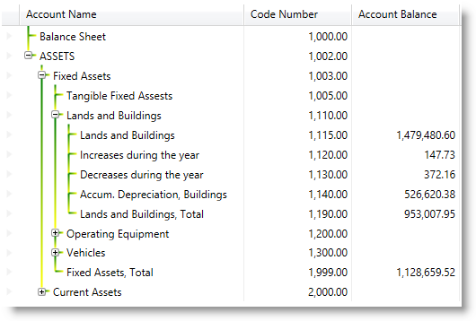

////

|metadata|
{
    "name": "xamtreegrid-styling-tree-connector-lines",
    "tags": ["Styling"],
    "controlName": ["xamTreeGrid"],
    "guid": "8655dab6-c200-48b9-a9b3-374ecbd93ec8",  
    "buildFlags": [],
    "createdOn": "2015-02-06T12:35:50.7675875Z"
}
|metadata|
////

= Styling Tree Connector Lines (xamTreeGrid)

== Topic Overview

=== Purpose

This topic explains how to style the control's tree connector lines.

=== Required background

The following topics are prerequisites to understanding this topic:

[options="header", cols="a,a"]
|====
|Topic|Purpose

| link:xamtreegrid-features-overview.html[Features Overview (xamTreeGrid)]
|This topic explains the features supported by the control from developer perspective.

| link:xamtreegrid-visual-elements-overview.html[Visual Elements Overview (xamTreeGrid)]
|This topic provides an overview of the visual elements of the control.

|====

=== In this topic

This topic contains the following sections:

* <<_Ref410649522, Styling Tree Connector Lines >>
* <<_Ref410649530, Related Content >>

[[_Ref410649522]]
== Styling Tree Connector Lines

=== Styling tree connector lines summary

The  _xamTreeGrid_   control's connector lines can be styled by providing a `Pen` to the `TreeLinePen` property of the link:{ApiPlatform}datapresenter{ApiVersion}~infragistics.windows.datapresenter.xamtreegrid~viewsettings.html[ViewSettings] object.

[options="header", cols="a,a,a"]
|====
|Configurable aspect|Details|Properties

|[[_Hlk356484826]] 

Styling Tree Connector Lines
|Set a custom Pen for drawing the connector lines.
| link:{ApiPlatform}datapresenter{ApiVersion}~infragistics.windows.datapresenter.treeviewsettings~treelinepen.html[TreeLinePen]

|====

=== Code example

The following code snippet shows how to set a custom Pen for drawing the control's connector lines:

*In XAML:*

[source,xaml]
----
<Page … >
  <Page.Resources>
    <ResourceDictionary>
      <Pen x:Key="YellowGreenBrush" Thickness="2">
        <Pen.Brush>
          <LinearGradientBrush>
            <GradientStop Offset="0.0" Color="Green" />
            <GradientStop Offset="1.0" Color="Yellow" />
          </LinearGradientBrush>
        </Pen.Brush>
      </Pen>
    </ResourceDictionary>
  </Page.Resources>
  <Grid x:Name="LayoutRoot">
    <igDP:XamTreeGrid x:Name="xtg" …>
      <igDP:XamTreeGrid.ViewSettings>
        <igDP:TreeViewSettings TreeLinePen="{StaticResource YellowGreenBrush}" />
      </igDP:XamTreeGrid.ViewSettings>
    </igDP:XamTreeGrid>
  </Grid>
</Page>
----

The following screenshot depicts the result from the code above:

.Note
[NOTE]
====
You can also set a `Pen` for the tree connector lines by just creating a `Pen` and set the `Key` property to:

`{x:Static igDP:DataPresenterBrushKeys.TreeLinePen}`.
====

[[_Ref410649530]]
== Related Content

=== Topic

The following topic provides additional information related to this topic.

[options="header", cols="a,a"]
|====
|Topic|Purpose

| link:xamtreegrid-styling-expansion-indicators.html[Styling Expansion Indicators (xamTreeGrid)]
|This topic explains how to style the control's expansion indicators.

|====

=== Samples

The following samples provide additional information related to this topic.

[options="header", cols="a,a"]
|====
|Sample|Purpose

| link:{SamplesURL}/tree-grid/styling-connectors[Styling Connectors]
|This sample demonstrates how to style the tree connector lines.

| link:{SamplesURL}/tree-grid/adding-icons[Adding Icons]
|This sample demonstrates how to add an icon in a field which also changes depending on an entity object's property value.

|====