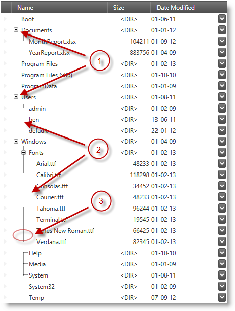

////

|metadata|
{
    "name": "xamtreegrid-visual-elements-overview",
    "tags": ["Getting Started"],
    "controlName": ["xamTreeGrid"],
    "guid": "de427eae-62f8-4d3c-80c2-b24b20a4ac27",  
    "buildFlags": [],
    "createdOn": "2015-02-06T12:21:16.9986398Z"
}
|metadata|
////

= Visual Elements Overview (xamTreeGrid)

== Topic Overview

=== Purpose

This topic provides an overview of the visual elements of the control.

=== Required background

The following table lists the concept and topics required as a prerequisite to understanding this topic.

[options="header", cols="a,a"]
|====
|Type|Content

|Concept
|Data Presenter Family
|==== 

=== Topics
[options="header", cols="a,a"]
|====
|Topic|Purpose 

| link:wpf-about-the-data-presenter-family.html[About the Data Presenter Family] 

|This topic explains the concept of the Data Presenter Family of controls. 

| link:xamdatagrid-understanding-xamdatagrid.html[About xamDataGrid] 

|This topic provides an overview of the _xamDataGrid_ control including a conceptual diagram of its comprising elements. 

| link:xamtreegrid-features-overview.html[Features Overview (xamTreeGrid)] 

|This topic explains the features supported by the control from developer perspective. 

|====

=== In this topic

This topic contains the following sections:

* <<_Ref410311836, Visual Elements of xamTreeGrid Control and Related Properties >>
* <<_Ref410311842, Related Content >>

[[_Ref410311836]]
== Visual Elements of xamTreeGrid Control and Related Properties

=== Visual elements summary

The following screenshot depicts the link:{ApiPlatform}datapresenter.v{ProductVersion}~infragistics.windows.datapresenter.xamtreegrid.html[xamTreeGrid] specific visual elements. The configurable elements are listed after the image.

[start=1]
. Expand/Collapse Indicators (Handles)
[start=2]
. Connector Lines
[start=3]
. Nested Records Indentation

=== Visual elements and related properties

The following table maps the  _xamTreeGrid_  -specific visual elements and the properties that configure them.

[options="header", cols="a,a,a"]
|====
|Visual Element|Property(ies)|Topic

|Expand/Collapse Indicators(Handles)
| link:{ApiPlatform}datapresenter.v{ProductVersion}~infragistics.windows.datapresenter.fieldlayoutsettings~expansionindicatordisplaymode.html[XamTreeGrid.FieldLayoutSettings.ExpansionIndicatorDisplayMode]
| link:xamtreegrid-conf-expansion-indicators.html[Configuring Expansion Indicators (xamTreeGrid)]

|Connector Lines
|
* link:{ApiPlatform}datapresenter.v{ProductVersion}~infragistics.windows.datapresenter.treeviewsettings~treelinevisibility.html[XamTreeGrid.ViewSettings.TreeLineVisibility] 

* link:{ApiPlatform}datapresenter.v{ProductVersion}~infragistics.windows.datapresenter.treeviewsettings~treelinepen.html[XamTreeGrid.ViewSettings.TreeLinePen] 

| link:xamtreegrid-styling-tree-connector-lines.html[Styling Tree Connector Lines (xamTreeGrid)]

|Nested Records Indentation
| link:{ApiPlatform}datapresenter.v{ProductVersion}~infragistics.windows.datapresenter.treeviewsettings~indentperlevel.html[XamTreeGrid.ViewSettings.IndentPerLevel]
| link:xamtreegrid-conf-indentation-per-level.html[Configuring Indentation per Level (xamTreeGrid)]

|====

.Note
[NOTE]
====
The column containing the tree is called a "tree field" and can be re-templated by providing a style targeting the `TreeCellValuePresenter` type.
====

[[_Ref410311842]]
== Related Content

=== Topics

The following topics provide additional information related to this topic.

[options="header", cols="a,a"]
|====
|Topic|Purpose

| link:xamtreegrid-user-interactions-and-usability.html[User Interactions and Usability (xamTreeGrid)]
|This topic explains what actions can be performed by the user.

| link:xamtreegrid-limitations.html[Limitations (xamTreeGrid)]
|This topic describes which features of the Data Presenter are not supported by this control.

|====