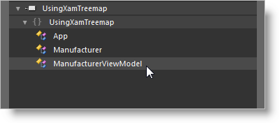

////

|metadata|
{
    "name": "xamtreemap-adding-xamtreemap-using-blend",
    "controlName": ["xamTreemap"],
    "tags": ["Charting","How Do I"],
    "guid": "8875f3c5-e8c3-4c58-aeeb-e1d01a25b5f3",  
    "buildFlags": [],
    "createdOn": "2016-05-25T18:21:59.7783833Z"
}
|metadata|
////

= Adding xamTreemap Using Expression Blend

This topic demonstrates how to create a xamTreemap™ using Expression Blend™.

The topic is organized as follows:

* <<preview,Preview>>
* <<requirements,Requirements>>
* <<overview,Overview>>
* <<steps,Steps>>

[[preview]]
== Preview

Following is a preview of the final result:

Figure 1: A data bound Treemap with color mapping. 

[[requirements]]
== Requirements

* Microsoft® {PlatformName}® project in Expression Blend™
* Control assemblies and references to them in the project:

* {ApiPlatform}{ApiVersion}dll
* {ApiPlatform}DataVisualization{ApiVersion}.dll
* {ApiPlatform}Controls.Charts.XamTreemap{ApiVersion}.dll

* This procedure uses a simple data model for binding the xamTreemap control's DataContext property. It can be downloading from Manufacturer View Model.

[[overview]]
== Overview

[start=1]
. <<step1,Adding the ManufacturerViewModel class.>>
[start=2]
. <<step2,Adding the XamTreemap to your application and binding it to data.>>

.. <<step2a,Dragging the XamTreemap control from the Assets library to your application.>>
.. <<step2b,Binding the DataContext property to the ManufacturerViewModel class.>>
.. <<step2c,Binding the ItemsSource property to the Manufacturers collection of the view model.>>
.. <<step2d,Creating a new NodeBinders collection.>>
.. <<step2e,Creating a new ValueMappers collection.>>

[start=3]
. <<step3,Save your project>>
[start=4]
. <<step4,(Optional) Verify the result.>>

[[steps]]
== Steps

[start=1]
. *[[step1]]
Add the ManufacturerViewModel class.*

Right-click on your project in Blend and select Add Reference to add the required assemblies.
[start=2]
. *[[step2]]
Add the XamTreemap to your application and bind it to data.*

.. *[[step2a]]
Drag the XamTreemap control from the Assets library to your application. (Figure 2)*

Figure 2: Blend’s Assets Library 

[[step2b]]
[start=2]
.. *Bind the DataContext property to the ManufacturerViewModel class.*In the Properties pane, go to Common Properties. For the DataContext property, create a new object and use the ManufacturerViewModel class. (Figure 3 and Figure 4)

Figure 3: The Properties tab for xamTreemap 

Figure 4: Blend object browser 

[[step2c]]
[start=3]
.. *Bind the ItemsSource property to the Manufacturers collection of the view model.*

In the Properties pane, go to XamTreemap Properties and apply a Data Binding to the ItemsSource property using the Manufacturers collection of the view model (Figure 5 and Figure 6):

Figure 5: Binding the ItemsSource 

Figure 6: Creating a Data Binding 

[[step2d]]
[start=4]
.. *Create a new NodeBinders collection.*

... In the XamTreemap Properties, go to NodeBinders and create a new collection. (Figure 7)

Figure 7: Creating a new Node Binders collection 

[start=2]
... Add a new Node Binder to the collection and set the following properties:

**** TargetTypeName = Manufacturer
**** TextPath = Name
**** ValuePath = Revenue

*Note:* Now that a Node Binder is added, notice how the xamTreemap displays its data. (Figure 8)

Figure 8: A preview of the Treemap in Blend 

[[step2e]]
[start=5]
.. *Create a new ValueMappers collection.*

... In the XamTreemap Properties, go to ValueMappers and create a new collection. (Figure 9)

Figure 9: Creating a new Value Mappers collection 

[start=2]
... Add a new item to the collection and from the Select Object window, choose the ColorMapper class:

Figure 10: Selecting ColorMapper 

[start=3]
... After you create a new Value Mapper, set the following properties:

**** ValueTypeName = Manufacturer
**** TargetProperty = Fill
**** ValuePath = Revenue

[start=4]
... Set colors for the From and To properties.

*Note:* Now that a Color Mapper is added, notice how the xamTreemap displays its data. (Figure 11)

Figure 11: A preview of the Treemap with Value Mappers in Blend 

[[step3]]
[start=3]
. *Save your project.*
[[step4]]
[start=4]
. *(Optional) Verify the result.*

Run your application and if you have implemented the steps correctly, your Treemap should look as shown in Figure 1 above.

== Related Topics

* link:xamtreemap-adding-xamtreemap-using-xaml.html[Adding xamTreemap Using XAML Code]
* link:xamtreemap-adding-xamtreemap-using-procedural.html[Adding xamTreemap Using Procedural Code]