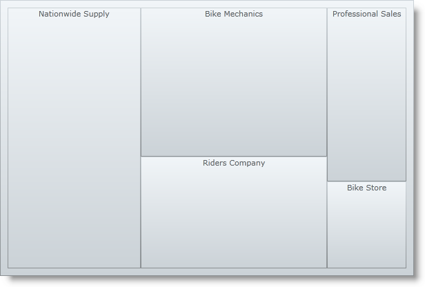
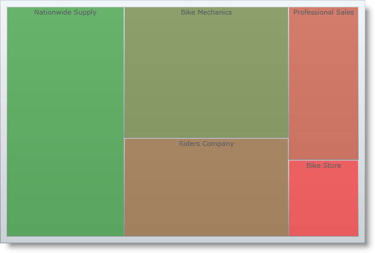

////

|metadata|
{
    "name": "xamtreemap-adding-xamtreemap-using-procedural",
    "controlName": ["xamTreemap"],
    "tags": ["Getting Started","How Do I"],
    "guid": "3a442ea3-626f-4668-878c-d6217fb51694",  
    "buildFlags": [],
    "createdOn": "2016-05-25T18:21:59.7713815Z"
}
|metadata|
////

= Adding xamTreemap Using Procedural Code

== Before You Begin

This topic describes the basic steps required for adding the xamTreemap™ control to your  pick:[sl="page"]  pick:[wpf,win-phone="application"]  using XAML. The control needs a data object model to be mapped to its DataContext property - the topic will provide a simple data object model, but you can create your own and use it instead.

== What You Will Accomplish

You will add an instance of the xamTreemap control with simple data binding to your  pick:[sl="page"]  pick:[wpf,win-phone="application"] .

== Follow these Steps

*Note:* This sample uses a simple data model for binding the xamTreemap control's DataContext property. You can download it from link:resources-manufacturer-view-model.html[Manufacturer View Model] and use it in your project while working through this sample.

[start=1]
. Create a Microsoft® {PlatformName}™ application.
[start=2]
. In the Solution Explorer, add the following references to your project:

ifdef::wpf[]
** {ApiPlatform}{ApiVersion}dll

endif::wpf[]

** {ApiPlatform}DataVisualization{ApiVersion}.dll
** {ApiPlatform}Controls.Charts.xamTreemap{ApiVersion}.dll

[start=3]
. Add an event handler to the UserControl’s Loaded event.

*In XAML:*

----
<UserControl Loaded="UserControl_Loaded">
</UserControl>
----

 
[start=4]
. Place using/Imports in your code behind. 

*In Visual Basic:*

----
Imports Infragistics.Controls.Charts
Imports DATA_MODEL_NAMESPACE
----

*In C#:*

----
using Infragistics.Controls.Charts;
using DATA_MODEL_NAMESPACE;
----

[start=5]
. Inside the UserControl_Loaded event handler, create an instance of the xamTreemap control with a DataContext bound to the ManufacturerViewModel and an ItemsSource bound to the Manufacturers property of the view model.

*In Visual Basic:*

----
Dim data As New ManufacturerViewModel()
Dim Treemap As New XamTreemap()
Treemap.DataContext = data
Treemap.ItemsSource = data.Manufacturers
----

*In C#:*

----
ManufacturerViewModel data = new ManufacturerViewModel();
XamTreemap Treemap = new XamTreemap();
Treemap.DataContext = data;
Treemap.ItemsSource = data.Manufacturers;
----

[start=6]
. Add the new instance of xamTreemap to the Grid panel’s Children collection (note that upon initial page creation, a grid panel called "LayoutRoot" is defined by default). 

*In Visual Basic:*

----
Me.LayoutRoot.Children.Add(Treemap)
----

*In C#:*

----
this.LayoutRoot.Children.Add(Treemap);
----

[start=7]
. Create a new link:xamtreemap-node-binders.html[Node Binder] and add it to the xamTreemap control's NodeBinders collection.

*In Visual Basic:*

----
Dim binder As New NodeBinder()
binder.TargetTypeName = "Manufacturer"
binder.ValuePath = "Revenue"
binder.TextPath = "Name"
Treemap.NodeBinders.Add(binder)
----

*In C#:*

----
NodeBinder binder = new NodeBinder();
binder.TargetTypeName = "Manufacturer";
binder.ValuePath = "Revenue";
binder.TextPath = "Name";
Treemap.NodeBinders.Add(binder);
----

*Note:* Here is how the xamTreemap control will look if you run your application at this step.

[start=8]
. Create a new link:xamtreemap-value-mappers.html[Value Mapper] and add it to the xamTreemap control's ValueMappers collection.

*In Visual Basic:*

----
Dim mapper As New ColorMapper()
mapper.ValueTypeName = "Manufacturer"
mapper.TargetProperty = "Fill"
mapper.ValuePath = "Revenue"
mapper.From = Color.FromArgb(144, 255, 0, 0)
mapper.To = Color.FromArgb(144, 0, 128, 0)
Treemap.ValueMappers.Add(mapper)
----

*In C#:*

----
ColorMapper mapper = new ColorMapper();
mapper.ValueTypeName = "Manufacturer";
mapper.TargetProperty = "Fill";
mapper.ValuePath = "Revenue";
mapper.From = Color.FromArgb(144, 255, 0, 0);
mapper.To = Color.FromArgb(144, 0, 128, 0);
Treemap.ValueMappers.Add(mapper);
----

[start=9]
. Save and run your application.

== Full Code

*In Visual Basic:*

----
    Private Sub UserControl_Loaded(ByVal sender As Object, ByVal e As RoutedEventArgs)
        Dim data As New ManufacturerViewModel()
        Dim Treemap As New XamTreemap()
        Treemap.DataContext = data
        Treemap.ItemsSource = data.Manufacturers
        Me.LayoutRoot.Children.Add(Treemap)
        Dim binder As New NodeBinder()
        binder.TargetTypeName = "Manufacturer"
        binder.ValuePath = "Revenue"
        binder.TextPath = "Name"
        Treemap.NodeBinders.Add(binder)
        Dim mapper As New ColorMapper()
        mapper.ValueTypeName = "Manufacturer"
        mapper.TargetProperty = "Fill"
        mapper.ValuePath = "Revenue"
        mapper.From = Color.FromArgb(144, 255, 0, 0)
        mapper.To = Color.FromArgb(144, 0, 128, 0)
        Treemap.ValueMappers.Add(mapper)
    End Sub
----

*In C#:*

----
        private void UserControl_Loaded(object sender, RoutedEventArgs e)
        {
            ManufacturerViewModel data = new ManufacturerViewModel();
            XamTreemap Treemap = new XamTreemap();
            Treemap.DataContext = data;
            Treemap.ItemsSource = data.Manufacturers;
            this.LayoutRoot.Children.Add(Treemap);
            NodeBinder binder = new NodeBinder();
            binder.TargetTypeName = "Manufacturer";
            binder.ValuePath = "Revenue";
            binder.TextPath = "Name";
            Treemap.NodeBinders.Add(binder);
            ColorMapper mapper = new ColorMapper();
            mapper.ValueTypeName = "Manufacturer";
            mapper.TargetProperty = "Fill";
            mapper.ValuePath = "Revenue";
            mapper.From = Color.FromArgb(144, 255, 0, 0);
            mapper.To = Color.FromArgb(144, 0, 128, 0);
            Treemap.ValueMappers.Add(mapper);
        }
----

== Related Topics

* link:xamtreemap-adding-xamtreemap-using-xaml.html[Adding xamTreemap Using XAML Code]
* link:xamtreemap-adding-xamtreemap-using-blend.html[Adding xamTreemap Using Expression Blend]