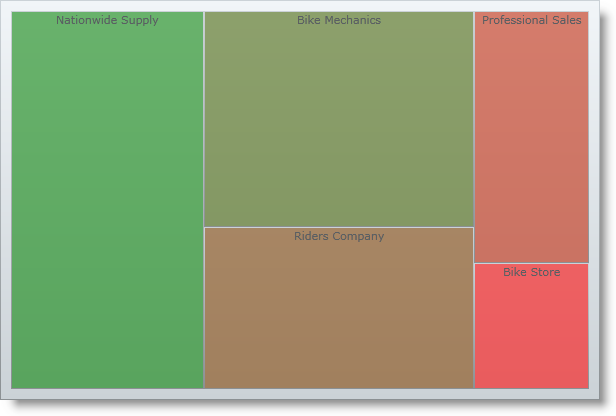

////

|metadata|
{
    "name": "xamtreemap-adding-xamtreemap-using-xaml",
    "controlName": ["xamTreemap"],
    "tags": ["Getting Started","How Do I"],
    "guid": "f80bc6a6-9681-4cd1-9fff-8885df093d75",  
    "buildFlags": [],
    "createdOn": "2016-05-25T18:21:59.7653827Z"
}
|metadata|
////

= Adding xamTreemap Using XAML Code

== Before You Begin

This topic describes the basic steps required for adding the xamTreemap™ control to your  pick:[sl="page"]  pick:[wpf,win-phone="application"]  using XAML. The control needs a data object model to be mapped to its DataContext property - the topic will provide a simple data object model, but you can create your own and use it instead.

== What You Will Accomplish

You will add an instance of the xamTreemap control with simple data binding to your  pick:[sl="page"]  pick:[wpf,win-phone="application"] .

== Follow these Steps

*Note:* This sample uses a simple data model for binding the xamTreemap control's DataContext property. You can download it from link:resources-manufacturer-view-model.html[Manufacturer View Model] and use it in your project while working through this sample.

[start=1]
. Create a Microsoft® {PlatformName}™ application.
[start=2]
. In the Solution Explorer, add the following references to your project:

ifdef::wpf[]
** {ApiPlatform}{ApiVersion}dll

endif::wpf[]

** {ApiPlatform}DataVisualization{ApiVersion}.dll
** {ApiPlatform}Controls.Charts.xamTreemap{ApiVersion}.dll

[start=3]
. Add the following XML namespace declarations:

ifdef::wpf[]

*In XAML:*

----
xmlns:ig="http://schemas.infragistics.com/xaml"
xmlns:models="clr-namespace:DATA_MODEL_NAMESPACE"
----

endif::wpf[]

[start=4]
. Add an instance of the xamTreemap control with a DataContext bound to the ManufacturerViewModel and an ItemsSource bound to the Manufacturers property of the view model.

*In XAML:*

----
<ig:XamTreemap ItemsSource="{Binding Manufacturers}">
    <ig:XamTreemap.DataContext>
        <models:ManufacturerViewModel />
    </ig:XamTreemap.DataContext>
    <ig:XamTreemap.NodeBinders>
        <!--Add Node Binders-->
    </ig:XamTreemap.NodeBinders>
    <ig:XamTreemap.ValueMappers>
        <!--Add Value Mappers-->
    </ig:XamTreemap.ValueMappers>
</ig:XamTreemap>
----

[start=5]
. Add link:xamtreemap-node-binders.html[Node Binders] to the control's NodeBinders collection.

*In XAML:*

----
<ig:XamTreemap ItemsSource="{Binding Manufacturers}">
    <ig:XamTreemap.DataContext>
        <models:ManufacturerViewModel />
    </ig:XamTreemap.DataContext>
    <ig:XamTreemap.NodeBinders>
        <ig:NodeBinder TargetTypeName="Manufacturer"
                       ValuePath="Revenue"
                       TextPath="Name" />
    </ig:XamTreemap.NodeBinders>
    <ig:XamTreemap.ValueMappers>
        <!--Add Value Mappers-->
    </ig:XamTreemap.ValueMappers>
</ig:XamTreemap>
----

image::images/xamTreemap_Adding_xamTreemap_Using_Xaml_Procedural_Code_01.png[]
[start=6]
. Add link:xamtreemap-value-mappers.html[Value Mappers] to the control's ValueMappers collection.

*In XAML:*

----
<ig:XamTreemap ItemsSource="{Binding Manufacturers}">
    <ig:XamTreemap.DataContext>
        <models:ManufacturerViewModel />
    </ig:XamTreemap.DataContext>
    <ig:XamTreemap.NodeBinders>
        <ig:NodeBinder TargetTypeName="Manufacturer"
                       ValuePath="Revenue"
                       TextPath="Name" />
    </ig:XamTreemap.NodeBinders>
    <ig:XamTreemap.ValueMappers>
        <ig:ColorMapper ValueTypeName="Manufacturer"
                        TargetProperty="Fill"
                        ValuePath="Revenue"
                        From="#90FF0000"
                        To="#90008000"/>
    </ig:XamTreemap.ValueMappers>
</ig:XamTreemap>
----

[start=7]
. Save and run your application.

== Related Topics

* link:xamtreemap-adding-xamtreemap-using-blend.html[Adding xamTreemap Using Expression Blend]
* link:xamtreemap-adding-xamtreemap-using-procedural.html[Adding xamTreemap Using Procedural Code]