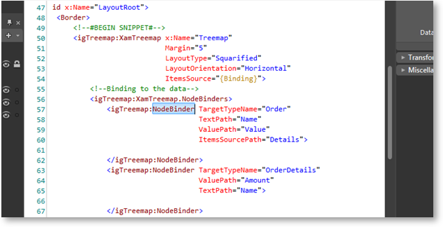
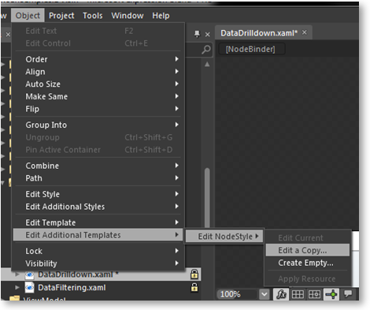
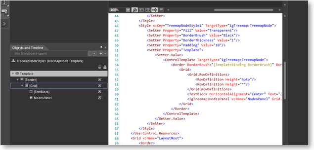
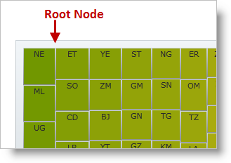

////

|metadata|
{
    "name": "xamtreemap-changing-the-style-of-the-nodes",
    "controlName": ["xamTreemap"],
    "tags": ["How Do I","Styling","Templating"],
    "guid": "287dcded-0ae5-4fb9-8c35-f3e1f4b6198d",  
    "buildFlags": [],
    "createdOn": "2016-05-25T18:21:59.8603908Z"
}
|metadata|
////

= Changing the Style of the Nodes

In this article you will learn how to change the style which a link:{ApiPlatform}controls.charts.xamtreemap.v{ProductVersion}~infragistics.controls.charts.nodebinder.html[NodeBinder] applies to the nodes. Each NodeBinder can apply a different style to the nodes.

== Before You Begin

A custom template for the nodes must contain a NodesPanel element named “NodesPanel”. This element will hold the child nodes.

== Creating a Style

[start=1]
. Create a project in Blend and add to it a xamTreemap control.
[start=2]
. Add NodeBinders to your xamTreemap.
[start=3]
. Highlight the NodeBinder which you will style:

[start=4]
. Go to the Object menu – Object \ Edit Additional Templates \ Edit NodeStyle \ Edit a Copy…

[start=5]
. Edit the template of your custom treemap node style:

== The DefaultStyle Property

When the xamTreemap control binds to data, it creates a root node which will contain the nodes from the data source. 

You can style this node by assigning a style to the link:{ApiPlatform}controls.charts.xamtreemap.v{ProductVersion}~infragistics.controls.charts.xamtreemap~defaultstyle.html[DefaultStyle] property of the xamTreemap control.

== Default Node Template

*In XAML:*

----

----