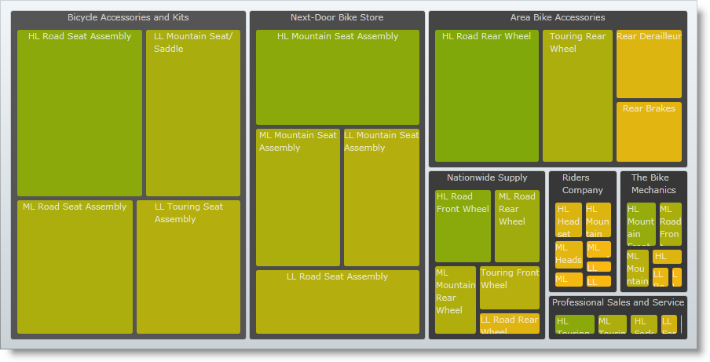

////

|metadata|
{
    "name": "xamtreemap-colormapper",
    "controlName": ["xamTreemap"],
    "tags": ["How Do I"],
    "guid": "0fbe69b0-8e83-468b-8cdb-01bfe34da172",  
    "buildFlags": [],
    "createdOn": "2016-05-25T18:21:59.8354203Z"
}
|metadata|
////

= ColorMapper

The link:{ApiPlatform}controls.charts.xamtreemap.v{ProductVersion}~infragistics.controls.charts.colormapper.html[ColorMapper] adds color to the nodes of the xamTreemap™ control depending on a specified value. It maps some property of the data to a property of the node, for example, the fill color or foreground color.

== ColorMapper Properties

* link:{ApiPlatform}controls.charts.xamtreemap.v{ProductVersion}~infragistics.controls.charts.valuemapper~valuepath.html[ValuePath] – determines the name of the property of the data source that contains the data.
* link:{ApiPlatform}controls.charts.xamtreemap.v{ProductVersion}~infragistics.controls.charts.valuemapper~valuetypename.html[ValueTypeName] – determines the name of the type that has the field containing data specified by ValuePath.
* link:{ApiPlatform}controls.charts.xamtreemap.v{ProductVersion}~infragistics.controls.charts.valuemapper~targetproperty.html[TargetProperty] – determines the property that will be affected by the color mapping.
* link:{ApiPlatform}controls.charts.xamtreemap.v{ProductVersion}~infragistics.controls.charts.valuemapper~targetname.html[TargetName] – if you have a custom template for the xamTreemap control’s nodes and you have a named element, you can use TargetName to specify this element.
* link:{ApiPlatform}controls.charts.xamtreemap.v{ProductVersion}~infragistics.controls.charts.valuemapper~mappingmode.html[MappingMode] – specifies the nodes to be affected by the color mapping. Possible values are "AllNodes" and "LeafNodesOnly".
* link:{ApiPlatform}controls.charts.xamtreemap.v{ProductVersion}~infragistics.controls.charts.colormapper~from.html[From] and link:{ApiPlatform}controls.charts.xamtreemap.v{ProductVersion}~infragistics.controls.charts.colormapper~to.html[To] – these two properties determine the range in which the color is determined depending on the value of each node.
* link:{ApiPlatform}controls.charts.xamtreemap.v{ProductVersion}~infragistics.controls.charts.rangemapper~dataminimum.html[DataMinimum] and link:{ApiPlatform}controls.charts.xamtreemap.v{ProductVersion}~infragistics.controls.charts.rangemapper~datamaximum.html[DataMaximum] – if the value specified by ValuePath is less than DataMinimum for a certain node, then the mapper applies the value of the From property; if the value specified by ValuePath is more than DataMaximum for a certain node, then the mapper applies the value of the To property.

== Example

We have two classes – Manufacturer and Product. The Product class has a double field StandardCost. The Manufacturer class an integer field Revenue.

*In XAML:*

----
<ig:xamTreemap.ValueMappers>
    <ig:ColorMapper 
        ValueTypeName="Manufacturer"
        ValuePath="Revenue"
        TargetProperty="Fill"
        MappingMode="AllNodes"
        From="#9C9C9C"
        To="#555555" />
    <ig:ColorMapper 
        ValueTypeName="Product"
        ValuePath="StandardCost"
        TargetProperty="Fill"
        MappingMode="AllNodes"
        From="#ffba13"
        To="#80a80b" />
</ig:xamTreemap.ValueMappers>
----

== How This Works

The first mapper will set a Fill for all nodes which are of type Manufacturer. The Fill will be a solid color brush with a color between the From and To values depending on the Revenue field of each node.

The second mapper will set the Fill for all nodes which are of type Product. The Fill will be a solid color brush with a color between the From and To values depending on the StandardCost value of each node.

== Related Topics

link:xamtreemap-node-binders.html[Node Binders]

link:xamtreemap-value-mappers.html[Value Mappers]