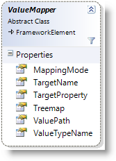

////

|metadata|
{
    "name": "xamtreemap-custom-value-mappers",
    "controlName": ["xamTreemap"],
    "tags": ["Charting","How Do I"],
    "guid": "14cba6d0-1828-49e2-8fd2-5487d26395b3",  
    "buildFlags": [],
    "createdOn": "2016-05-25T18:21:59.904393Z"
}
|metadata|
////

= xamTreemap Custom Value Mappers

== Before You Begin

The xamTreemap™ control allows you to manipulate the properties of each node according to its ranking. This is accomplished by Value Mappers.

The xamTreemap control has the following predefined Value Mappers:

* link:xamtreemap-colormapper.html[ColorMapper]
* link:xamtreemap-radialcolormapper.html[RadialColorMapper]
* link:xamtreemap-groupvaluemapper.html[GroupValueMapper]
* link:xamtreemap-doublemapper.html[DoubleMapper]

In some use cases, custom logic may be necessary to set the properties of each node. This can be done by creating a custom Value Mapper.

== Value Mappers

There are two base mappers:

* link:{ApiPlatform}controls.charts.xamtreemap.v{ProductVersion}~infragistics.controls.charts.valuemapper.html[ValueMapper]

* link:{ApiPlatform}controls.charts.xamtreemap.v{ProductVersion}~infragistics.controls.charts.rangemapper.html[RangeMapper] – inherits ValueMapper.

== Value Mappers Inheritance

== Custom Value Mapper

First we need to decide whether to derive from the ValueMapper class or the RangeMapper class – the RangeMapper class extends the ValueMapper class’s functionality.

Note that the ValueMapper.Treemap property provides a reference to the instance of the xamTreemap control – depending on the scenario, this can provide a greater degree of control.

== The MapValue Method

The Value Mappers use the MapValue method to calculate the node’s ranking and set the mapped properties.

The xamTreemap control goes through all nodes and calls the MapValue method of the Value Mappers on each node. This method is responsible for the following actions:

* Checks if the current node is of the ValueTypeName type.
* Applies logic on the node’s data context.
* Depending on the logic of the mapper, this method sets a value to the TargetPrpoperty.

== The ResetValue Method

When a value mapper is removed from the collection with Value Mappers, the ResetValue method is executed for each of the mapped nodes. Its purpose is to revert the node to the state it had before the MapValue method was executed. For this purpose you need to know the state of the node before the mapper was applied.

== Example

The following Value Mapper will check if the current node is of the Product type – if so, the node’s Fill will be set to a solid color Magenta.

Note that the XAML declaration of this Value Mapper does not specify the properties ValueTypename or TargetProperty – they are coded in the MapValue method (the ValueTypeName is Product, the TargetProperty is Fill).

*In Visual Basic:*

[source]
----
Public Class CustoMapper
    Inherits ValueMapper
    Public Overrides Sub MapValue(ByVal node As Infragistics.Controls.Charts.TreemapNode)
        If (node.DataContext Is Product) Then
            node.Fill = New SolidColorBrush(Colors.Magenta)
        End If
    End Sub

    Public Overrides Sub ResetValue(ByVal node As Infragistics.Controls.Charts.TreemapNode)
	End Sub
End Class
----

*In C#:*

----
public class CustomMapper : ValueMapper
{
    public override void MapValue(TreemapNode node)
    {
        if (node.DataContext is Product)
        {
            node.Fill = new SolidColorBrush(Colors.Magenta);
        }
    }    public override void ResetValue(TreemapNode node)
    {    }
}
----

*In XAML:*

----
<ig:XamTreemap>
    <ig:XamTreemap.ValueMappers>
        <local:CustomMapper />
    </ig:XamTreemap.ValueMappers>
</ig:XamTreemap>
----

== Example

The nodes which represent the InventoryEntry elements have a collapsed image (an exclamation icon) in their template. If the Quantity property of the InventoryEntry is lower than 300, the image is shown to warn the user that more items have to be purchased.

Note that the following Value Mapper has a set ValueTypeName in its XAML declaration. The MapValue compares the string ValueTypeName with the type of the current node’s data context. The approach of setting the mapper’s mapping properties in XAML or code-behind (not hard-coding them as in the previous example) is useful when the mapper is going to be used for numerous target types of a variety of target properties.
*In Visual Basic:*

[source]
----
Public Class CustoMapper
    Inherits ValueMapper
    Public Overrides Sub MapValue(ByVal node As Infragistics.Controls.Charts.TreemapNode)
        If (IsDBNull(node.DataContext)) Then
            Return
        End If
        'Check if the current node is of the ValueTypeName and has children in its template
        If (Me.ValueTypeName = node.DataContext.GetType().Name And VisualTreeHelper.GetChildrenCount(node) > 0) Then
            Dim inventoryEntry = CType(node.DataContext, InventoryEntry)
            'The custom logic
            If (inventoryEntry.Quantity < 300) Then
                'Get an instance of the WarningImage from the node's template
                Dim rootElement = CType(VisualTreeHelper.GetChild(node, 0), FrameworkElement)
                Dim warningImage = CType(rootElement.FindName("WarningImage"), Image)
                'Set the visibility of the image
                warningImage.Visibility = Visibility.Visible
            End If
        End If
    End Sub
    Public Overrides Sub ResetValue(ByVal node As Infragistics.Controls.Charts.TreemapNode)
        If (IsDBNull(node.DataContext)) Then
            Return
        End If
        'Check if the current node is of the ValueTypeName and has children in its template
        If (Me.ValueTypeName = node.DataContext.GetType().Name And VisualTreeHelper.GetChildrenCount(node) > 0) Then
            Dim inventoryEntry = CType(node.DataContext, InventoryEntry)
            'Get an instance of the WarningImage from the node's template
            Dim rootElement = CType(VisualTreeHelper.GetChild(node, 0), FrameworkElement)
            Dim warningImage = CType(rootElement.FindName("WarningImage"), Image)
            'Set the visibility of the image
            warningImage.Visibility = Visibility.Collapsed
        End If
    End Sub
End Class
----

*In C#:*

----
public class VisibilityMapper : ValueMapper
{
    public override void MapValue(TreemapNode node)
    {
        if (node.DataContext == null)
        {
            return;
        }
        //Check if the current node is of the ValueTypeName and has children in it's template
        if (this.ValueTypeName == node.DataContext.GetType().Name && VisualTreeHelper.GetChildrenCount(node) > 0)
        {
            InventoryEntry inventoryEntry = (InventoryEntry)node.DataContext;
            //The custom logic
            if (inventoryEntry.Quantity < 300)
            {
                //Get an instance of the WarningImage from the node's template
                FrameworkElement rootElement = VisualTreeHelper.GetChild(node, 0) as FrameworkElement;
                Image warningImage = rootElement.FindName("WarningImage") as Image;
                //Set the visibility of the image
                warningImage.Visibility = Visibility.Visible;
            }
        }
    }
    public override void ResetValue(TreemapNode node)
    {
        if (node.DataContext == null)
        {
            return;
        }
        //Check if the current node is of the ValueTypeName and has children in it's template
        if (this.ValueTypeName == node.DataContext.GetType().Name && VisualTreeHelper.GetChildrenCount(node) > 0)
        {
            InventoryEntry inventoryEntry = (InventoryEntry)node.DataContext;
            //Get an instance of the WarningImage from the node's template
            FrameworkElement rootElement = VisualTreeHelper.GetChild(node, 0) as FrameworkElement;
            Image warningImage = rootElement.FindName("WarningImage") as Image;
            //Collapse the image
            warningImage.Visibility = Visibility.Collapsed;
        }
    }
}
----

*In XAML:*

----
<ig:XamTreemap>
    <ig:XamTreemap.ValueMappers>
        <local:VisibilityMapper ValueTypeName="InventoryEntry" />
    </ig:XamTreemap.ValueMappers>
</ig:XamTreemap>
----

image::images/xamTreemap_Custom_Value_Mappers_04.png[]

== Related Topics

link:xamtreemap-node-binders.html[Node Binders]

link:xamtreemap-value-mappers.html[Value Mappers]