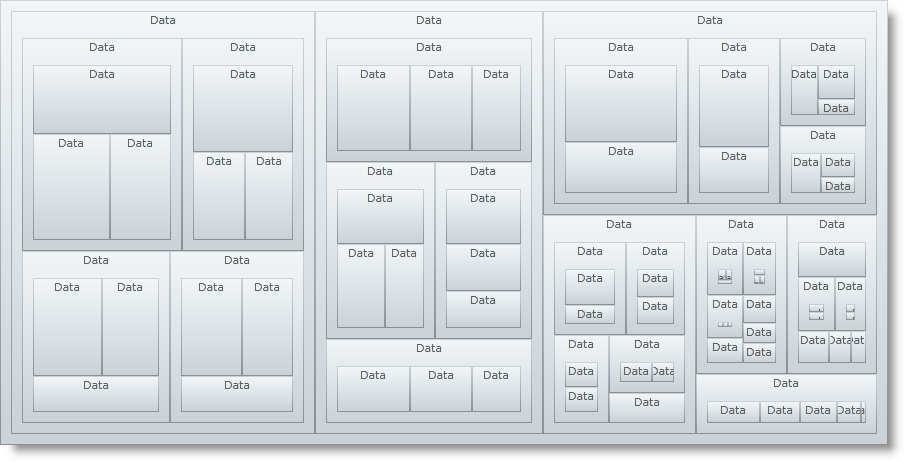

////

|metadata|
{
    "name": "xamtreemap-data-binding",
    "controlName": ["xamTreemap"],
    "tags": ["Data Binding","How Do I"],
    "guid": "172d9fbb-9f91-4010-96ff-bc51b05ee80e",  
    "buildFlags": [],
    "createdOn": "2016-05-25T18:21:59.7843832Z"
}
|metadata|
////

= Data Binding

== Before You Begin

In this article you will learn how to make a suitable class for your data and how to pass it to the xamTreemap™ control.

== What You Will Accomplish

You will bind data to the xamTreemap control.

== Follow These Steps

[start=1]
. Add the xamTreemap control to your page. For information on this, see link:xamtreemap-adding-xamtreemap-using-xaml.html[Adding xamTreemap Using XAML Code], link:xamtreemap-adding-xamtreemap-using-procedural.html[Adding xamTreemap Using Procedural Code], or link:xamtreemap-adding-xamtreemap-using-blend.html[Adding xamTreemap Using Expression Blend].

Create a class named Data that implements the INotifyPropertyChanged. This class will represent a node of the data for the xamTreemap control – each node will have a name, a value and a collection of subnodes.

*Note that the access modifier of the Data class has to be public.*

*In Visual Basic:*

----
Public Class Data
        Implements INotifyPropertyChanged
        Private _Name As String
        Public Property Name() As String
        Get
                Return _Name
        End Get
        Set(ByVal value As String)
                _Name = value
        End Set
        End Property
        Private _value As Integer
        Public Property Value() As Integer
        Get
               Return _value
        End Get
        Set(ByVal value As Integer)
                _value = value
                RaiseEvent PropertyChanged(Me, New PropertyChangedEventArgs("Value"))
        End Set
        End Property
        Public Event PropertyChanged(ByVal sender As Object, ByVal e As PropertyChangedEventArgs) Implements INotifyPropertyChanged.PropertyChanged
End Class
----

*In C#:*

----
public class Data : INotifyPropertyChanged
{
        public string Name { get; set; }
        private int _value;
        public int Value
        {
                get { return _value; }
                set
                {
                        _value = value;
                        if (this.PropertyChanged != null) this.PropertyChanged(this, new PropertyChangedEventArgs("Value"));
                }
        }
        private ObservableCollection<Data> _subData = new ObservableCollection<Data>();
        public ObservableCollection<Data> SubData
        {
                get { return _subData; }
                set
                {
                        _subData = value;
                        if (this.PropertyChanged != null) this.PropertyChanged(this, new PropertyChangedEventArgs("SubData"));
                }
        }
        #region INotifyPropertyChanged Members
        public event PropertyChangedEventHandler PropertyChanged;
        #endregion
}
----

[start=2]
. After populating a collection with Data items, pass the collection to the xamTreemap.DataContext property. For example:

*In Visual Basic:*

----
Dim data As ObservableCollection(Of Data) = GetData()
myTreemap.DataContext = data
----

*In C#:*

----
ObservableCollection<Data> data = GetData();
myTreemap.DataContext = data;
----

*In XAML:*

----
<ig:xamTreemap
        x:Name="myTreemap" 
        ItemsSource="{Binding}">
    <ig:xamTreemap.NodeBinders>
        <ig:NodeBinder
                TextPath="Name"
                ValuePath="Value"
                TargetTypeName="Data"
                ItemsSourcePath="SubData"/>
    </ig:xamTreemap.NodeBinders>
</ig:xamTreemap>
----

[start=3]
. Save and run your application.

== Related Topics

link:xamtreemap-node-binders.html[Node Binders]

link:xamtreemap-wpf-bind-xamtreemap-to-ado.net-entity-data-model.html[Bind xamTreemap to ADO.NET Entity Data Model]

link:xamtreemap-value-mappers.html[Value Mappers]