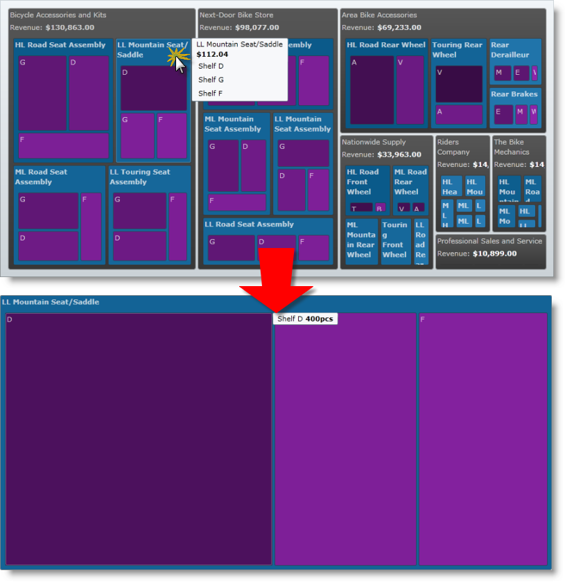

////

|metadata|
{
    "name": "xamtreemap-data-drill-down",
    "controlName": ["xamTreemap"],
    "tags": ["Drilldown","How Do I"],
    "guid": "a6b0c7cd-9739-4408-a6f4-bee59911c448",  
    "buildFlags": [],
    "createdOn": "2016-05-25T18:21:59.8663911Z"
}
|metadata|
////

= Data Drill-down

== Before You Begin

In this article you will learn how to use xamTreemap™ control’s link:{ApiPlatform}controls.charts.xamtreemap.v{ProductVersion}~infragistics.controls.charts.xamtreemap~itemssourceroot.html[ItemsSourceRoot] property.

The ItemsSourceRoot property allows the user to specify which node of the current DataContext will be set as root.

== Creating a Simple Drill-down Application

[start=1]
. Create a Microsoft® {PlatformName}™ application.
[start=2]
. Add an instance of the xamTreemap control to your application.
[start=3]
. Handle the NodeMouseLeftButtonDown event:

*In XAML:*

----
<ig:xamTreemap 
    x:Name="Treemap"
    NodeMouseLeftButtonDown="Treemap_NodeMouseLeftButtonDown">
</ig:xamTreemap>
----

*In Visual Basic:*

----
Private Sub Treemap_NodeMouseLeftButtonDown _
(ByVal sender As Object, ByVal e As TreemapNodeClickEventArgs)
    If Treemap.ItemsSourceRoot <> e.Node.DataContext Then
        Treemap.ItemsSourceRoot = e.Node.DataContext
    End If
End Sub
----

*In C#:*

----
private void Treemap_NodeMouseLeftButtonDown(object sender, TreemapNodeClickEventArgs e)
{
    if (Treemap.ItemsSourceRoot != e.Node.DataContext)
    {
        Treemap.ItemsSourceRoot = e.Node.DataContext;
    }
}
----

[start=4]
. Create custom logic for drilling down and storing the drilled roots.

== Related Topics

link:xamtreemap-node-binders.html[Node Binders]

link:xamtreemap-value-mappers.html[Value Mappers]