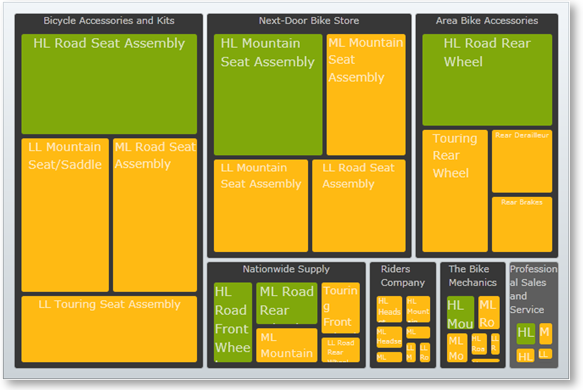

////

|metadata|
{
    "name": "xamtreemap-dataminimum-and-datamaximum",
    "controlName": ["xamTreemap"],
    "tags": ["Application Scenarios","How Do I"],
    "guid": "b65e2766-8861-4c1d-bc23-b3285d21ca67",  
    "buildFlags": [],
    "createdOn": "2016-05-25T18:21:59.8723907Z"
}
|metadata|
////

= DataMinimum and DataMaximum

== Before You Begin

The xamTreemap™ control’s link:{ApiPlatform}controls.charts.xamtreemap.v{ProductVersion}~infragistics.controls.charts.rangemapper~dataminimum.html[DataMinimum] and link:{ApiPlatform}controls.charts.xamtreemap.v{ProductVersion}~infragistics.controls.charts.rangemapper~datamaximum.html[DataMaximum] properties belong to the link:{ApiPlatform}controls.charts.xamtreemap.v{ProductVersion}~infragistics.controls.charts.rangemapper.html[RangeMapper] class. All classes that inherit the RangeMapper class can use these properties:

* link:xamtreemap-colormapper.html[ColorMapper]
* link:xamtreemap-radialcolormapper.html[RadialColorMapper]
* link:xamtreemap-doublemapper.html[DoubleMapper]

== What You Will Accomplish

You will understand the purpose of the DataMinimum and DataMaximum properties and how to use them effectively.

== Scenario

This topic will refer to the following classes – Manufacturer, Product and InventoryEntry. The Product class’ InventoryEntries property contains a list of InventoryEntry items. The Manufacturer class’ Products property contains a list of Product items.

image::images/xamTreemap_Node_Binders_01.png[]

This sample contains an instance of the xamTreemap control, which has been bound to a list of Manufacturers using link:xamtreemap-value-mappers.html[Value Mappers].
*In XAML:*

[source]
----
<ig:xamTreemap 
           Margin="5"
           LayoutType="Squarified"
           LayoutOrientation="Horizontal"
           ItemsSource="{Binding Path=Manufacturers}">

        <!--Binding to the data-->
        <ig:xamTreemap.NodeBinders>
                <ig:NodeBinder 
                       TargetTypeName="Manufacturer"
                       ValuePath="Revenue"
                       TextPath="Name"
                       ItemsSourcePath="Products"
                       NodeStyle="{StaticResource TreemapNodeStyle}" />
                <ig:NodeBinder 
                       TargetTypeName="Product"
                       ValuePath="StandardCost"
                       TextPath="Name"
                       NodeStyle="{StaticResource TreemapNodeStyle}" />

        </ig:xamTreemap.NodeBinders>
        <!--Color mapping-->
        <ig:xamTreemap.ValueMappers>
                <ig:ColorMapper 
                        ValueTypeName="Manufacturer"
                        ValuePath="Revenue"
                        TargetProperty="Fill"
                        MappingMode="AllNodes"
                        From="#FF838383"
                        To="#FF373737" />
                <ig:ColorMapper 
                        ValueTypeName="Product"
                        ValuePath="StandardCost"
                        TargetProperty="Fill"
                        MappingMode="AllNodes"
                        From="#ffba13"
                        To="#80a80b" />
                <ig:DoubleMapper 
                     ValueTypeName="Product"
                     ValuePath="StandardCost"
                     TargetProperty="FontSize"
                     MappingMode="AllNodes"
                     From="8"
                     To="15" />
        </ig:xamTreemap.ValueMappers>
</ig:xamTreemap>
----

Here, the Product items have StandardCost values ranging from $500 to $10000, mapped to colors between orange and green.

== DataMinumum and DataMaximum

You will set the DataMinimum and DataMaximum properties of the value mapper which is for the StandardCost of the Product items:

*In XAML:*

----
<ig:ColorMapper 
        ValueTypeName="Product"
        ValuePath="StandardCost"
        TargetProperty="Fill"
        MappingMode="AllNodes"
        From="#ffba13"
        To="#80a80b"
        DataMinimum="3000"
        DataMaximum="8000" />
----

Using this value mapper, all Product items that have a StandardCost value lower than the DataMinimum value will get the Fill value that is defined in the ColorMapper’s From property – in this case Orange. The Product items which have a StandardCost greater than the DataMaximum will get the Fill defined in the To property – Green.

The following code shows how you can set the value mapper’s DataMinimum and DataMaximum properties for the Product item’s StandardCost property and map it to the FontSize of the nodes. Mapping to the node’s FontSize property will affect the node’s displayed font size based on the underlying data values:

*In XAML:*

----
<ig:DoubleMapper 
        ValueTypeName="Product"
        ValuePath="StandardCost"
        TargetProperty="FontSize"
        MappingMode="AllNodes"
        From="8"
        To="15"
        DataMinimum="7000"
        DataMaximum="9000" />
----

Notice the difference in the text of the nodes without the DataMinimum and DataMaximum set and with them set:

== Summary

When setting the DataMinimum and/or DataMaximum properties on a value mapper object, the nodes whose mapped values are lower than the DataMinimum have their mapped properties set with the From value, and the nodes whose mapped values that are greater than the DataMaximum have their mapped properties set with the To value.

This enables you to create a range around a compaction point of the mapped values in your data:

