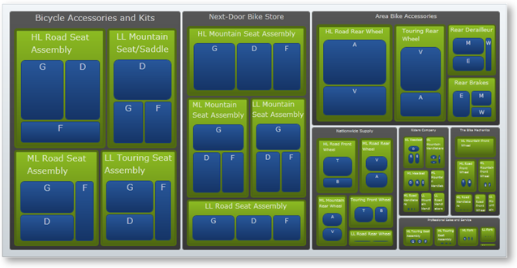

////

|metadata|
{
    "name": "xamtreemap-doublemapper",
    "controlName": ["xamTreemap"],
    "tags": ["How Do I"],
    "guid": "270e1ae9-2bf2-45e8-8ff2-79287603cb79",  
    "buildFlags": [],
    "createdOn": "2016-05-25T18:21:59.8543908Z"
}
|metadata|
////

= DoubleMapper

The link:{ApiPlatform}controls.charts.xamtreemap.v{ProductVersion}~infragistics.controls.charts.doublemapper.html[DoubleMapper] sets a numeric value to the nodes’ template of the xamTreemap™ control depending on a specified property from the nodes’ data context.

== DoubleMapper Properties

* link:{ApiPlatform}controls.charts.xamtreemap.v{ProductVersion}~infragistics.controls.charts.valuemapper~valuepath.html[ValuePath] – determines the name of the property of the data source which contains the data.
* link:{ApiPlatform}controls.charts.xamtreemap.v{ProductVersion}~infragistics.controls.charts.valuemapper~valuetypename.html[ValueTypeName] – determines the name of the type which has the field containing data specified by ValuePath.
* link:{ApiPlatform}controls.charts.xamtreemap.v{ProductVersion}~infragistics.controls.charts.valuemapper~targetproperty.html[TargetProperty] – determines the property which will be affected by the color mapping.
* link:{ApiPlatform}controls.charts.xamtreemap.v{ProductVersion}~infragistics.controls.charts.valuemapper~targetname.html[TargetName] – if you have a custom template for the xamTreemap control’s nodes and you have a named element, you can use TargetName to specify this element.
* link:{ApiPlatform}controls.charts.xamtreemap.v{ProductVersion}~infragistics.controls.charts.valuemapper~mappingmode.html[MappingMode] – specifies the nodes to be affected by the color mapping. Possible values are "AllNodes" and "LeafNodesOnly".
* link:{ApiPlatform}controls.charts.xamtreemap.v{ProductVersion}~infragistics.controls.charts.doublemapper~from.html[From] and link:{ApiPlatform}controls.charts.xamtreemap.v{ProductVersion}~infragistics.controls.charts.doublemapper~to.html[To] – these two properties determine the range of the value which will be applied to the node’s template.
* link:{ApiPlatform}controls.charts.xamtreemap.v{ProductVersion}~infragistics.controls.charts.rangemapper~dataminimum.html[DataMinimum] and link:{ApiPlatform}controls.charts.xamtreemap.v{ProductVersion}~infragistics.controls.charts.rangemapper~datamaximum.html[DataMaximum] – if the value specified by ValuePath is less than DataMinimum for a certain node then the mapper applies the value of the From property; if the value specified by ValuePath is more than DataMaximum for a certain node then the mapper applies the value of the To property.

== Example

We have three classes – Manufacturer, Product and InventoryEntry. The Product class has a double field StandardCost. The Manufacturer class has an integer field Revenue. The InventoryEntry class has an integer field Quantity.

*In XAML:*

----
<ig:xamTreemap.ValueMappers>
    <ig:DoubleMapper
        ValueTypeName="Manufacturer"
        ValuePath="Revenue"
        TargetProperty="FontSize"
        MappingMode="AllNodes"
        From="5"
        To="15" />
    <ig:DoubleMapper
        ValueTypeName="Product"
        ValuePath="StandardCost"
        TargetProperty="BorderThickness"
        MappingMode="AllNodes"
        From="1"
        To="5" />
    <ig:DoubleMapper
        ValueTypeName="InventoryEntry"
        ValuePath="Quantity"
        TargetProperty="CornerRadius"
        MappingMode="AllNodes"
        From="2"
        To="10" />
</ig:xamTreemap.ValueMappers>
----

== How This Works

The first mapper will set the FontSize of the nodes of type Manufacturer depending on the Revenue.

The second mapper will set the BorderThickness of the nodes of type Product depending on the StandardCost.

The third mapper will set the CornerRadius of the nodes of type InventoryEntry depending on the Quantity.

== Related Topics

link:xamtreemap-node-binders.html[Node Binders]

link:xamtreemap-value-mappers.html[Value Mappers]