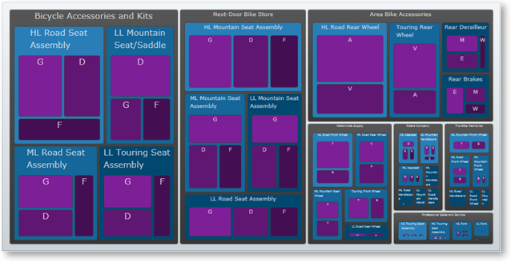

////

|metadata|
{
    "name": "xamtreemap-groupvaluemapper",
    "controlName": ["xamTreemap"],
    "tags": ["How Do I"],
    "guid": "330f37ef-152b-43f4-966f-98fa22982aa9",  
    "buildFlags": [],
    "createdOn": "2016-05-25T18:21:59.8473902Z"
}
|metadata|
////

= GroupValueMapper

The link:{ApiPlatform}controls.charts.xamtreemap{ApiVersion}~infragistics.controls.charts.groupvaluemapper.html[GroupValueMapper] groups the nodes of the xamTreemap™ control depending on a specified value (for example, StandardCost). The similar nodes gain the same group value.

== GroupValueMapper Properties

* link:{ApiPlatform}controls.charts.xamtreemap{ApiVersion}~infragistics.controls.charts.valuemapper~valuepath.html[ValuePath] – determines the name of the property of the data source which contains the data.
* link:{ApiPlatform}controls.charts.xamtreemap{ApiVersion}~infragistics.controls.charts.valuemapper~valuetypename.html[ValueTypeName] – determines the name of the type that has the field containing data specified by ValuePath.
* link:{ApiPlatform}controls.charts.xamtreemap{ApiVersion}~infragistics.controls.charts.valuemapper~targetproperty.html[TargetProperty] – determines the property which will be affected by the group mapping.
* link:{ApiPlatform}controls.charts.xamtreemap{ApiVersion}~infragistics.controls.charts.valuemapper~targetname.html[TargetName] – if you have a custom template for the xamTreemap control’s nodes and you have a named element, you can use TargetName to specify this element.
* link:{ApiPlatform}controls.charts.xamtreemap{ApiVersion}~infragistics.controls.charts.valuemapper~mappingmode.html[MappingMode] – specifies the nodes to be affected by the color mapping. Possible values are "AllNodes" and "LeafNodesOnly".
* link:{ApiPlatform}controls.charts.xamtreemap{ApiVersion}~infragistics.controls.charts.groupvaluemapper~groupvalues.html[GroupValues] - this is a collection of values which the similar objects gain.
* link:{ApiPlatform}controls.charts.xamtreemap{ApiVersion}~infragistics.controls.charts.groupvaluemapper~order.html[Order] – an enumeration which takes two values: Ascending and Descending . It affects the order in which the group values are mapped. The default ascending behavior maps the first group values to the elements with smallest value and the last to those with largest.

== Example

We have three classes – Manufacturer, Product and InventoryEntry. The Product class has a double field StandardCost. The Manufacturer class has an integer field Revenue. The InventoryEntry class has an integer field Quantity.

*In XAML:*

----
<ig:xamTreemap.ValueMappers>
    <ig:GroupValueMapper 
        ValueTypeName="Manufacturer"
        ValuePath="Revenue"
        TargetProperty="FontSize"
        MappingMode="AllNodes"
        Order="Descending">
        <ig:GroupValueMapper.GroupValues>
            <System:Double>15</System:Double>
            <System:Double>10</System:Double>
            <System:Double>5</System:Double>
        </ig:GroupValueMapper.GroupValues>
    </ig:GroupValueMapper>
    <ig:GroupValueMapper 
        ValueTypeName="Product"
        ValuePath="StandardCost"
        TargetProperty="Fill"
        MappingMode="AllNodes">
        <ig:GroupValueMapper.GroupValues>
            <SolidColorBrush Color="#014871" />
            <SolidColorBrush Color="#156699" />
            <SolidColorBrush Color="#297eb7" />
        </ig:GroupValueMapper.GroupValues>
    </ig:GroupValueMapper>
    <ig:GroupValueMapper 
        ValueTypeName="InventoryEntry"
        ValuePath="Quantity"
        TargetProperty="Fill"
        MappingMode="AllNodes">
        <ig:GroupValueMapper.GroupValues>
            <SolidColorBrush Color="#430f52" />
            <SolidColorBrush Color="#601774" />
            <SolidColorBrush Color="#7d1f97" />
        </ig:GroupValueMapper.GroupValues>
    </ig:GroupValueMapper>
</ig:xamTreemap.ValueMappers>
----

 

== How This Works

The first mapper will divide the nodes of type Manufacturer into three groups depending on their Revenue. The nodes in each group will have their font size set to the value coresponding to the group.

The second mapper will divide the nodes of type Product into three groups depending on their StandardCost. The nodes in each group will have their fill set to the brush coresponding to the group.

The third mapper will divide the nodes of type InventoryEntry into three groups depending on their Quantity. The nodes in each group will have their fill set to the brush coresponding to the group.

== Related Topics

link:xamtreemap-node-binders.html[Node Binders]

link:xamtreemap-value-mappers.html[Value Mappers]