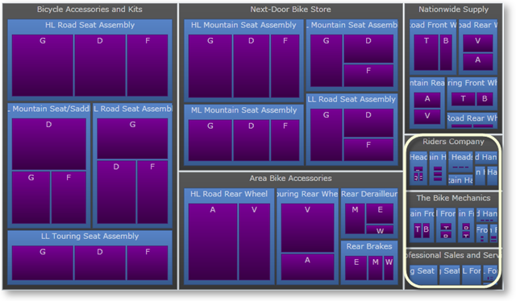
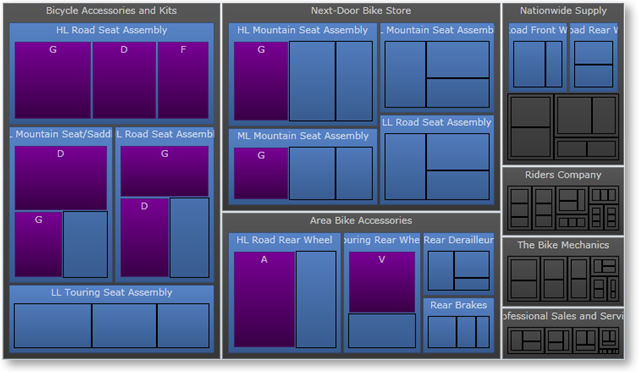

////

|metadata|
{
    "name": "xamtreemap-item-minimum-size",
    "controlName": ["xamTreemap"],
    "tags": ["How Do I"],
    "guid": "4d311f3b-4526-4d6b-b504-f5cd34e2a0a4",  
    "buildFlags": [],
    "createdOn": "2016-05-25T18:21:59.816419Z"
}
|metadata|
////

= Item Minimum Size

== Before You Begin

When the xamTreemap™ control displays hierarchical data, there might be nodes which are not large enough to be seen.

Notice the small nodes.

The link:{ApiPlatform}controls.charts.xamtreemap.v{ProductVersion}~infragistics.controls.charts.xamtreemap~itemminsize.html[ItemMinSize] property allows the user to set the minimum size of the nodes. If a node’s width or height is smaller than the ItemMinSize, then the node is rendered as transparent image instead of a UIElement.

== Setting the ItemMinSize Property

*In XAML:*

----
<ig:xamTreemap x:Name="Treemap" ItemMinSize="56" >
----

*In Visual Basic:*

----
Treemap.ItemMinSize = 56
----

*In C#:*

----
Treemap.ItemMinSize = 56;
----

 