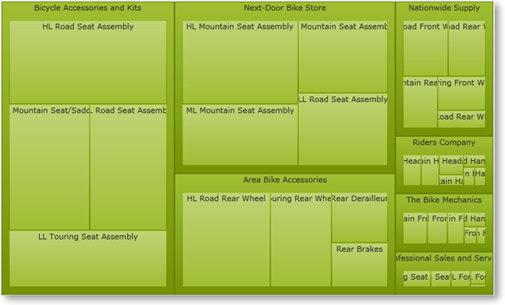
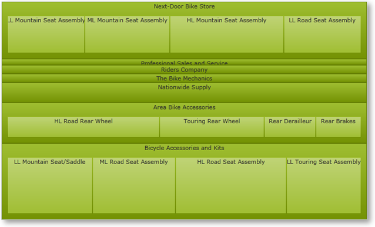
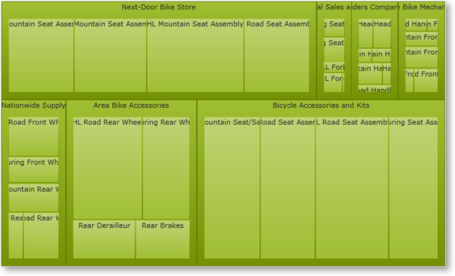
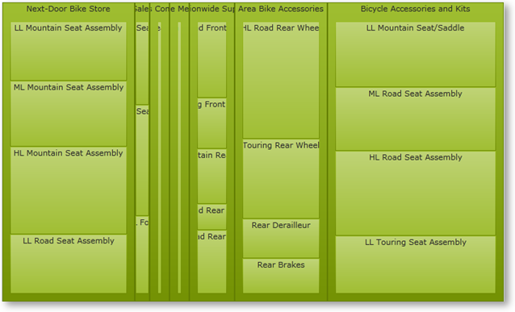

////

|metadata|
{
    "name": "xamtreemap-layouts",
    "controlName": ["xamTreemap"],
    "tags": ["Charting","How Do I","Layouts"],
    "guid": "6e6de661-6c31-4edb-8152-8c1fc03acde3",  
    "buildFlags": [],
    "createdOn": "2016-05-25T18:21:59.804418Z"
}
|metadata|
////

= Layouts

== About

In this article, you will learn about the properties link:{ApiPlatform}controls.charts.xamtreemap{ApiVersion}~infragistics.controls.charts.xamtreemap~layouttype.html[LayoutType] and link:{ApiPlatform}controls.charts.xamtreemap{ApiVersion}~infragistics.controls.charts.xamtreemap~layoutorientation.html[LayoutOrientation], which are responsible for data tiling in the xamTreemap™ control.

== Layout Type

There are different tiling algorithms when it comes to displaying the data. All algorithms have their advantages depending on the user’s needs. Some aim to obtain the best aspect ratio – the nodes are as close to rectangles as possible. Other algorithms aim to preserve the initial order of the elements – object which are close to each other in the data source are arranged near each other on the treemap.

The tiling algorithm for the xamTreemap control is set through the LayoutType property. The different layout types are:

* Squarified – this algorithm obtains the best aspect ratio but the objects are arranged by size.

*In XAML:*

----
<ig:xamTreemap Name="myTreemap" LayoutType="Squarified" />
----

* SliceAndDice – this algorithm aims to preserve the initial order at the expense of the aspect ratio.

*In XAML:*

----
<ig:xamTreemap Name="myTreemap" LayoutType="SliceAndDice" />
----

* Strip – this tiling algorithm has a better aspect ratio than the SliceAndDice and keeps a better order than Squarified.

*In XAML:*

----
<ig:xamTreemap Name="myTreemap" LayoutType="Strip" />
----

The default value of the xamTreemap control’s LayoutType property is Squarified.

== Layout Orientation

The xamTreemap control’s LayoutOrientation property enables the user to set the direction in which the nodes of the hierarchy will be expanded.

Note that the LayoutOrientation property works with the layout types SliceAndDice and Strip.

* Horizontal – the child nodes are going to be stacked horizontally (SliceAndDice).

*In XAML:*

----
<ig:xamTreemap LayoutOrientation="Horizontal" LayoutType="SliceAndDice" />
----

* Vertical – the child nodes are going to be stacked vertically (SliceAndDice).

*In XAML:*

----
<ig:xamTreemap LayoutOrientation="Vertical" LayoutType="SliceAndDice" />
----

