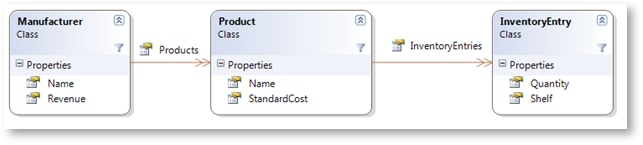

////

|metadata|
{
    "name": "xamtreemap-node-binders",
    "controlName": ["xamTreemap"],
    "tags": ["How Do I"],
    "guid": "3ced1457-0e02-47f0-9cc2-097d00dc4013",  
    "buildFlags": [],
    "createdOn": "2016-05-25T18:21:59.7903839Z"
}
|metadata|
////

= Node Binders

== Before You Begin

When binding to data, the xamTreemap™ control needs to understand the data. This is done with node binders.

The link:{ApiPlatform}controls.charts.xamtreemap.v{ProductVersion}~infragistics.controls.charts.nodebinder.html[NodeBinder] class has properties that indicate how the data should be read:

* link:{ApiPlatform}controls.charts.xamtreemap.v{ProductVersion}~infragistics.controls.charts.nodebinder~textpath.html[TextPath] - determines the name of the property of the data source that contains text information.
* link:{ApiPlatform}controls.charts.xamtreemap.v{ProductVersion}~infragistics.controls.charts.nodebinder~valuepath.html[ValuePath] – determines the name of the property of the data source that contains the data.
* link:{ApiPlatform}controls.charts.xamtreemap.v{ProductVersion}~infragistics.controls.charts.nodebinder~targettypename.html[TargetTypeName] – determines the type of the data that is pointed by ValuePath.
* link:{ApiPlatform}controls.charts.xamtreemap.v{ProductVersion}~infragistics.controls.charts.nodebinder~itemssourcepath.html[ItemsSourcePath] – if the data source is of hierarchical type, ItemsSourcePath is the name of the property that points to the child nodes.
* link:{ApiPlatform}controls.charts.xamtreemap.v{ProductVersion}~infragistics.controls.charts.nodebinder~nodestyle.html[NodeStyle] – the nodes to which the NodeBinder binds will inherit the style specified by the NodeStyle property. Note that every NodeBinder can have a different NodeStyle.

== Example

We have the following classes: Manufacturer, Product and InventoryEntry. The Product class contains a List of InventoryEntry items, and the Manufacturer class contains a list of Product items.

We will now set the xamTreemap control to display the list of Manufacturer items from our data source.

The snippet shows three node binders – each binder applies to one of the classes (Manufacturer, Product and InventoryEntry).

*In XAML:*

----
<ig:xamTreemap.NodeBinders>
    <ig:NodeBinder 
        TargetTypeName="Manufacturer"
        ValuePath="Revenue" 
        TextPath="Name" 
        ItemsSourcePath="Products" />
    <ig:NodeBinder 
        TargetTypeName="Product" 
        ValuePath="StandardCost" 
        TextPath="Name" 
        ItemsSourcePath="InventoryEntries" />
    <ig:NodeBinder 
        TargetTypeName="InventoryEntry" 
        ValuePath="Quantity" 
        TextPath="Shelf" />
</ig:xamTreemap.NodeBinders>
----

image::images/xamTreemap_Node_Binders_02.png[]

== Related Topics

link:xamtreemap-data-binding.html[Data Binding]

link:xamtreemap-wpf-bind-xamtreemap-to-ado.net-entity-data-model.html[Bind xamTreemap to ADO.NET Entity Data Model]